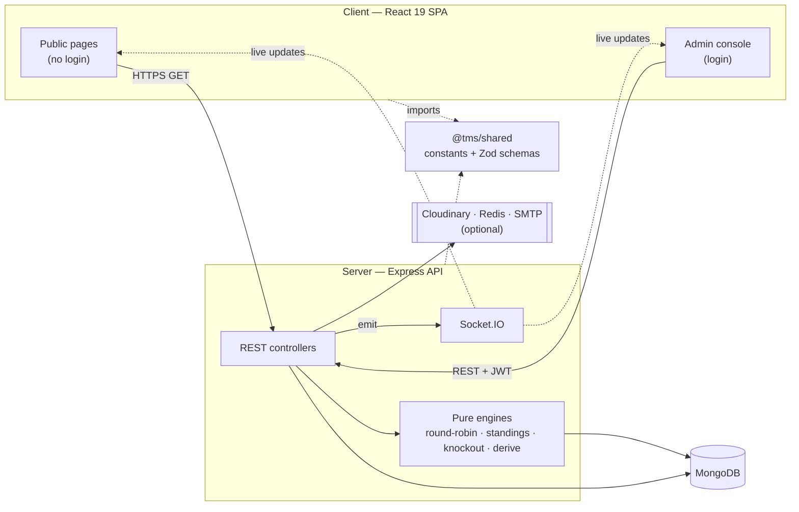

<div align="center">


# TourneyOps

### The open-source engine for running cricket & football tournaments — from first whistle to final standings.

Group stages, seeded knockouts, **live ball-by-ball / event scoring** over WebSockets,
and broadcast-quality public leaderboards — all driven by one configurable, sport-aware core.

<p>
  <a href="#quick-start"><b>Quick Start</b></a> ·
  <a href="#features"><b>Features</b></a> ·
  <a href="#architecture"><b>Architecture</b></a> ·
  <a href="docs/README.md"><b>Documentation</b></a> ·
  <a href="#deployment"><b>Deploy</b></a>
</p>

<p>
  
  
  
  
  
  
  
  
  
  
</p>

</div>

---

## Why TourneyOps?

Running a tournament means juggling fixtures, scores, standings, tiebreakers, and brackets —
and keeping them all consistent every time a result changes. **TourneyOps does the bookkeeping for you.**

You enter results; it derives everything else. Standings (with **Net Run Rate** / **goal
difference** and configurable tiebreakers), player statistics, leaderboards, and the knockout
bracket are **always recomputed from the source-of-truth fixtures** — so a late scorecard edit
ripples through the whole tournament correctly, and never drifts out of sync.

One codebase handles **two sports** through data-driven configuration: a tournament's
`sportType` and points rules decide which result fields, stats, and tiebreakers apply — the
engine branches on data, not on hard-coded flows.

> **New here?** The fastest path is [Quick Start](#quick-start) → log in → open the demo
> tournaments. For the full picture, the [`docs/`](docs/README.md) folder is a complete,
> production-grade engineering reference.

---

## Table of contents

- [Features](#features)
- [Tech stack](#tech-stack)
- [Architecture](#architecture)
- [Quick start](#quick-start)
- [Configuration](#configuration)
- [Sign-in & demo data](#sign-in--demo-data)
- [Scripts](#scripts)
- [Testing](#testing)
- [Deployment](#deployment)
- [Documentation](#documentation)
- [Roadmap](#roadmap)
- [Contributing](#contributing)
- [License](#license)

---

## Features

**Competition management**
- Multi-tournament platform for **cricket and football**, each fully configurable.
- Groups with **round-robin** scheduling (single or double, fair home/away, automatic byes).
- **Snake-draft** auto-distribution of seeded teams across groups.
- **Seeded knockouts**: single-elimination (with optional third-place playoff) and IPL-style
  playoff brackets, with automatic winner/loser advancement.

**Scoring & correctness**
- **Live scoring** with ball-by-ball (cricket) and event-by-event (football) consoles.
- Automatic standings with **NRR**, goal difference, bonus points, and **configurable
  tiebreakers** (incl. head-to-head).
- The **recalculation cascade**: edit any result and standings, player stats, and the bracket
  rebuild from scratch — with a confirmation guard before it resets an already-played knockout.
- Sport-aware rules baked in (own goals credited to the opponent, bowled-out NRR uses full
  allotted overs, ties → Super Over / penalties in knockouts).

**Presentation & realtime**
- **Public broadcast surface**: standings, fixtures, brackets, leaderboards, team & player pages.
- **Real-time updates over Socket.IO** — viewers see scores, standings, and brackets change live.
- Player leaderboards, "best XI", win-probability, worm/Manhattan charts, and shareable result cards.

**Platform**
- **Two-token JWT auth** (in-memory access token + httpOnly refresh cookie), role-based access
  (super admin / organiser), ownership & collaborator model, and an append-only **audit log**.
- Organiser **sign-up + approval** workflow and per-tournament **access requests**.
- Optional integrations with sensible fallbacks: **Cloudinary** (images), **Redis** (shared
  rate limiting), **SMTP** (email → console in dev).

---

## Tech stack

| Layer | Technology |
|-------|------------|
| **Runtime** | Node.js (ESM), JavaScript |
| **API** | Express 4 · Socket.IO 4 |
| **Database** | MongoDB 6+ via Mongoose 8 |
| **Auth** | JWT (access + refresh) · bcryptjs |
| **Validation** | Zod (schemas shared between client & server) |
| **Frontend** | React 19 · Vite 6 · React Router 7 |
| **Client state** | TanStack Query 5 · Zustand 5 · Axios |
| **UI** | Tailwind CSS v4 · Radix UI · Framer Motion |
| **Testing** | Vitest |
| **Optional infra** | Cloudinary · Redis · SMTP |

The repo is an npm monorepo of three workspaces — `shared` (the contract), `server` (the API),
and `client` (the SPA) — where both server and client import `@tms/shared`.

---

## Architecture



```text
TournamentManager/
├── shared/   @tms/shared — sport constants + Zod schemas (the contract)
├── server/   Express + MongoDB + Socket.IO API   (see server/README.md)
├── client/   React 19 + Vite SPA                 (see client/README.md)
└── docs/     Complete engineering documentation
```

**Core design principles** — *pure core / imperative shell* (algorithms are side-effect-free
and unit-tested), *derived-never-incremented* (results are the source of truth), and
*data-driven polymorphism* (one engine, two sports). Deep dives:
[Architecture](docs/02-architecture.md) · [System Design](docs/03-system-design.md).

---

## Quick start

### Prerequisites
- **Node.js ≥ 18** (20 LTS recommended) and npm 9+
- **MongoDB 6+** running locally (default `mongodb://127.0.0.1:27017/tournament_manager`)
  or a connection string in `server/.env`

### Set it up

```bash
# 1. Configure the API (Mongo URI, JWT secrets, seed credentials)
cp server/.env.example server/.env        # PowerShell: Copy-Item server\.env.example server\.env

# 2. Install all workspaces and seed the super admin + a full demo dataset
npm run setup                             # = install:all → seed → seed:demo

# 3. Run the API and SPA together
npm run dev
```

`npm run dev` launches both servers concurrently — **API on `http://localhost:5000`**, **SPA on
`http://localhost:5173`**. Open the SPA, sign in at `/login`, and explore the seeded tournaments.

> Prefer step-by-step? See the [Development Guide](docs/13-development-guide.md).

---

## Configuration

All server configuration is environment-driven and **validated at boot** — a misconfigured
production deploy fails fast rather than running insecurely. Copy `server/.env.example` and
adjust. The essentials:

| Variable | Required | Purpose |
|----------|:--------:|---------|
| `MONGODB_URI` | yes | MongoDB connection string |
| `JWT_ACCESS_SECRET` / `JWT_REFRESH_SECRET` | prod | Token signing secrets (separate, ≥32 random chars) |
| `CLIENT_ORIGIN` | prod | Comma-separated CORS allowlist (browser origins) |
| `SEED_ADMIN_EMAIL` / `SEED_ADMIN_PASSWORD` | yes | Fixed super-admin login |
| `CLOUDINARY_*` | optional | Image CDN (else local disk — ephemeral on PaaS) |
| `RATE_LIMIT_REDIS_URL` | optional | Shared rate-limit store for multi-instance |
| `SMTP_*` | optional | Email transport (blank → logged to console) |

Full reference: [DevOps & Infrastructure → Environment configuration](docs/11-devops-and-infrastructure.md#112-environment-configuration).

---

## Sign-in & demo data

Seed scripts create these accounts (override via `SEED_*` vars in `server/.env`):

| Role | Email | Password | Created by |
|------|-------|----------|------------|
| Super admin | `admin@tms.local` | `admin12345` | `npm run seed` |
| Demo organiser | `demo@tms.local` | `demo12345` | `npm run seed:demo` |

> The super admin uses a **fixed configured password** (`SEED_ADMIN_PASSWORD`) and cannot
> change/reset it from the app. To rotate it, update `server/.env` and re-run `npm run seed`.

`npm run seed:demo` is **idempotent** — every run wipes and recreates only the demo organiser's
tournaments (scoped by owner), so it never touches real data. It builds the dataset by driving
the **real engines** (round-robin → results → knockout generation → recalculation cascade), so
standings, brackets, and stats are always internally consistent. It seeds three tournaments to
exercise every UI state:

1. **Riverside Premier Cup** (football) — *completed*: two groups, full knockout with a
   third-place playoff, a champion, and a Player of the Tournament.
2. **Summer Sixes Trophy** (cricket) — *in progress*: most group games scored ball-by-ball (so
   batting/bowling leaderboards + NRR populate), the rest still scheduled.
3. **City Champions League** (football) — *setup*: teams and groups created, no fixtures yet
   (the onboarding / empty state).

---

## Scripts

Run from the repository root:

| Command | What it does |
|---------|--------------|
| `npm run setup` | install:all → seed → seed:demo (first-time bootstrap) |
| `npm run install:all` | Install root, shared, server, and client dependencies |
| `npm run dev` | Run API + SPA together (concurrently) |
| `npm run dev:server` / `npm run dev:client` | Run one side only |
| `npm run seed` / `npm run seed:demo` | Seed the super admin / demo dataset |
| `npm run build` | Production build of the SPA (`client/dist`) |
| `npm start` | Start the API in production mode |
| `npm test` | Run the engine test suite (Vitest) |

---

## Testing

The correctness-critical logic lives in **pure functions** — scheduling, standings + NRR,
knockout seeding & advancement, and the cricket/football derivation layer — and is covered by a
fast, hermetic Vitest suite (no database or network required):

```bash
npm test                              # from the repo root (delegates to server)
npm --prefix server run test:watch    # TDD loop
```

See the [Testing guide](docs/12-testing.md) for strategy, coverage expectations, and the
integration/E2E roadmap.

---

## Deployment

TourneyOps deploys as **three artifacts** from one repo:

- **Client** — `npm run build` produces a static SPA (`client/dist`) for any CDN/static host.
- **Server** — `npm start` runs the stateless Express + Socket.IO API (default port `5000`).
- **Database** — MongoDB (managed Atlas recommended).

Two common topologies — **split origin** (SPA on a CDN, API on a Node host) or **single origin**
(reverse proxy serving the SPA and proxying `/api` + `/socket.io`). Recommended Docker, CI/CD,
scaling (Redis adapter + sticky sessions), monitoring, and disaster-recovery guidance is in
[DevOps & Infrastructure](docs/11-devops-and-infrastructure.md).

---

## Documentation

The [`docs/`](docs/README.md) folder is a complete, production-grade reference written for
developers, architects, DevOps/SRE, QA, and stakeholders — assuming no prior knowledge.

| Doc | Topic |
|-----|-------|
| [Project Overview](docs/01-project-overview.md) | Purpose, goals, use cases, features |
| [Architecture](docs/02-architecture.md) | System architecture, patterns, flows, scalability |
| [System Design](docs/03-system-design.md) | HLD/LLD, domain model, engines, trade-offs |
| [Code Structure](docs/04-code-structure.md) | Repository map, module responsibilities |
| [Database](docs/05-database.md) | Schemas, relationships, indexing, lifecycle |
| [API Reference](docs/06-api-reference.md) | Every endpoint, auth, errors, examples |
| [Backend](docs/07-backend.md) | Services, engines, middleware, recalc cascade |
| [Frontend](docs/08-frontend.md) | UI architecture, routing, state, components |
| [Realtime & Live Scoring](docs/09-realtime-and-live-scoring.md) | Socket.IO rooms & events |
| [Security](docs/10-security.md) | Auth, authorization, threat model |
| [DevOps & Infrastructure](docs/11-devops-and-infrastructure.md) | Deploy, config, monitoring, DR |
| [Testing](docs/12-testing.md) | Strategy, suite, coverage, roadmap |
| [Development Guide](docs/13-development-guide.md) | Setup, debugging, contribution workflow |
| [Maintenance Guide](docs/14-maintenance-guide.md) | Troubleshooting, limitations, upgrades |
| [Domain Glossary](docs/15-domain-glossary.md) | Every domain term defined |

---

## Roadmap

- More sports & formats (the data-driven core is built for it)
- Integration & end-to-end test suites (API + Playwright)
- Background job queue for bulk operations (emails, exports)
- Public API / webhooks for external scoreboards
- Internationalisation and finer-grained collaborator roles

See [Maintenance Guide → Future improvements](docs/14-maintenance-guide.md#146-future-improvement-opportunities).

---

## Contributing

Contributions are welcome.

1. Read the [Development Guide](docs/13-development-guide.md) and [Code Structure](docs/04-code-structure.md).
2. Branch off the default branch and keep changes focused.
3. Before opening a PR, run `npm test` and `npm run build`.
4. When you change the API, model, or env contract, update the matching doc in the same PR —
   documentation drift is treated as a bug.

---

## License

Released under the [MIT License](LICENSE) © 2026 Mainak Dasgupta.

<div align="center">
<sub>Built for organisers who would rather watch the game than maintain a spreadsheet.</sub>
</div>
