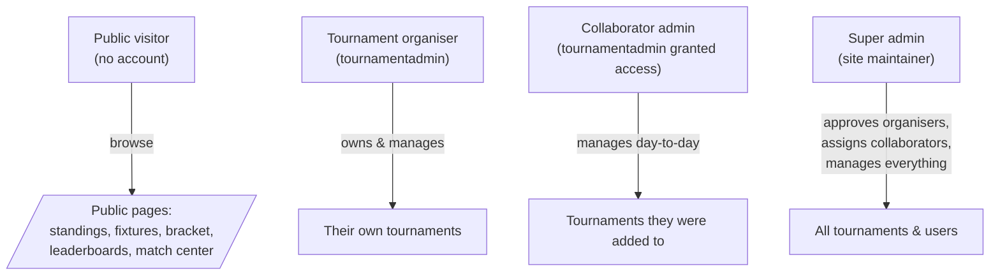

# 01 · Project Overview

[← Back to index](./README.md) · Next: [Architecture →](./02-architecture.md)

---

## 1.1 What is TourneyOps?

**TourneyOps** is a web platform for **organising and broadcasting sports tournaments**.
A single deployment can run many independent tournaments for two sports — **cricket**
and **football** — covering the full competition lifecycle:

1. **Setup** — create the tournament, configure points & tiebreakers, add teams and
   player rosters, organise teams into groups.
2. **Group stage** — auto‑generate a round‑robin schedule, enter results (quick or
   ball‑by‑ball / event‑by‑event), and watch standings recompute automatically.
3. **Knockout stage** — generate a seeded cross‑group bracket (standard single
   elimination *or* IPL‑style top‑4 playoffs), with optional third‑place playoff.
4. **Completion** — a champion is crowned; leaderboards, a "Best XI", and a Player of
   the Tournament are surfaced on public pages.

Throughout, **public visitors need no account** to browse standings, fixtures,
brackets, leaderboards, team/player profiles, and a live "Match Center", while
**organisers** manage everything from a protected admin console. Live scoring is pushed
to every open page in real time over WebSockets.

---

## 1.2 Purpose & problem statement

Running an amateur or semi‑pro tournament usually means juggling spreadsheets for
fixtures and standings, a chat group for score updates, and manual recalculation every
time a result changes. This is error‑prone (Net Run Rate maths is famously easy to get
wrong), opaque to spectators, and impossible to keep "live".

TourneyOps solves this by providing:

- **A correct, automated competition engine.** Round‑robin scheduling, points,
  Net Run Rate, goal difference, tiebreakers, and knockout seeding/advancement are all
  computed by tested, pure functions — never by hand.
- **A single source of truth.** Results (down to each ball / each goal) are the only
  authored data. Standings, player stats, and the bracket are *derived* from them, so
  an edit can never leave the tournament internally inconsistent.
- **A broadcast‑quality public experience.** A polished, dark‑first SPA with live
  tickers, win‑probability bars, worm/Manhattan charts, formation boards, generated
  commentary, and shareable result cards.
- **Multi‑tenant organiser access.** A super admin (site maintainer) approves
  organisers; each organiser owns their tournaments and can be granted collaborator
  access to others.

---

## 1.3 Business goals

| Goal | How the system delivers it |
|------|----------------------------|
| **Reduce organiser workload** | Auto‑scheduling, auto‑standings, auto‑bracket advancement, idempotent recalculation. |
| **Eliminate scoring disputes** | Every edit is audited (who/what/before/after); standings are always re‑derivable from fixtures. |
| **Engage spectators in real time** | Socket.IO live updates; public Match Center with ball‑by‑ball / event feeds. |
| **Support multiple sports without forking** | Data‑driven engines keyed on `sportType` + `pointsConfig`. |
| **Operate safely as a shared service** | Approval workflow, RBAC, owner‑vs‑collaborator separation, rate limiting, two‑token auth with revocation. |
| **Be cheap to run and easy to deploy** | Single API process + static SPA; optional CDN/Redis/SMTP that degrade gracefully when absent. |

---

## 1.4 Target users & roles



| Role | Constant | Capabilities |
|------|----------|--------------|
| **Public visitor** | — | Read‑only access to all public tournament data. No login. |
| **Tournament admin (organiser)** | `tournamentadmin` | Self‑signs up (pending approval). Once approved, can create tournaments and fully manage the ones they **own** or were **granted collaborator access** to. Can request access to others. |
| **Super admin (maintainer)** | `superadmin` | Approves/rejects organiser signups and tournament‑access requests, assigns/removes collaborators, can manage **every** tournament. Password is fixed by configuration (cannot be changed in‑app). |

> **Owner vs. collaborator.** The *creator* of a tournament is its **owner**. Owners can
> do everything including **deleting** the tournament. **Collaborators** (organisers a
> super admin added to `tournament.admins`) can manage day‑to‑day data but **cannot
> delete** the tournament. See [Security → Authorization model](./10-security.md#102-authorization-model).

---

## 1.5 Core features

### Competition management
- **Two sports, one engine:** cricket and football, selected at creation and immutable
  thereafter (changing sport would invalidate config, standings, rosters, and fixtures).
- **Configurable points & tiebreakers:** win/draw/loss/no‑result points, optional bonus
  points, and an ordered tiebreaker list per sport (NRR / head‑to‑head / total wins for
  cricket; goal difference / goals scored / head‑to‑head for football).
- **Groups & seeding:** manual group CRUD or a **snake‑draft auto‑distribute** that
  spreads seeded teams fairly across N groups.
- **Round‑robin scheduling:** single or double round‑robin via the classic circle
  method, with bye handling for odd team counts and fair home/away alternation.
- **Standings:** points, NRR (ICC‑correct, using full allotted overs when bowled out),
  goal difference, ranks, and tiebreakers — recomputed after every completed match.
- **Knockouts:** seeded cross‑group bracket with byes routed to top seeds; optional
  third‑place playoff; **or** an IPL‑style top‑4 playoff (Qualifier 1 / Eliminator /
  Qualifier 2 / Final) that gives the top two seeds a "second life".

### Scoring
- **Quick result entry** *or* **granular events** — cricket ball‑by‑ball (with extras,
  wickets, bowler credit, maidens) and football goals/cards/substitutions/lineups.
- **Live mode:** push incremental snapshots that broadcast to all viewers; flip to live
  automatically on first update.
- **Event‑level editing** of a completed match (add/edit/delete a single ball, over,
  goal, card, or substitution) with full audit and automatic re‑derivation.
- **Football formations:** per‑team default formation and per‑fixture lineup/formation
  overrides on a tactical pitch board (strict 11‑player XI from a 26‑player squad).

### Statistics & presentation
- **Player stats** (cached, always re‑derivable): cricket batting/bowling aggregates,
  football goals/assists/cards/clean sheets/appearances.
- **Leaderboards:** most runs/wickets, best strike‑rate/economy, top scorers, most
  assists, golden glove, team fair‑play — each with sensible qualification thresholds.
- **Player of the Tournament** (admin‑assigned) and an auto‑computed **Best XI**.
- **Live analytics:** transparent win‑probability, cricket worm & Manhattan charts,
  football match timeline, generated commentary, and shareable result cards.

### Platform
- **Approval workflow** for organiser self‑signup, with email notifications.
- **Per‑tournament access requests** an organiser can submit and a super admin reviews.
- **Audit log** of every admin edit, with before/after snapshots.
- **Image uploads** for logos/banners (Cloudinary, with local‑disk fallback).
- **Per‑user theme preference** (dark/light), persisted server‑side.
- **Password recovery** (enumeration‑safe) and self‑service password change.

---

## 1.6 Representative use cases

1. **Run a weekend football cup.** Organiser creates a football tournament, adds 8
   teams across 2 groups, auto‑generates the round‑robin, enters results on match day
   (spectators watch standings update live), generates a knockout with a third‑place
   playoff, and crowns a champion. Leaderboards show the golden boot and golden glove.

2. **Score a six‑over cricket league ball‑by‑ball.** Organiser scores each over live
   from the boundary; the public Match Center shows the worm chart, win probability,
   and commentary updating in real time. NRR and batting/bowling leaderboards populate
   automatically.

3. **Correct a mistake after the fact.** An organiser realises a quarter‑final winner
   was entered wrong. They edit the result; the recalculation cascade detects that a
   downstream semi‑final was already played with the now‑incorrect team and **asks for
   confirmation** before resetting it — then re‑slots the correct team.

4. **Operate as a shared community service.** Several clubs sign up as organisers; the
   site maintainer approves them, occasionally grants one club's organiser collaborator
   access to a shared regional tournament, and reviews tournament‑access requests from a
   single queue.

---

## 1.7 High‑level system overview

The platform is a **monorepo** with three workspaces:

```
TournamentManager/
├── server/   Express + MongoDB + Socket.IO API
├── client/   React 19 + Vite single-page app
└── shared/   @tms/shared — domain constants + Zod schemas used by both
```

- The **server** exposes a REST API under `/api`, emits realtime events over
  Socket.IO, and owns all business logic via a layered architecture
  (routes → middleware → controllers → services → models).
- The **client** is a static SPA that consumes the REST API (TanStack Query),
  subscribes to Socket.IO rooms, and renders both the public site and the admin console.
- The **shared** package is the *contract* between them: a single source of truth for
  enums (sports, statuses, roles, positions…), validation schemas, and pure football
  formation helpers. Importing the same module on both sides prevents the classic "the
  dropdown allows a value the backend rejects" bug.

External, **optional** dependencies (Cloudinary, Redis, SMTP) each have a built‑in
fallback so the app runs fully on a laptop with only Node and MongoDB.

Continue to [Architecture](./02-architecture.md) for the detailed component and data‑flow
view, or jump to the [Development Guide](./13-development-guide.md) to run it locally.
