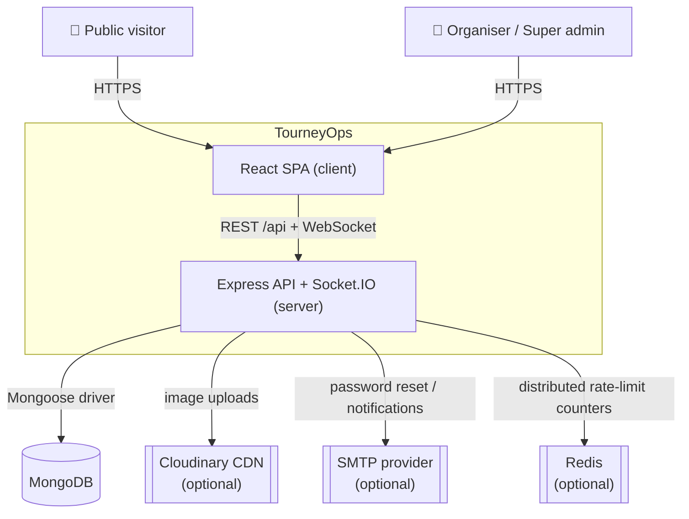
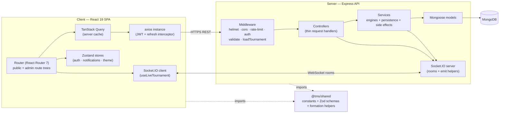
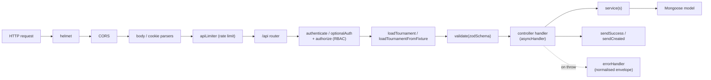
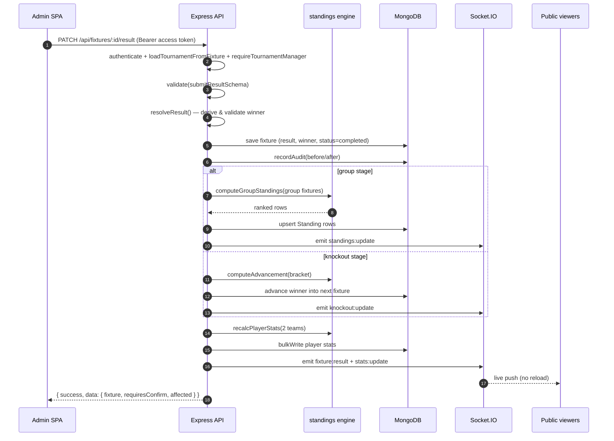
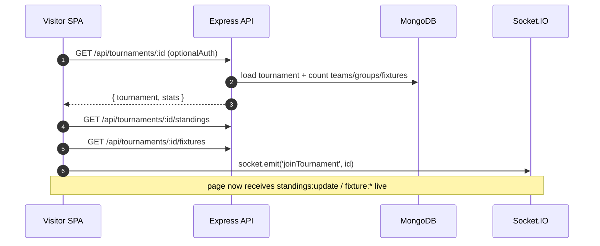
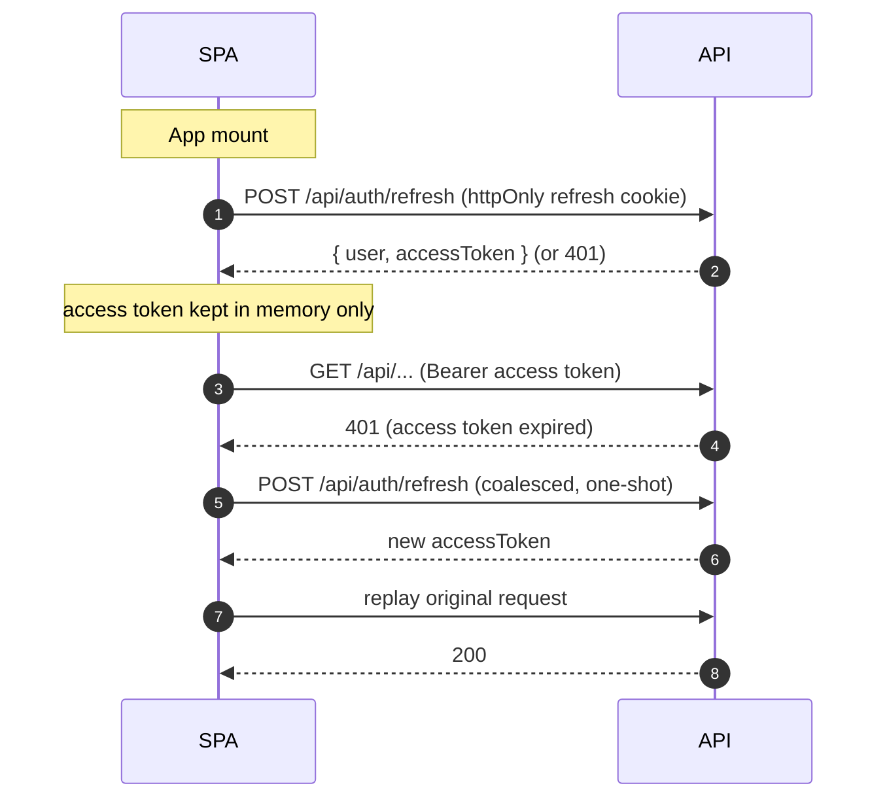
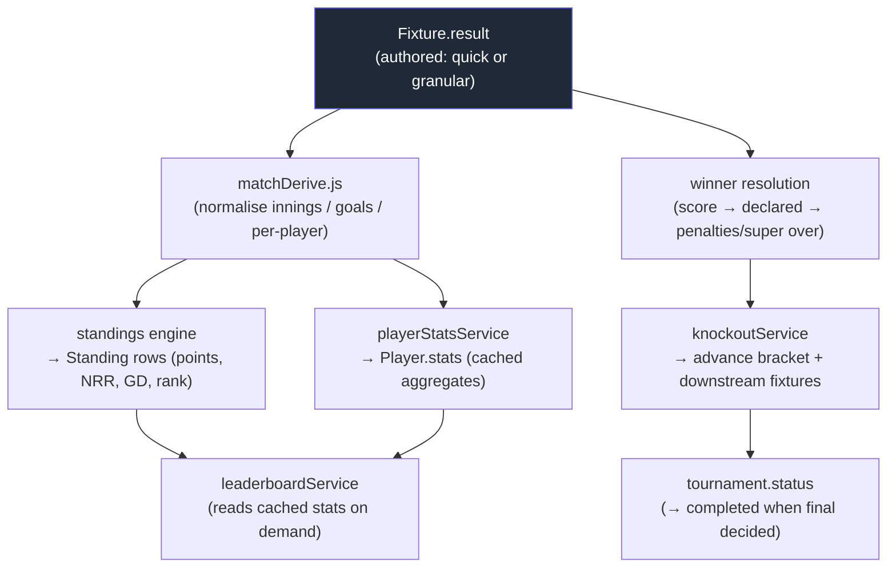
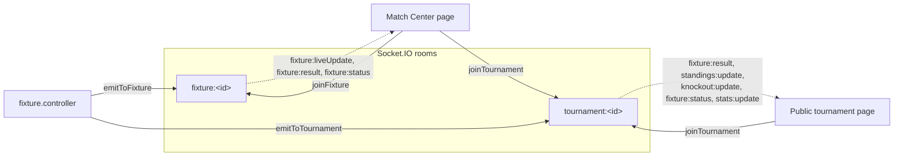
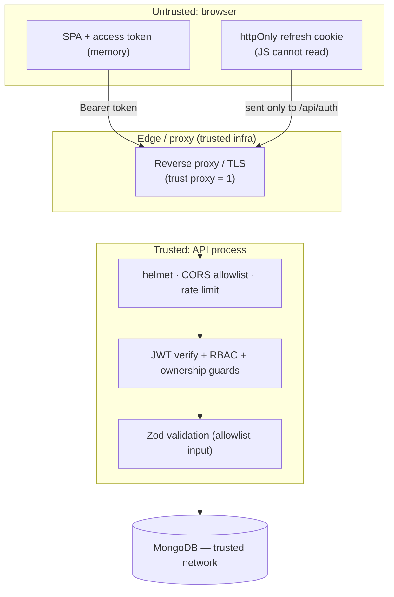

# 02 · Architecture

[← Project Overview](./01-project-overview.md) · [Back to index](./README.md) · Next: [System Design →](./03-system-design.md)

---

This document describes the **runtime architecture** of TourneyOps: how the major
components are organised, how requests and data flow through the system, the
architectural patterns and the reasons behind them, and how the system scales and stays
reliable. For the static code layout see [Code Structure](./04-code-structure.md); for
class/function‑level design see [System Design](./03-system-design.md).

---

## 2.1 System context (C4 level 1)

The platform has **two first‑party components** (SPA + API) and **three optional
third‑party integrations**, each of which has a built‑in fallback:

| Integration | Used for | Fallback when absent |
|-------------|----------|----------------------|
| Cloudinary | Storing/serving uploaded logos & banners | Local‑disk storage served at `/uploads` |
| SMTP | Password‑reset & notification emails | Messages logged to the server console (`jsonTransport`) |
| Redis | Shared rate‑limit store across instances | In‑memory per‑process rate limiting |

> **Why optional with fallbacks?** It keeps local development zero‑config (only Node +
> MongoDB are mandatory) while letting production wire up real CDN/email/Redis without
> code changes — purely via environment variables.

---

## 2.2 Container / component view (C4 level 2)

### Server layers (request pipeline)

Each layer has one job:

- **Security middleware** (`helmet`, `cors`, parsers) — defined in `server/src/app.js`.
- **Rate limiting** (`apiLimiter`, `authLimiter`) — `server/src/middleware/rateLimit.js`.
- **Authentication & RBAC** (`authenticate`, `optionalAuth`, `authorize`) —
  `server/src/middleware/auth.js`.
- **Resource loading & ownership guards** (`loadTournament`, `requireTournamentManager`,
  `requireTournamentOwner`) — `server/src/middleware/loadTournament.js`.
- **Validation** (`validate(schema)` using `@tms/shared` Zod schemas) —
  `server/src/middleware/validate.js`.
- **Controllers** — thin orchestrators that read the validated request, call services,
  emit socket events, and return the standard envelope.
- **Services** — the real work: pure engines plus database persistence and side effects.
- **Models** — Mongoose schemas with indexes.
- **Error handling** — a single central `errorHandler` normalises every error shape.

See [Backend](./07-backend.md) for the full breakdown of each layer.

---

## 2.3 Architectural patterns & rationale

| Pattern | Where | Why it was chosen |
|---------|-------|-------------------|
| **Layered / N‑tier** (routes → middleware → controller → service → model) | Server | Clear separation of concerns; controllers stay thin and testable; business rules live in services. |
| **Pure functional core, imperative shell** | `services/roundRobin.js`, `standings.js`, `knockout.js`, `matchDerive.js` are *pure*; `*Service.js` files do the DB I/O | Pure functions are trivial to unit‑test and reason about; persistence is isolated. This is the project's single most important design decision. |
| **Derived state / event‑sourcing‑lite** | Standings, player stats, bracket advancement are recomputed from fixtures | Eliminates drift: the only authored data is results; everything else is a deterministic function of them. |
| **Data‑driven polymorphism** | Sport behaviour keyed on `sportType` + `pointsConfig` | One codebase serves cricket and football; adding rules is config, not new flows. |
| **Shared contract package** | `@tms/shared` constants + Zod schemas imported by both sides | Server and client validate against the *same* rules, removing a whole class of bugs. |
| **CQRS‑flavoured reads** | Standings/leaderboards are denormalised, pre‑ranked rows read in one indexed query | Public read paths are hot; writes do the heavy computation once and store the result. |
| **Publish/subscribe (rooms)** | Socket.IO `tournament:<id>` / `fixture:<id>` rooms | Updates are pushed only to interested viewers, not broadcast globally. |
| **Two‑token authentication** | Short access token + httpOnly refresh cookie with `tokenVersion` | Balances UX (silent refresh) with security (revocation on logout/password change). |
| **Consistent response envelope** | `ApiResponse` + central `errorHandler` | Predictable client handling; the SPA has one success and one error shape to deal with. |
| **Optional‑dependency adapters** | `imageStorage.js`, `emailService.js`, `rateLimit.js` | Graceful degradation; zero‑config dev, production‑grade when configured. |

---

## 2.4 Request/response flows

### 2.4.1 Authenticated mutation (submit a group result)

### 2.4.2 Public read (load a tournament hub)

### 2.4.3 Silent session restore + 401 refresh

See [Security](./10-security.md) and [Realtime](./09-realtime-and-live-scoring.md) for
deeper treatment of these flows.

---

## 2.5 Data‑flow: results are the source of truth

The defining data‑flow principle is that **only results are authored**; everything else
is derived. This diagram shows the fan‑out triggered by saving a result.

**Consequence:** any derived artifact can be rebuilt at any time by re‑reading the
fixtures. This powers the **recalculation cascade** (`recalcService.recalculateTournament`)
and makes the demo seeder, manual recalcs, and points‑config changes safe — see
[Backend → The recalculation cascade](./07-backend.md#75-persistence--orchestration-services).

---

## 2.6 Realtime architecture

- The server keeps a singleton `io` instance (`server/src/socket/index.js`).
- Clients join a **tournament room** for page‑level updates and additionally a
  **fixture room** for granular live scoring.
- Controllers emit named events after a successful mutation; the client either
  invalidates the relevant TanStack Query cache (for results/standings/bracket) or
  updates a small piece of local React state (for high‑frequency `liveUpdate` snapshots,
  to avoid a refetch storm). Full contract in
  [Realtime & Live Scoring](./09-realtime-and-live-scoring.md).

---

## 2.7 Scalability considerations

The system is designed to scale **horizontally for reads** and to keep the **write path
cheap and bounded**.

| Concern | Design response |
|---------|-----------------|
| **Hot public read paths** | Standings/leaderboards are denormalised and pre‑ranked; reads are single indexed queries (`{tournamentId, groupId, rank}`). The browser caches with TanStack Query (`staleTime` 30s). |
| **Stateless API** | The Express process holds no per‑user session state (JWT in header, refresh in cookie). Multiple instances can run behind a load balancer. |
| **Rate‑limit across instances** | When `RATE_LIMIT_REDIS_URL` is set, limits use a shared Redis store so counters are global, not per‑process. |
| **Scoped recomputation** | A single result recomputes only the affected group's standings and the two involved teams' player stats — not the whole tournament. The expensive full pass is reserved for explicit recalcs / config changes. |
| **Bounded payloads** | JSON body limit 1 MB; image uploads capped at 2 MB; list endpoints are paginated or capped (max 200 unpaginated, 100 per page). |
| **CDN offload for assets** | Cloudinary serves images; the API serves only JSON + (optionally) local‑disk images with long immutable cache headers. |
| **Socket fan‑out scoped by room** | Events go only to viewers of the relevant tournament/fixture. |

### Multi‑instance caveat (Socket.IO)

Socket.IO with multiple API instances requires a **shared adapter** (e.g.
`@socket.io/redis-adapter`) so an event emitted on instance A reaches a client connected
to instance B. The current code uses the default in‑memory adapter, which is correct for
a **single API instance**. Scaling sockets horizontally is a documented follow‑up — see
[Maintenance Guide → Known limitations](./14-maintenance-guide.md#143-known-limitations).

---

## 2.8 Reliability & fault tolerance

| Mechanism | Where | Effect |
|-----------|-------|--------|
| **Fail‑fast config** | `server/src/config/env.js` | Missing/weak secrets throw on boot, so a broken deploy never serves traffic with a forgeable token secret. |
| **Graceful shutdown** | `server/src/index.js` | `SIGINT`/`SIGTERM` close the HTTP server, drain in‑flight requests, disconnect Mongo, with a 10s force‑exit guard. |
| **Central error handling** | `server/src/middleware/error.js` | All errors become a consistent JSON envelope; 500s log primitive strings only (so an odd error shape can't crash the handler); stack traces hidden in production. |
| **Best‑effort side effects** | `auditService.recordAudit`, `emailService.dispatchEmail` | Audit/email failures never break the primary mutation; they log and continue. |
| **Idempotent, re‑derivable state** | engines + recalc cascade | If derived data is ever wrong, an admin "Recalculate all" rebuilds it from fixtures. |
| **Transactional cascade delete** | `tournament.controller.deleteTournament` | Deletes a tournament + all dependents inside a Mongo transaction, falling back to best‑effort deletes on standalone Mongo (no replica set). |
| **Safe knockout edits** | `recalcService.planBracketReconciliation` | A clear‑then‑replay simulation detects when an edit would invalidate an already‑played later round and requires explicit confirmation before resetting it. |
| **DB connection guardrails** | `server/src/config/db.js` | Warns if a non‑production env points at a non‑local DB; 10s server‑selection timeout. |
| **Mongoose lifecycle logging** | `config/db.js` | `connected`/`error`/`disconnected` events surfaced in logs for operability. |

---

## 2.9 Trust & security boundaries

Every request crossing from the browser into the API passes through: TLS at the edge →
CORS origin allowlist → rate limiting → JWT verification → role/ownership authorization →
Zod input validation. The refresh cookie is `httpOnly`, `secure` (prod), `sameSite`
scoped, and path‑restricted to `/api/auth`. See [Security](./10-security.md) for the full
threat model.

---

## 2.10 Where to go next

- **How the engines actually compute** → [System Design](./03-system-design.md)
- **Every file and module** → [Code Structure](./04-code-structure.md)
- **Data model & indexes** → [Database](./05-database.md)
- **Endpoint contracts** → [API Reference](./06-api-reference.md)
