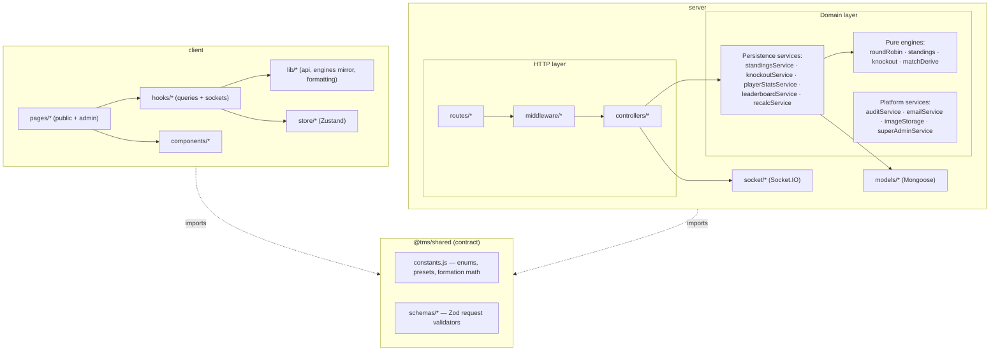
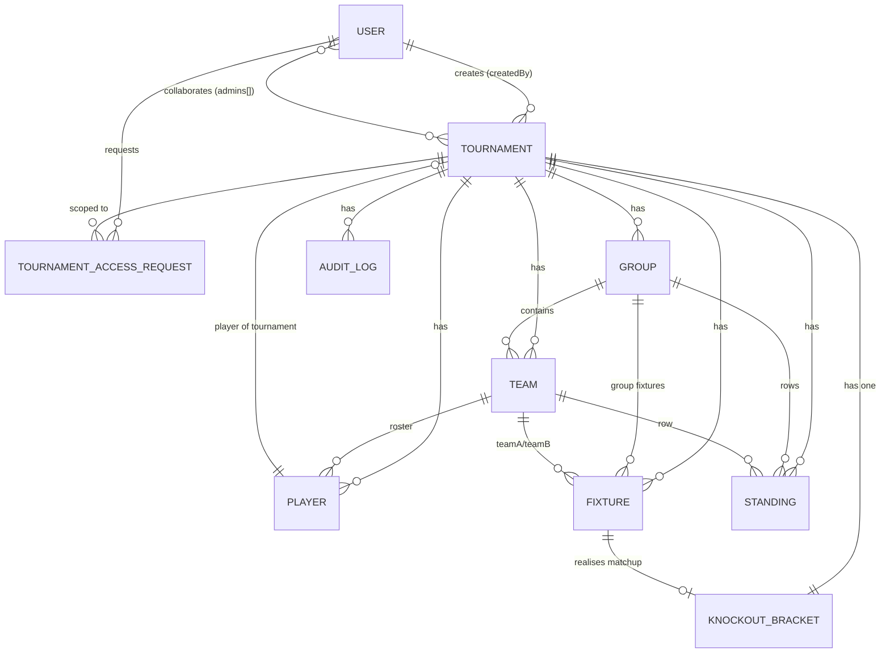
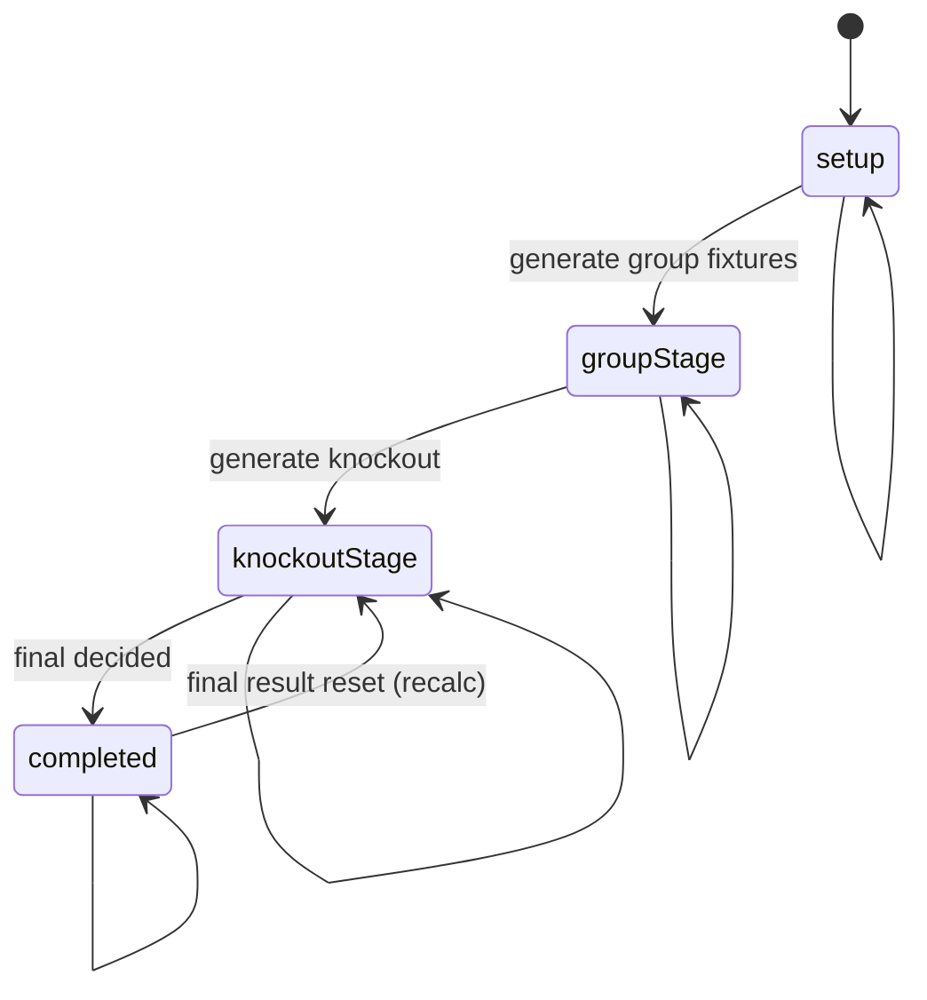
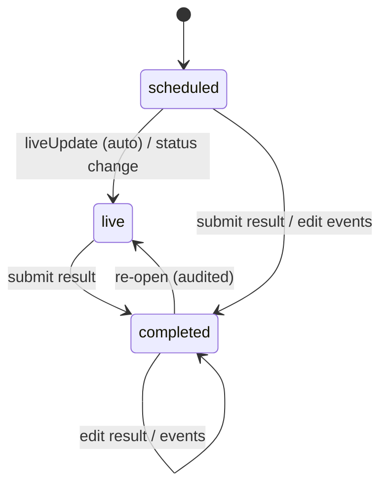
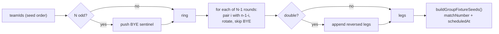
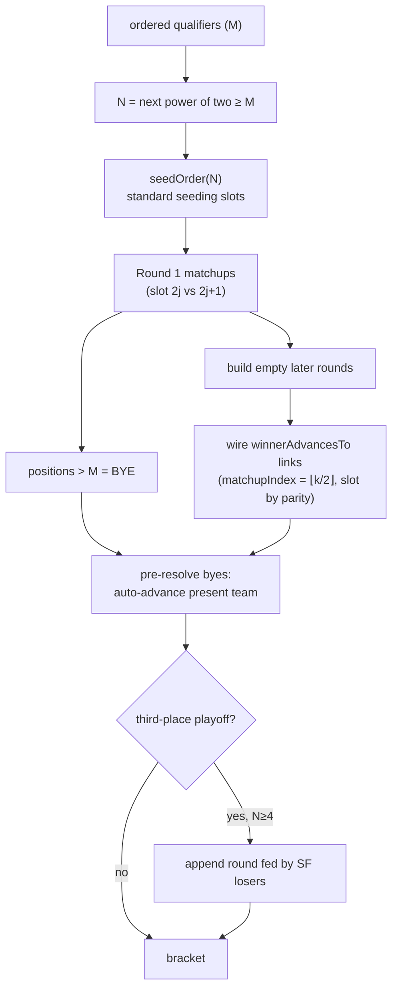
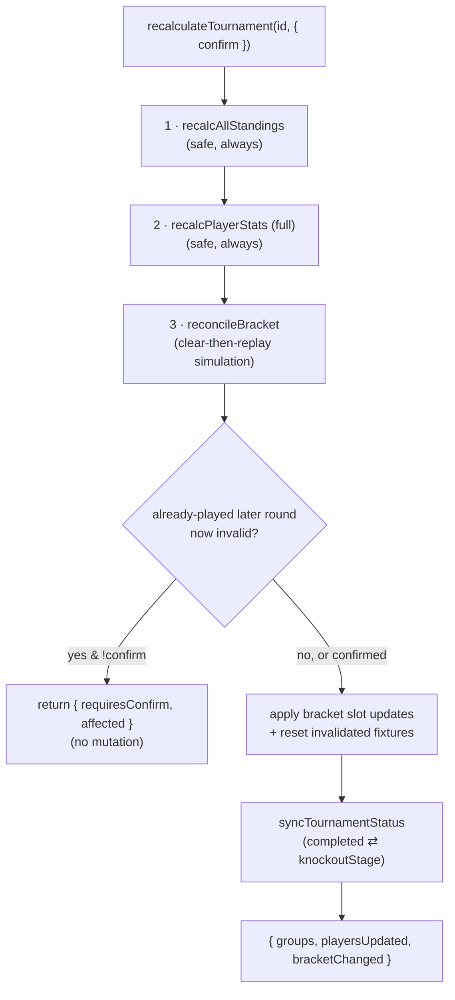
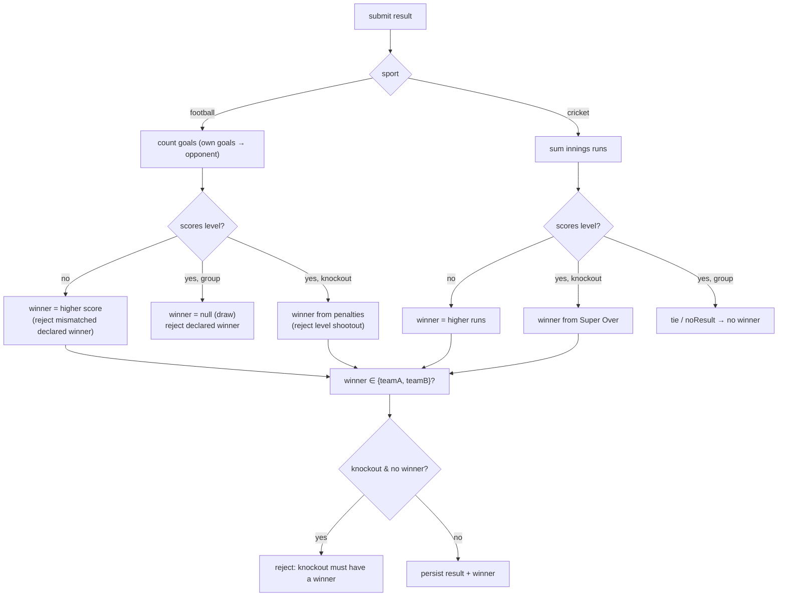

# 03 · System Design (HLD & LLD)

[← Architecture](./02-architecture.md) · [Back to index](./README.md) · Next: [Code Structure →](./04-code-structure.md)

---

This document goes from the **high‑level design (HLD)** — module decomposition and the
domain model — down to the **low‑level design (LLD)** of the algorithms that make
TourneyOps correct: round‑robin scheduling, standings + Net Run Rate, knockout seeding &
advancement, the derivation layer, and the recalculation cascade. It closes with the
design patterns used, the key trade‑offs, and performance characteristics.

---

## 3.1 High‑level design

### 3.1.1 Module decomposition



### 3.1.2 Bounded contexts / domains

| Domain | Owns | Key models | Key services |
|--------|------|------------|--------------|
| **Identity & access** | Users, roles, approval, sessions | `User`, `TournamentAccessRequest` | `superAdminService`, `auth.controller`, `tokens` |
| **Tournament configuration** | Tournament, points config, groups, teams, players, formations | `Tournament`, `Group`, `Team`, `Player` | `tournament.controller`, `group.controller`, `team.controller` |
| **Scheduling** | Fixtures, round‑robin | `Fixture` | `roundRobin`, `fixture.controller` |
| **Scoring & derivation** | Results, live state, events | `Fixture.result` / `liveState` | `matchDerive`, `fixture.controller` |
| **Standings** | Group tables, NRR, ranks | `Standing` | `standings`, `standingsService` |
| **Knockout** | Bracket, advancement, reconciliation | `KnockoutBracket` | `knockout`, `knockoutService`, `recalcService` |
| **Statistics** | Cached player aggregates, leaderboards | `Player.stats` | `playerStatsService`, `leaderboardService` |
| **Audit & ops** | Audit trail, recalculation | `AuditLog` | `auditService`, `recalcService`, `recalc.controller` |
| **Assets & comms** | Image uploads, email | — | `imageStorage`, `emailService` |

### 3.1.3 Domain model (entity relationships)



The full field‑level schema for each entity is in [Database](./05-database.md).

### 3.1.4 Tournament lifecycle (state machine)



Transitions are enforced server‑side in `tournament.controller.updateStatus` via the
`ALLOWED_STATUS_TRANSITIONS` table (no skipping stages), **and** advanced automatically:
generating group fixtures moves `setup → groupStage`; generating a knockout moves to
`knockoutStage`; deciding the final moves to `completed`; resetting the final during a
recalc reverts `completed → knockoutStage`.

### 3.1.5 Fixture lifecycle



---

## 3.2 Low‑level design: the engines

The four files in `server/src/services/` named `roundRobin.js`, `standings.js`,
`knockout.js`, and `matchDerive.js` are **pure** (no DB, no I/O, no globals). They are
the algorithmic heart of the system and are covered by the Vitest suite
([Testing](./12-testing.md)).

### 3.2.1 Round‑robin scheduling — `roundRobin.js`

**Goal:** given N teams, produce a schedule where every team plays every other team
exactly once (single) or twice (double), with no team playing twice in a round and a
fair home/away balance.

**Algorithm — the "circle method":**

1. If N is odd, append a `BYE` sentinel so the ring is even (each real team then sits out
   exactly one round, in rotation).
2. Fix team at index 0; rotate all others one step clockwise each round.
3. For `N` (possibly padded) teams there are `N‑1` rounds, each pairing `ring[i]` with
   `ring[n‑1‑i]`. Pairings involving `BYE` are skipped.
4. Home/away alternates per slot and per round (`(round + i) % 2`).
5. For a **double** round‑robin, append the same schedule with home/away reversed and
   round numbers continuing.



`buildGroupFixtureSeeds()` then flattens rounds into fixture seeds, assigning a
sequential `matchNumber` and a `scheduledAt` that advances by `daysBetweenRounds` per
round (when a `startDate` is given). The controller (`generateGroupStage`) maps `home/away`
to `teamA/teamB` and persists them.

**Complexity:** O(N²) pairings (inherent — that's how many matches exist). Verified by
`server/tests/roundRobin.test.js`.

### 3.2.2 Standings & Net Run Rate — `standings.js`

**Entry point:** `computeGroupStandings({ sport, pointsConfig, teamIds, fixtures })`
returns fully ranked plain rows for one group.

**Steps:**

1. Initialise an empty row per team.
2. For each **completed** fixture with a result, accumulate per sport:
   - **Football** (`accumulateFootball`): goals for/against (own goals credited to the
     opponent via `deriveFootballGoals`), W/D/L and points (a level group score is a
     draw — penalties never affect group points).
   - **Cricket** (`accumulateCricket`): for each innings, add runs/overs for and against;
     **if a side is all out (10 wickets), use its full allotted overs** for NRR per ICC
     convention. Outcome from innings totals (or declared winner), with `tie`/`noResult`
     handled as shared points.
3. Apply any explicit per‑team `bonus` points carried on the result.
4. Derive `netRunRate = runsFor/oversFor − runsAgainst/oversAgainst` (rounded to 3 dp)
   and `goalDifference = goalsFor − goalsAgainst`.
5. **Sort:** by points desc, then by the configured `tiebreakerOrder` (applied left to
   right), then a deterministic `teamId` fallback so ranks are stable.
6. Assign `rank = index + 1`.

**Net Run Rate detail (`oversToDecimal`):** cricket over notation `19.4` means *19 overs
and 4 balls* = `19 + 4/6 ≈ 19.667`. Balls beyond `.5` are clamped defensively. This
conversion is essential — naïvely treating `19.4` as a decimal would corrupt NRR.

**Tiebreakers (`compareByTiebreakers`):**

| Key | Sport | Comparison |
|-----|-------|------------|
| `netRunRate` | cricket | higher NRR wins |
| `goalDifference` | football | higher GD wins |
| `goalsScored` | football | more goals for wins |
| `totalWins` | cricket | more wins |
| `headToHead` | both | more points taken in direct meetings (built by `buildHeadToHead`) |

> **Why recompute, not increment?** Incrementing standings on each result is the classic
> source of "the table is wrong and nobody knows why" bugs (a missed decrement on an
> edit, a double‑count on a retry). Recomputing the whole group from its completed
> fixtures is O(matches‑in‑group) — tiny — and is *correct by construction* every time.

Validated by `server/tests/standings.test.js`.

### 3.2.3 Knockout bracket — `knockout.js`

This engine builds the bracket structure and computes advancement. It never touches the
DB; `knockoutService.js` persists what it returns.

**Qualifier collection (`collectQualifiers`):** from each group's ranked team list, take
the top `qualifiersPerGroup`, ordered **position‑first then group‑order**:
`[A1, B1, C1, …, A2, B2, C2, …]`, each tagged with a readable label (`A1`, `B2`, …).

**Standard single elimination (`generateBracket`):**



- `seedOrder(size)` produces the standard seeding where each round‑1 pair sums to
  `size + 1` (`seedOrder(8) = [1,8,4,5,2,7,3,6]`). Combined with the position‑first
  qualifier order, this naturally yields **cross‑group** round‑1 pairings (a group winner
  meets a *different* group's runner‑up) and keeps same‑group rematches out of round 1.
- Non‑power‑of‑two fields are padded with byes routed to the **top seeds**, which are
  pre‑advanced into round 2.
- An optional **third‑place playoff** round is appended, fed by the two semifinal losers
  via `loserAdvancesTo`.

**IPL‑style playoff (`generatePlayoffBracket`):** the top four seeds play:

```
Qualifier 1 : seed1 v seed2  → winner → Final,        loser → Qualifier 2
Eliminator  : seed3 v seed4  → winner → Qualifier 2,  loser → out
Qualifier 2 : (loser Q1) v (winner Elim) → winner → Final, loser → out
Final       : (winner Q1) v (winner Q2)
```

The top two seeds get a "second life" (losing Q1 is not elimination). This is expressed
entirely through the same `winnerAdvancesTo` / `loserAdvancesTo` links, so advancement and
reconciliation work unchanged.

**Advancement (`computeAdvancement`):** given a completed matchup and its winner/loser,
returns the slot edits to apply — push the winner into `winnerAdvancesTo`, and (for
semifinals) push the loser into `loserAdvancesTo`. Returns a list of edits for the caller
to persist (keeping the engine pure).

Validated by `server/tests/knockout.test.js`.

### 3.2.4 Derivation layer — `matchDerive.js`

This module turns **authored results** (quick aggregates *or* granular events) into the
normalised totals the standings engine needs and the per‑player contributions the stats
service needs. It degrades gracefully: if only aggregate fields exist, it uses them; if
ball‑by‑ball / event detail exists, it derives totals from that.

| Function | Produces |
|----------|----------|
| `deriveCricketInnings(inn)` | Normalised `{ runs, wickets, overs, extras }` — from `oversDetail` when present, else aggregates. Correctly: wides/no‑balls cost the score +1 but are not legal balls; byes/leg‑byes are legal but not charged to the bowler. |
| `deriveCricketPlayerStats(fixture)` | Per‑player batting (runs, balls faced, 4s/6s, dismissal) and bowling (balls, runs conceded, wickets, **maidens** = 6 legal balls, 0 charged). |
| `deriveFootballGoals(result, a, b)` | Goals per side (own goals credited to the opponent). |
| `deriveFootballPlayerStats(fixture)` | Per‑player goals/assists/own‑goals/cards. |
| `deriveFootballTeamCredits(fixture, roster)` | Appearances + goalkeeping clean sheets/goals conceded — exact from the named Playing XI when present, else a legacy heuristic (event participants + rostered keepers). |
| `deriveLiveTicker(sport, state, a, b)` | A flat score snapshot for the public live ticker. |
| `ballsToOvers(balls)` | Inverse of `oversToDecimal` (e.g. 7 legal balls → `1.1`). |

Validated by `server/tests/matchDerive.test.js` and `server/tests/formationRegression.test.js`.

---

## 3.3 Low‑level design: the recalculation cascade

The cascade (`recalcService.recalculateTournament`) is the system's correctness
backstop. It rebuilds **everything derived** from fixtures in one pass:



**The delicate part — bracket reconciliation (`planBracketReconciliation`):** if a
completed result is edited so its winner changes, the team it sent forward may already
have *played* a later round. The planner uses **clear‑then‑replay** on a deep clone:

1. Find every "fed" slot (a destination of some advancement link) — these are derived,
   never seeded, so they are safe to clear.
2. Clear those slot team ids (first‑round seeds are preserved; labels kept as cosmetic
   placeholders).
3. Replay byes + completed results **in round order**, advancing a result *only while the
   fixture's recorded participants still match the replayed bracket slots* — a stale
   completed match never feeds forward.
4. Diff the replayed bracket against each fixture: any whose required teams changed is
   updated; if it was already completed it is flagged as `affected` and reset.

If any `affected` fixtures exist and `confirm` is `false`, the cascade **returns without
mutating** so the admin can confirm before downstream matches are invalidated. This is
surfaced in the UI via `useSubmitResult` / `useRecalculate`.

> **Why clear‑then‑replay instead of incremental fix‑up?** A single corrected result can
> ripple forward two or more rounds (correcting a quarterfinal can un‑decide the final).
> Trying to patch only the touched slots is fragile; replaying from a clean slate is
> simple and provably consistent.

---

## 3.4 Result winner resolution (LLD)

`fixture.controller.resolveResult` is the single place that decides a fixture's `winner`,
applying sport‑ and stage‑specific rules and rejecting contradictory input:



After resolution, cricket results are **folded for storage** (`normalizeForStorage`):
ball‑by‑ball detail is collapsed back into aggregate innings fields so the stored result
is internally consistent, while granular `oversDetail` is preserved untouched.

---

## 3.5 Design patterns catalogue

| Pattern | Concrete usage |
|---------|----------------|
| **Pure function / functional core** | `roundRobin`, `standings`, `knockout`, `matchDerive`. |
| **Service layer** | `*Service.js` orchestrate engines + persistence + side effects. |
| **Repository (via Mongoose models)** | Models encapsulate collection access; services compose them. |
| **Middleware chain (decorator)** | `authenticate → loadTournament → requireTournamentManager → validate → handler`. |
| **Strategy (data‑driven)** | Sport branch selection; single‑elimination vs playoff bracket builders. |
| **Adapter** | `imageStorage` (Cloudinary ↔ disk), `emailService` (SMTP ↔ jsonTransport), `rateLimit` (Redis ↔ memory). |
| **Factory** | `ApiError.badRequest/...`, `emptyMatchup()`, `emptyRow()`. |
| **Template method** | `recalculateTournament` defines the fixed cascade order; steps vary. |
| **Observer / pub‑sub** | Socket.IO rooms + event emits. |
| **Singleton** | `getSocket()` (client), `io` (server), `getTransporter()`. |
| **Envelope / DTO** | `sendSuccess`/`sendCreated`; controllers shape lean DTOs (e.g. `projectPlayer`, `toRequestSummary`). |
| **Guard clauses** | Ownership/manager guards as dedicated middleware. |

---

## 3.6 Key trade-offs & technical decisions

| Decision | Alternative considered | Why this choice |
|----------|------------------------|-----------------|
| **Derive standings/stats from fixtures** | Incrementally maintain counters | Correctness & auditability over micro‑optimisation; recompute cost is negligible at tournament scale. |
| **Cache player stats on the `Player` doc** | Always derive on read | Leaderboards read by many viewers; caching makes reads O(players). Cache is re‑derivable, so staleness is never permanent. |
| **MongoDB document model** | Relational DB | The domain is naturally document‑shaped (a result is a nested object; a bracket is a tree); denormalised reads are fast; no rigid migrations for evolving result shapes (`Mixed` result). |
| **`result` as `Mixed`** | Strict subdocument per sport | Result shapes differ by sport and evolve (events were added later); Zod validates on write, so flexibility doesn't cost safety. |
| **Two‑token JWT auth** | Server sessions | Stateless API scales horizontally; `tokenVersion` still gives revocation. |
| **Access token in memory (client)** | localStorage | Reduces XSS token theft; refresh cookie is httpOnly. |
| **Shared Zod package** | Duplicate validation | One source of truth eliminates client/server validation drift. |
| **Single Socket.IO instance (default adapter)** | Redis adapter now | Simpler ops for the common single‑instance deployment; documented upgrade path for scale. |
| **IPL playoff via the same advancement model** | A separate bracket type with bespoke logic | Reuses `winnerAdvancesTo`/`loserAdvancesTo`, so advancement + reconciliation need no special cases. |
| **Confirm‑before‑reset on bracket edits** | Silently rewrite downstream | Never destroys recorded results without explicit operator consent. |

---

## 3.7 Performance considerations

| Path | Cost | Notes |
|------|------|-------|
| Generate group fixtures | O(N²) per group, single `insertMany` | Bounded by tournament size. |
| Submit a result (group) | Recompute one group's standings + 2 teams' player stats | Scoped, not whole‑tournament. |
| Submit a result (knockout) | Advance one matchup; full reconcile only on re‑submit of an already‑played match | Re‑submit triggers the full cascade because ripples can be multi‑round. |
| Read standings | One indexed query `{tournamentId, groupId, rank}` | Pre‑ranked, denormalised. |
| Read leaderboards | Reads cached `Player.stats`, ranks in memory, slices top 15 | No per‑request derivation. |
| Player profile | Re‑derives that player's per‑match lines from completed fixtures | On‑demand; acceptable for a single profile page. |
| Full recalc | O(all completed fixtures) standings + stats + bracket replay | Admin‑initiated; the expensive path, used rarely. |

Indexing strategy backing these is documented in
[Database → Indexing strategy](./05-database.md#54-indexing-strategy). Client‑side, TanStack
Query caches with a 30s `staleTime` and high‑frequency live updates bypass refetching by
patching local state — see [Frontend](./08-frontend.md) and
[Realtime](./09-realtime-and-live-scoring.md).
