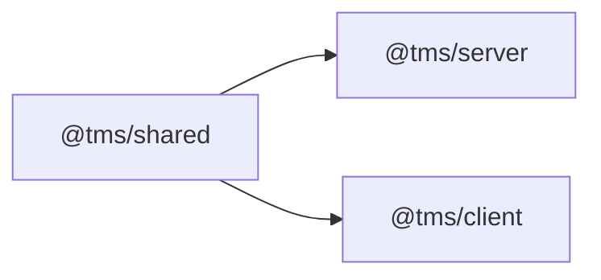

# 04 · Code Structure

[← System Design](./03-system-design.md) · [Back to index](./README.md) · Next: [Database →](./05-database.md)

---

This document is the **map of the repository**: the workspace layout, a file‑by‑file
description of every meaningful module, and the rationale for the major dependencies. Use
it to locate code quickly and to understand what each file is responsible for.

---

## 4.1 Monorepo layout

TourneyOps is an npm‑workspaces‑style monorepo (linked via `file:` dependencies) with
three packages:

```
TournamentManager/
├── package.json            # root scripts (install:all, dev, seed, build, test)
├── README.md               # quick-start
├── LICENSE
├── .gitignore
├── docs/                   # ← this documentation
├── shared/                 # @tms/shared — constants + Zod schemas (no build step)
├── server/                 # @tms/server — Express + MongoDB + Socket.IO API
└── client/                 # @tms/client — React 19 + Vite SPA
```

**Dependency direction:** both `server` and `client` depend on `shared`; `shared` depends
on nothing but `zod`. This keeps the contract package free of framework/runtime concerns.



### Root `package.json` scripts

| Script | Action |
|--------|--------|
| `npm run install:all` | Install root + shared + server + client deps |
| `npm run dev` | Run API and SPA concurrently |
| `npm run dev:server` / `dev:client` | Run one side only |
| `npm run build` | Production build of the SPA |
| `npm start` | Start the API (production) |
| `npm run seed` / `seed:demo` | Seed super admin / demo dataset |
| `npm run setup` | install:all → seed → seed:demo |
| `npm test` | Run the server Vitest suite |

---

## 4.2 `shared/` — the domain contract

```
shared/
├── package.json            # exports ".", "./constants", "./schemas"
└── src/
    ├── index.js            # re-exports constants + schemas namespace
    ├── constants.js        # enums, presets, formation math (single source of truth)
    └── schemas/
        ├── index.js        # barrel of all schemas
        ├── common.js       # objectId, isoDate, hexColor, imageAssetUrl, pagination
        ├── auth.schema.js
        ├── user.schema.js
        ├── tournament.schema.js
        ├── team.schema.js
        ├── group.schema.js
        ├── fixture.schema.js
        ├── result.schema.js
        ├── knockout.schema.js
        ├── formation.schema.js
        └── tournamentAccess.schema.js
```

| File | Responsibility |
|------|----------------|
| `constants.js` | All domain enums (`SPORTS`, `USER_ROLES`, `TOURNAMENT_STATUS`, `FIXTURE_STAGE/STATUS`, `APPROVAL_STATUS`, audit enums, card/extra/wicket/goal types), `PLAYER_CATEGORIES`, `THEME_VALUES`, `TIEBREAKERS`, `DEFAULT_POINTS_CONFIG`, knockout round names, **football position vocabulary** (canonical + legacy aliases + labels + groups), **formation presets** (percentage pitch anchors for 9 formations), squad‑size constants (11 pitch + 15 bench = 26), and pure helpers to **normalise/infer football positions and formation roles** from pitch coordinates. |
| `schemas/*` | Zod request validators consumed by the server `validate` middleware and by the client before mutating. Each schema validates a `{ body, query, params }` envelope. Field‑level detail is in [API Reference](./06-api-reference.md). |

> **Why a shared package?** The server uses these constants as Mongoose enums and Zod
> validators; the client uses them for form options and display. Importing the *same*
> module guarantees the UI can never offer a value the API rejects. The formation math
> lives here too because both the admin editor and public board need identical role
> inference. Note: `shared` resolves its **own** copy of `zod`, which is why the server
> detects `ZodError` by shape, not `instanceof` (see `server/src/utils/zodError.js`).

---

## 4.3 `server/` — the API

```
server/
├── package.json
├── .env.example            # documented environment template
├── README.md
├── uploads/                # local-disk image fallback (gitignored contents)
├── src/
│   ├── index.js            # bootstrap: connect DB, seed admin, start HTTP + sockets
│   ├── app.js              # Express app: security, parsers, routes, static, errors
│   ├── config/
│   │   ├── env.js          # validated env access (fail-fast on weak/missing secrets)
│   │   └── db.js           # Mongoose connection + lifecycle logging + guardrails
│   ├── models/             # Mongoose schemas (see Database doc)
│   ├── middleware/         # auth, validate, rateLimit, error, loadTournament, upload
│   ├── controllers/        # thin request handlers
│   ├── routes/             # REST routing (nested under /tournaments/:id)
│   ├── services/           # engines + persistence + platform services
│   ├── socket/             # Socket.IO rooms + emit helpers
│   ├── utils/              # ApiError, ApiResponse, asyncHandler, tokens, zodError
│   └── scripts/            # seed.js, seedDemo.js
└── tests/                  # Vitest engine tests
```

### 4.3.1 Bootstrap & config

| File | Responsibility |
|------|----------------|
| `src/index.js` | Entry point. Connects to MongoDB, ensures the seed super admin exists, warns if Cloudinary is unconfigured in prod, creates the HTTP server, attaches Socket.IO, listens, and wires graceful shutdown on `SIGINT`/`SIGTERM`. |
| `src/app.js` | Builds the Express app: `trust proxy`, Helmet (cross‑origin resource policy for images), CORS allowlist with credentials, JSON (1 MB) + urlencoded + cookie parsers, `morgan` in dev, the `apiLimiter`, the `/api` router, static `/uploads`, then `notFound` + `errorHandler`. |
| `src/config/env.js` | Centralised, **validated** env. Throws on missing required vars; rejects weak/short secrets outside dev/test; parses CORS origins, JWT settings, Cloudinary/SMTP/Redis config, and seed credentials. |
| `src/config/db.js` | `connectDB`/`disconnectDB`. Sets `strictQuery`, warns if a non‑prod env points at a non‑local DB, logs connection lifecycle, 10s server‑selection timeout. |

### 4.3.2 Models (`src/models/`)

| File | Entity |
|------|--------|
| `index.js` | Barrel re‑export of all models. |
| `User.js` | Accounts, roles, approval, password hashing, `tokenVersion`, theme prefs, reset‑token hash. |
| `Tournament.js` | Tournament config: sport, points config (+ bonus, tiebreakers), group settings, status, knockout lock, POTM, owner + collaborator admins. |
| `Group.js` | Named group with ordered team membership. |
| `Team.js` | Team with short code, colour, group, seed, optional default football formation. |
| `Player.js` | Roster entry with role/category and **cached** cricket/football stat subdocs. |
| `Fixture.js` | A match: stage, round linkage, teams, schedule, status, `Mixed` result + liveState, winner, bye flag. |
| `Standing.js` | Denormalised per‑(group,team) standings row. |
| `KnockoutBracket.js` | The bracket tree: rounds → matchups (slots, labels, advancement links, flags), format, lock. |
| `AuditLog.js` | Append‑only edit history with before/after snapshots. |
| `TournamentAccessRequest.js` | Organiser requests for tournament collaborator access. |

Full schemas, indexes, and relationships: [Database](./05-database.md).

### 4.3.3 Middleware (`src/middleware/`)

| File | Exports | Responsibility |
|------|---------|----------------|
| `auth.js` | `authenticate`, `authorize`, `optionalAuth` | Verify JWT, re‑load live user (rejects deactivated/unapproved/role‑changed), enforce `tokenVersion`, RBAC, optional auth for public‑but‑personalised routes. |
| `loadTournament.js` | `loadTournament`, `loadTournamentFromFixture`, `requireTournamentManager`, `requireTournamentOwner`, `canManageTournament`, `isTournamentOwner` | Load `req.tournament` once; enforce manager (owner/collaborator/super admin) vs owner‑only access. |
| `validate.js` | `validate(schema)` | Parse `{body,query,params}` with a Zod schema; replace request fields with coerced values; convert Zod errors to 422. |
| `rateLimit.js` | `apiLimiter`, `authLimiter` | App‑wide (300/min) and auth (30/15min) limiters, backed by Redis when configured. |
| `error.js` | `notFound`, `errorHandler` | 404 for unmatched routes; central error normaliser (Zod/Mongoose/JWT/dup‑key → envelope). |
| `upload.js` | `handleImageUpload` | Multer single‑file, in‑memory, MIME‑allowlisted, 2 MB cap; normalises multer errors. |

### 4.3.4 Controllers (`src/controllers/`)

Thin handlers wrapped in `asyncHandler`. Each reads the validated request, calls services,
emits socket events, and returns the standard envelope.

| File | Handles |
|------|---------|
| `auth.controller.js` | signup, register, login, refresh, logout(+all), me, preferences, change/forgot/reset password. |
| `user.controller.js` | super‑admin user directory + approval decisions. |
| `tournament.controller.js` | tournament CRUD, points config, status transitions, POTM, collaborators (list/search/assign/remove), cascade delete. |
| `group.controller.js` | group CRUD + snake‑draft auto‑distribute. |
| `team.controller.js` | team CRUD, default formation, roster (player) CRUD with sport‑aware role validation & squad‑size rules. |
| `fixture.controller.js` | generate group stage, list/get fixture, update fixture, **submit result**, **live update**, **edit events**. The largest controller (winner resolution + cascades + broadcasts). |
| `standing.controller.js` | public standings, manual standings recalc. |
| `knockout.controller.js` | get/generate/adjust/lock bracket. |
| `leaderboard.controller.js` | leaderboards, tournament players list, single player profile. |
| `recalc.controller.js` | full recalculation cascade + audit‑log listing. |
| `tournamentAccessRequest.controller.js` | request/list/review tournament access. |
| `upload.controller.js` | image upload. |

Endpoint‑level detail: [API Reference](./06-api-reference.md). Business logic: [Backend](./07-backend.md).

### 4.3.5 Routes (`src/routes/`)

| File | Mount | Notes |
|------|-------|-------|
| `index.js` | `/api` | Health check + mounts auth, users, tournaments, fixtures, players, uploads, tournament‑access‑requests. |
| `auth.routes.js` | `/api/auth` | Applies `authLimiter` to all auth traffic. |
| `user.routes.js` | `/api/users` | All super‑admin only. |
| `tournament.routes.js` | `/api/tournaments` | Collection + single tournament + **nested** team/group/fixture/standing/knockout/stats routers (all scoped to `:id`). |
| `team.routes.js` | `/api/tournaments/:id/teams` | `mergeParams` to read `:id`. |
| `group.routes.js` | `/api/tournaments/:id/groups` | |
| `tournamentFixture.routes.js` | `/api/tournaments/:id/fixtures` | Generate + list group fixtures. |
| `fixture.routes.js` | `/api/fixtures/:fixtureId` | Top‑level fixture ops (parent tournament resolved from the fixture). |
| `standing.routes.js` | `/api/tournaments/:id/standings` | |
| `knockout.routes.js` | `/api/tournaments/:id/knockouts` | |
| `stats.routes.js` | `/api/tournaments/:id` | `/leaderboards`, `/players`. |
| `player.routes.js` | `/api/players/:id/stats` | Public player profile. |
| `tournamentAccessRequest.routes.js` | `/api/tournament-access-requests` | Super‑admin queue. |
| `upload.routes.js` | `/api/uploads` | Authenticated image upload. |

### 4.3.6 Services (`src/services/`)

| File | Kind | Responsibility |
|------|------|----------------|
| `roundRobin.js` | **pure engine** | Circle‑method scheduling + fixture seeds. |
| `standings.js` | **pure engine** | Points/NRR/GD/tiebreakers/ranking; `oversToDecimal`. |
| `knockout.js` | **pure engine** | Seed order, qualifier collection, bracket generation (single‑elim + playoff), advancement. |
| `matchDerive.js` | **pure engine** | Normalise innings/goals; per‑player contributions; live ticker; over↔ball conversions. |
| `standingsService.js` | persistence | Recompute + upsert standings (per group / all / per fixture). |
| `knockoutService.js` | persistence | Build ranked groups, generate & persist bracket + fixtures, adjust, lock, advance after result. |
| `recalcService.js` | persistence | The recalculation cascade + bracket reconciliation planner. |
| `playerStatsService.js` | persistence | Rebuild cached player aggregates (scoped or full) via `bulkWrite`. |
| `leaderboardService.js` | read model | Compute sport‑specific leaderboards + single player profile. |
| `auditService.js` | platform | Best‑effort audit writer + paginated reader. |
| `emailService.js` | platform (adapter) | SMTP or console fallback; templated emails (reset, access requests, decisions). |
| `imageStorage.js` | platform (adapter) | Cloudinary or local‑disk image persistence; MIME allowlist (no SVG). |
| `superAdminService.js` | platform | Ensure/sync the configured seed super admin on boot. |

The legacy filenames `services/standings.js` (engine) vs `services/standingsService.js`
(DB glue), and `services/knockout.js` (engine) vs `services/knockoutService.js` (DB glue),
encode the **pure‑core / imperative‑shell** split deliberately.

### 4.3.7 Socket, utils, scripts, tests

| File | Responsibility |
|------|----------------|
| `socket/index.js` | `initSocket`, room helpers, `EVENTS` contract, `emitToTournament`/`emitToFixture`. Validates room ids are ObjectIds. |
| `utils/ApiError.js` | Operational error class + status factories. |
| `utils/ApiResponse.js` | `sendSuccess` / `sendCreated` envelope. |
| `utils/asyncHandler.js` | Forwards async rejections to the error middleware. |
| `utils/tokens.js` | Sign/verify access & refresh JWTs; refresh‑cookie options. |
| `utils/zodError.js` | Shape‑based `ZodError` detection + issue formatting. |
| `scripts/seed.js` | Idempotent super‑admin seed (+ legacy approval backfill). |
| `scripts/seedDemo.js` | Drives the real engines to build 3 internally consistent demo tournaments (idempotent, scoped to the demo owner). |
| `tests/*.test.js` | Vitest unit tests for the engines + a cross‑package formation regression test. |

---

## 4.4 `client/` — the SPA

```
client/
├── package.json
├── vite.config.js          # React + Tailwind v4 plugins, @ alias, dev proxy, manual chunks
├── index.html
├── jsconfig.json
├── public/                 # manifest.webmanifest, sw.js (PWA), trophy.svg
└── src/
    ├── main.jsx            # provider stack + PWA registration
    ├── App.jsx             # route tree (lazy-loaded) + guards
    ├── index.css           # Tailwind v4 CSS-first theme tokens (dark + light)
    ├── lib/                # api, socket, queryClient, domain mirrors, formatting
    ├── store/              # Zustand: auth, notifications, theme
    ├── hooks/              # queries (TanStack), live (sockets), small utilities
    ├── components/         # ui primitives, layout, admin, charts, feature components
    └── pages/
        ├── public/         # viewer pages + PublicTournamentLayout
        └── admin/          # admin console pages + layouts
```

### 4.4.1 App shell

| File | Responsibility |
|------|----------------|
| `main.jsx` | Provider stack: `StrictMode → MotionConfig → QueryClientProvider → BrowserRouter → ErrorBoundary → TooltipProvider → ConfirmProvider → App` + `ThemedToaster`; registers the PWA service worker in production. |
| `App.jsx` | Declares the full route tree, code‑splits every page with `React.lazy`, calls `useAuth().bootstrap()` on mount, and gates admin routes with `ProtectedRoute`/`SuperAdminRoute`. |
| `index.css` | Tailwind v4 theme: CSS variables for a dark‑first (and light) palette, layout vars (`--header-h`, `--tabbar-h`), shadows, and component utilities. No JS Tailwind config. |
| `vite.config.js` | React + Tailwind plugins; `@ → src` alias; dev proxy for `/api`, `/uploads`, `/socket.io` to the API; manual vendor chunks (react/query/motion/radix). |

### 4.4.2 `lib/` (infrastructure & domain mirrors)

| File | Responsibility |
|------|----------------|
| `api.js` | axios instance (`/api` base, `withCredentials`), in‑memory access token, request interceptor (Bearer), 401 → coalesced refresh + replay, `apiError()` normaliser. |
| `queryClient.js` | Shared `QueryClient` (no refetch‑on‑focus, retry 1, 30s `staleTime`) + `qk` query‑key factory. |
| `socket.js` | Socket.IO singleton (`getSocket`) + `EVENTS` constants mirroring the server. |
| `cricket.js`, `cricketSeries.js` | Pure cricket scoring helpers + chart series (mirror server conventions for client‑side display/scoring). |
| `formation.js` | Football formation editor state machine (templates, remap preset, slot assignment, meta). |
| `qualification.js` | Points‑based group qualification scenarios (qualified/contention/eliminated). |
| `formGuide.js` | Form (W/L/D) + head‑to‑head from fixtures. |
| `bestEleven.js` | Client‑side "Team of the Tournament" auto‑picker. |
| `winPredictor.js` | Transparent live win‑probability heuristics. |
| `commentary.js` | Generated broadcast commentary from events. |
| `resultCard.js` | Shareable 1200×630 SVG→PNG result card. |
| `format.js` | Dates, overs, score formatting, result summaries. |
| `exportCsv.js` | Dependency‑free CSV export (BOM for Excel). |
| `celebrate.js` | Confetti for champion/podium moments (respects reduced motion). |
| `motion.js` | Shared Framer Motion presets. |
| `utils.js` | `cn` (clsx + tailwind‑merge), colour/accent helpers, upload‑URL normalisation, initials, shortcut modifier. |

### 4.4.3 `store/`, `hooks/`, `components/`, `pages/`

These are documented in depth in [Frontend](./08-frontend.md), including the Zustand
stores (`auth`, `notifications`, `theme`), the TanStack Query hooks and invalidation
strategy (`hooks/queries.js`), the realtime hooks (`useLiveTournament`,
`useTournamentNotifications`), the component hierarchy (`ui/`, `layout/`, `admin/`,
`charts/`, feature components), and the public/admin page catalogues with the full route
table.

---

## 4.5 Dependency rationale

### Server

| Dependency | Why |
|------------|-----|
| `express` | Mature, minimal HTTP framework; middleware model fits the layered pipeline. |
| `mongoose` | Schema/validation/indexes over MongoDB; document model suits nested results/brackets. |
| `socket.io` | Reliable realtime with rooms + transport fallback. |
| `jsonwebtoken` + `bcryptjs` | Stateless auth + password hashing. |
| `zod` (via `@tms/shared`) | Shared, composable validation. |
| `helmet`, `cors`, `cookie-parser` | Security headers, origin allowlist, refresh cookie. |
| `express-rate-limit` + `rate-limit-redis` + `redis` | Abuse protection, optionally shared across instances. |
| `multer` + `cloudinary` | Image upload handling + CDN storage (disk fallback). |
| `nodemailer` | Transactional email (console fallback). |
| `morgan`, `dotenv` | Dev logging, env loading. |
| `vitest` (dev) | Fast unit testing of the engines. |

### Client

| Dependency | Why |
|------------|-----|
| `react` 19 + `react-dom` + `react-router-dom` 7 | UI + routing. |
| `vite` + `@vitejs/plugin-react` | Fast dev server + optimized build. |
| `@tanstack/react-query` | Declarative server‑state caching + invalidation. |
| `zustand` | Tiny client state (auth/theme/notifications). |
| `axios` | HTTP with interceptors (refresh/replay). |
| `socket.io-client` | Realtime client. |
| `tailwindcss` v4 + `@tailwindcss/vite` | CSS‑first styling, no JS config. |
| `@radix-ui/*` + `class-variance-authority` + `clsx` + `tailwind-merge` | Accessible primitives + shadcn‑style component system. |
| `framer-motion` | Page/standings/bracket transitions. |
| `react-hook-form` + `@hookform/resolvers` + `zod` | Forms validated against shared schemas. |
| `lucide-react` | Icon set. |
| `date-fns` | Date formatting. |
| `sonner` | Toasts. |
| `canvas-confetti` | Celebration effects. |

For exact pinned versions, consult each workspace's `package.json` and lockfile.
