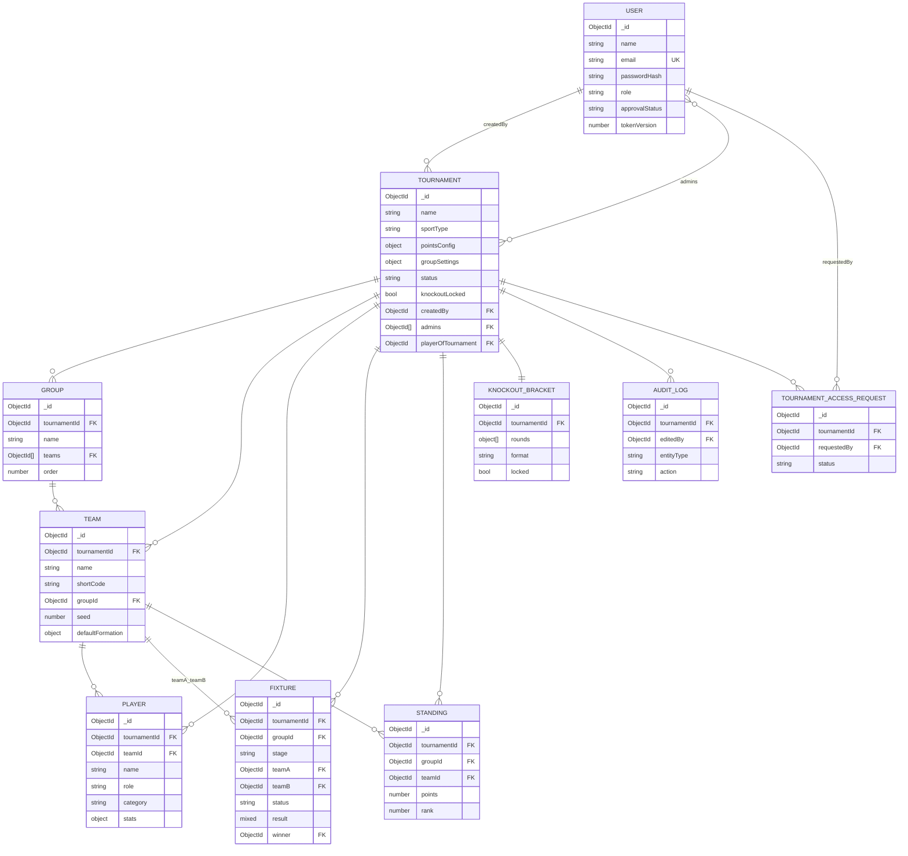

# 05 · Database

[← Code Structure](./04-code-structure.md) · [Back to index](./README.md) · Next: [API Reference →](./06-api-reference.md)

---

This document is the complete reference for the persistence layer: the database
architecture, every collection and its fields, entity relationships, the indexing
strategy and the query each index serves, the migration approach, and data‑lifecycle
management. The models live in `server/src/models/`.

---

## 5.1 Database architecture

- **Engine:** MongoDB (6.x+), accessed through **Mongoose 8**.
- **Connection:** a single connection established at boot in `server/src/config/db.js`
  (`strictQuery` on, 10s server‑selection timeout, lifecycle event logging).
- **Database name:** from `MONGODB_URI` (default `mongodb://127.0.0.1:27017/tournament_manager`).
- **ID strategy:** Mongo `ObjectId` for all primary keys and references.
- **Timestamps:** every collection except embedded subdocuments uses Mongoose
  `timestamps: true` (`createdAt`, `updatedAt`).
- **Design philosophy:** the document model mirrors the domain — a match *result* is a
  nested object, a *bracket* is a tree — and read‑hot data (standings) is **denormalised**
  so public pages read in one indexed query. Derived collections (standings, player
  stats) are always re‑computable from fixtures, so denormalisation never risks permanent
  drift. See [System Design](./03-system-design.md#36-key-trade-offs--technical-decisions).

### Collections

| Collection | Model | Purpose | Authored or derived |
|------------|-------|---------|---------------------|
| `users` | `User` | Accounts, roles, sessions | Authored |
| `tournaments` | `Tournament` | Tournament config & lifecycle | Authored |
| `groups` | `Group` | Group membership | Authored |
| `teams` | `Team` | Teams + default formation | Authored |
| `players` | `Player` | Rosters + **cached** stats | Authored roster / **derived** stats |
| `fixtures` | `Fixture` | Matches + results + live state | **Authored (source of truth)** |
| `standings` | `Standing` | Group tables | **Derived** |
| `knockoutbrackets` | `KnockoutBracket` | Bracket tree | **Derived** (advancement) from authored structure |
| `auditlogs` | `AuditLog` | Edit history | Authored (append‑only) |
| `tournamentaccessrequests` | `TournamentAccessRequest` | Access requests | Authored |

---

## 5.2 Entity‑relationship diagram

> **Referential integrity** is enforced in application code (Mongoose has no foreign
> keys). Deletes cascade explicitly (e.g. `deleteTournament` removes all dependents in a
> transaction; deleting a team is blocked if it has played fixtures).

---

## 5.3 Collection schemas

> Notation: **(idx)** = indexed, **(uniq)** = part of a unique index, `select:false`
> = excluded from query results by default.

### 5.3.1 `users` — `User.js`

| Field | Type | Constraints / default | Notes |
|-------|------|-----------------------|-------|
| `name` | String | required, ≤120, trimmed | |
| `email` | String | required, **unique (idx)**, lowercase, trimmed | Login identity. |
| `passwordHash` | String | required, `select:false` | bcrypt hash (10 salt rounds). |
| `role` | String (enum) | `superadmin` \| `tournamentadmin`, default `tournamentadmin` | RBAC. |
| `approvalStatus` | String (enum, idx) | `pending` \| `approved` \| `rejected`, default `pending` | Self‑signups start pending. |
| `organization` | String | ≤160, optional | Context shown to the maintainer. |
| `approvedBy` | ObjectId → User | — | Audit of who approved. |
| `approvedAt` | Date | — | |
| `reviewNote` | String | ≤500 | Reviewer note. |
| `isActive` | Boolean | default `true` | Soft‑deactivation gate. |
| `preferences.theme` | String (enum) | `dark` \| `light`, default `dark` | **Server is source of truth** for theme. |
| `tokenVersion` | Number | default `0` | Bumped on logout‑all / password change/reset to revoke refresh tokens. |
| `resetPasswordTokenHash` | String | `select:false`, default `null`, **(idx, sparse)** | SHA‑256 of the single‑use reset token (never the raw token). |
| `resetPasswordExpires` | Date | `select:false`, default `null` | Reset link TTL (30 min). |

**Methods:** `setPassword(plain)` (hash & assign), `comparePassword(plain)`, `toJSON()`
(strips `passwordHash` + `__v`).

**Security notes:** the password hash and reset fields are `select:false` so they never
leak through normal queries; `toJSON` is a second line of defence. See
[Security](./10-security.md).

### 5.3.2 `tournaments` — `Tournament.js`

| Field | Type | Constraints / default | Notes |
|-------|------|-----------------------|-------|
| `name` | String | required, ≤160, trimmed | |
| `sportType` | String (enum) | `cricket` \| `football`, required | **Immutable** after creation. |
| `logo`, `bannerImage` | String | default `''` | Image URLs. |
| `primaryColor` | String | default `#6366f1` | Theme accent. |
| `startDate`, `endDate` | Date | optional | `endDate ≥ startDate` enforced. |
| `venues` | [String] | default `[]` | |
| `description` | String | ≤2000 | |
| `pointsConfig` | Subdoc | **required** | See below. |
| `groupSettings` | Subdoc | default `{}` | See below. |
| `status` | String (enum, idx) | `setup`/`groupStage`/`knockoutStage`/`completed`, default `setup` | Lifecycle. |
| `knockoutLocked` | Boolean | default `false` | Bracket frozen. |
| `playerOfTournament` | ObjectId → Player | default `null` | Admin‑assigned POTM. |
| `createdBy` | ObjectId → User | required, **(idx)** | **Owner**. |
| `admins` | [ObjectId → User] | — | **Collaborators**. |

**`pointsConfig` subdocument:** `win`, `draw`, `loss` (required), `noResult` (default 0),
`bonusPointRule` `{ enabled, description, bonusPoints }`, `tiebreakerOrder` (string[]).

**`groupSettings` subdocument:** `numberOfGroups` (default 1), `doubleRoundRobin`
(default false), `qualifiersPerGroup` (default 2).

**Indexes:** `{email}` is on User; here: `{status}`, `{sportType, status}`, `{name}`
(A–Z sort + ordered listing on the admin dashboard).

### 5.3.3 `groups` — `Group.js`

| Field | Type | Constraints | Notes |
|-------|------|-------------|-------|
| `tournamentId` | ObjectId → Tournament | required, **(idx)** | |
| `name` | String | required, ≤60, trimmed | Unique within tournament. |
| `teams` | [ObjectId → Team] | — | Ordered membership (display/seeding). Teams are *also* stamped with `groupId`. |
| `order` | Number | default 0 | Display/seeding order. |

**Indexes:** `{tournamentId, name}` **(uniq)**, `{tournamentId, order}` (ordered listing).

> **Dual membership representation.** Group membership is stored both as `Group.teams[]`
> *and* `Team.groupId`. The array preserves explicit ordering and gives fast membership
> reads; the back‑reference makes per‑team queries simple. Controllers keep them in sync.

### 5.3.4 `teams` — `Team.js`

| Field | Type | Constraints / default | Notes |
|-------|------|-----------------------|-------|
| `tournamentId` | ObjectId → Tournament | required, **(idx)** | |
| `name` | String | required, ≤120 | |
| `shortCode` | String | required, uppercase, ≤4, **(uniq within tournament)** | Display + bracket labels. |
| `logo` | String | default `''` | |
| `primaryColor` | String | default `#3b82f6` | |
| `groupId` | ObjectId → Group | default `null`, **(idx)** | Back‑reference. |
| `seed` | Number | default `null` | Seeding rank (lower = stronger). |
| `defaultFormation` | Subdoc | default `null` | Football only; preset + 11 slots. |

**`defaultFormation` subdocument:** `preset` (enum of preset keys), `slots[]` each
`{ slot, playerId, x (0–100), y (0–100), position }`.

**Indexes:** `{tournamentId}`, `{groupId}`, `{tournamentId, shortCode}` **(uniq)**.

### 5.3.5 `players` — `Player.js`

| Field | Type | Constraints / default | Notes |
|-------|------|-----------------------|-------|
| `tournamentId` | ObjectId → Tournament | required, **(idx)** | |
| `teamId` | ObjectId → Team | required, **(idx)** | |
| `name` | String | required, ≤120 | |
| `role` | String | default `''` | Cricket role *or* football position (validated against sport in controller). |
| `jerseyNumber` | Number | default `null` | |
| `category` | String (enum)\|null | `S++`/`S`/`A`/`B`/`C`/`D` or `null` | Manual tier; `null` = Unrated. |
| `stats.cricket` | Subdoc | derived | Batting + bowling aggregates (see below). |
| `stats.football` | Subdoc | derived | Goals/assists/cards/clean sheets/appearances. |
| `statsUpdatedAt` | Date | default `null` | Last recompute. |

**`stats.cricket`:** `matches`, `batInnings`, `runs`, `ballsFaced`, `fours`, `sixes`,
`notOuts`, `highScore`, `dismissals`, `bowlInnings`, `ballsBowled`, `runsConceded`,
`wickets`, `maidens`, `bestWickets`, `bestRuns`.

**`stats.football`:** `appearances`, `goals`, `assists`, `ownGoals`, `yellowCards`,
`redCards`, `goalsConcededByTeam`, `cleanSheets`.

**Index:** `{tournamentId, teamId}` (formation validation, scoped stat recompute).

> **Stats are a cache.** Only the relevant sport's section is populated, and it is rebuilt
> from granular match events by `playerStatsService.recalcPlayerStats` — so it can always
> be regenerated and never needs hand‑editing.

### 5.3.6 `fixtures` — `Fixture.js` (source of truth)

| Field | Type | Constraints / default | Notes |
|-------|------|-----------------------|-------|
| `tournamentId` | ObjectId → Tournament | required, **(idx)** | |
| `groupId` | ObjectId → Group | default `null`, **(idx)** | `null` for knockout fixtures. |
| `stage` | String (enum) | `group` \| `knockout`, default `group` | |
| `groupRound` | Number | default `null` | Round‑robin round. |
| `leg` | Number | default `1` | 1 = first leg, 2 = return leg (double RR). |
| `roundIndex`, `matchupIndex` | Number | default `null` | Knockout linkage to the bracket. |
| `roundName` | String | default `''` | e.g. "Semifinals". |
| `teamA`, `teamB` | ObjectId → Team | default `null` | Null until a knockout slot resolves. |
| `placeholderA`, `placeholderB` | String | default `''` | Human label for unresolved slots ("Winner QF1", "A1"). |
| `scheduledAt` | Date | default `null` | |
| `venue` | String | default `''` | |
| `matchNumber` | Number | default `null` | Sequential. |
| `status` | String (enum, idx) | `scheduled`/`live`/`completed`, default `scheduled` | |
| `result` | **Mixed** | default `null` | Sport‑specific result object (Zod‑validated on write). |
| `liveState` | **Mixed** | default `null` | Incremental live snapshot broadcast over sockets. |
| `winner` | ObjectId → Team | default `null` | Normalised winner; `null` = draw/tie/no‑result/not played. |
| `isBye` | Boolean | default `false` | Knockout bye auto‑completes. |

**Indexes:** `{tournamentId}`, `{groupId}`, `{status}`, plus compounds
`{tournamentId, stage, status}`, `{tournamentId, groupId, groupRound}`,
`{tournamentId, scheduledAt}`, `{tournamentId, status}`.

**`result` shape (validated by `result.schema.js`):**
- **Cricket:** `{ toss?, innings[] (battingTeam, bowlingTeam, runs, wickets, overs,
  extras, allottedOvers?, oversDetail[]?), result: { winner, margin }, superOver?,
  manOfTheMatch?, bonus[]?, lineups? }`. `oversDetail` holds ball‑by‑ball events.
- **Football:** `{ goals[], cards[], substitutions[], matchStats?, extraTime,
  penalties?, result: { winner }, manOfTheMatch?, bonus[]?, lineups?, formation? }`.

### 5.3.7 `standings` — `Standing.js` (derived)

One row per `(tournament, group, team)`, fully denormalised.

| Field | Type | Notes |
|-------|------|-------|
| `tournamentId` | ObjectId (idx) | |
| `groupId` | ObjectId (idx) | |
| `teamId` | ObjectId | |
| `played`, `won`, `drawn`, `lost`, `noResult`, `points` | Number | `drawn` = draws (football) / ties (cricket); `noResult` = abandoned (cricket). |
| `runsFor`, `oversFor`, `runsAgainst`, `oversAgainst`, `netRunRate` | Number | Cricket NRR aggregates (overs are **decimal**). |
| `goalsFor`, `goalsAgainst`, `goalDifference` | Number | Football aggregates. |
| `rank` | Number | 1‑based rank within the group. |

**Indexes:** `{tournamentId, groupId, teamId}` **(uniq)** (upsert key),
`{tournamentId, groupId, rank}` (rank‑ordered read for qualifier selection).

### 5.3.8 `knockoutbrackets` — `KnockoutBracket.js` (one per tournament)

| Field | Type | Notes |
|-------|------|-------|
| `tournamentId` | ObjectId | **unique (idx)** — at most one bracket per tournament. |
| `rounds` | [Round] | Ordered rounds. |
| `format` | String (enum) | `single-elimination` \| `playoff`. |
| `thirdPlacePlayoff` | Boolean | |
| `locked` | Boolean | Freezes structural edits. |

**`Round` subdoc:** `{ roundName, matchups[] }`.

**`Matchup` subdoc:** `{ fixtureId, slotA, slotB, matchupName, slotALabel, slotBLabel,
winnerAdvancesTo, loserAdvancesTo, isBye, isThirdPlace }` where `*AdvancesTo` =
`{ roundIndex, matchupIndex, slot ('A'|'B') }`.

> The bracket is the only place where a tree is stored as nested arrays. Advancement
> mutates slot fields; the linked `Fixture` is updated in lock‑step so it becomes
> playable. See [Backend → Knockout](./07-backend.md#75-persistence--orchestration-services).

### 5.3.9 `auditlogs` — `AuditLog.js` (append‑only)

| Field | Type | Notes |
|-------|------|-------|
| `tournamentId` | ObjectId (idx) | |
| `editedBy` | ObjectId → User | Nullable. |
| `editedByName` | String | **Denormalised** so the log reads sensibly even if the user is removed. |
| `entityType` | String (enum) | `fixture`/`result`/`event`/`pointsConfig`/`knockout`/`tournament`/`standings`. |
| `entityId` | Mixed | ObjectId or config id. |
| `action` | String (enum) | `create`/`update`/`delete`/`recalculate`/`reopen`. |
| `summary` | String | Human one‑liner. |
| `before`, `after`, `meta` | Mixed | Snapshots + extra context. |

**Indexes:** `{tournamentId, createdAt:-1}` (newest‑first), `{tournamentId, entityType,
createdAt:-1}` (filtered, sorted).

### 5.3.10 `tournamentaccessrequests` — `TournamentAccessRequest.js`

| Field | Type | Notes |
|-------|------|-------|
| `tournamentId` | ObjectId (idx) | |
| `requestedBy` | ObjectId → User (idx) | |
| `message` | String | ≤500. |
| `status` | String (enum, idx) | `pending`/`approved`/`rejected`. |
| `reviewedBy`, `reviewedAt`, `reviewNote` | — | Decision audit. |

**Indexes:** `{tournamentId, requestedBy, status}` **(uniq, partial: status=pending)** —
at most **one active pending request** per user/tournament; `{status, createdAt:-1}`;
`{requestedBy, createdAt:-1}`.

---

## 5.4 Indexing strategy

Every index exists to serve a specific hot query. Summary:

| Index | Serves |
|-------|--------|
| `users.{email}` uniq | Login lookup; uniqueness. |
| `users.{approvalStatus}` | Pending‑queue filtering. |
| `users.{resetPasswordTokenHash}` sparse | Reset‑token lookup without scanning. |
| `tournaments.{status}`, `{sportType,status}`, `{name}` | Public/admin filtering + A–Z sort. |
| `tournaments.{createdBy}` | "My tournaments" filter. |
| `groups.{tournamentId,name}` uniq, `{tournamentId,order}` | Uniqueness + ordered listing. |
| `teams.{tournamentId,shortCode}` uniq, `{tournamentId}`, `{groupId}` | Uniqueness + scoped listing. |
| `players.{tournamentId,teamId}`, `{tournamentId}`, `{teamId}` | Roster reads + scoped stat recompute. |
| `fixtures.{tournamentId,stage,status}` | Stage/status filtered fixture lists. |
| `fixtures.{tournamentId,groupId,groupRound}` | Group schedule by round. |
| `fixtures.{tournamentId,scheduledAt}` | Date‑sorted listing. |
| `fixtures.{tournamentId,status}` | Completed‑fixture scans for stats/leaderboards. |
| `standings.{tournamentId,groupId,teamId}` uniq | Upsert key. |
| `standings.{tournamentId,groupId,rank}` | Rank‑ordered qualifier selection. |
| `knockoutbrackets.{tournamentId}` uniq | One bracket per tournament. |
| `auditlogs.{tournamentId,createdAt:-1}`, `{tournamentId,entityType,createdAt:-1}` | Newest‑first + filtered audit reads. |
| `tournamentaccessrequests` partial‑unique + sort indexes | One pending per pair; queue sorting. |

> **Index creation:** Mongoose auto‑builds these from the schema definitions at startup
> (`autoIndex` defaults to on). In production with large collections, prefer building
> indexes ahead of a deploy to avoid foreground build stalls. See
> [DevOps](./11-devops-and-infrastructure.md).

---

## 5.5 Query optimisation considerations

- **Read denormalisation:** standings and player stats are stored pre‑computed so public
  reads avoid aggregation pipelines.
- **`.lean()` everywhere on reads:** services/controllers use `.lean()` for read paths to
  skip Mongoose hydration overhead.
- **Scoped writes:** a single result recomputes only the affected group + two teams, not
  the whole tournament (`recalcStandingsForFixture`, `recalcPlayerStats({ teamIds })`).
- **Batched updates:** player stats are written with a single `bulkWrite`; standings use
  parallel upserts (group sizes are small).
- **Single‑query bucketing:** knockout qualifier building fetches all groups' standings in
  one query and buckets in memory rather than N queries (`buildRankedGroups`).
- **Pagination & caps:** list endpoints paginate (≤100/page) or cap unpaginated results
  (≤200) to bound payloads.

---

## 5.6 Migration strategy

The project intentionally has **no migration framework**. Two mechanisms cover schema
evolution:

1. **Mongoose schema defaults + flexible `Mixed` results.** New optional fields get
   defaults; the `result`/`liveState` fields are `Mixed`, so result‑shape evolution (e.g.
   adding ball‑by‑ball events, lineups, formations) required no migration — Zod validates
   the new shape on write.
2. **Idempotent backfill in the seed script.** `server/src/scripts/seed.js` backfills
   `approvalStatus = approved` for legacy users created before the approval workflow,
   and `ensureSeedSuperAdmin` reconciles the configured super admin on every boot.

**Recommended approach for a true schema change** (e.g. renaming a field): write a
one‑off idempotent script under `server/src/scripts/`, run it once per environment, and
rely on the recalculation cascade to rebuild any affected derived data. Because derived
collections are re‑derivable, most "migrations" reduce to *changing how results are
written, then running a recalc*.

---

## 5.7 Data lifecycle management

| Data | Created | Updated | Deleted |
|------|---------|---------|---------|
| User | signup/register/seed | approval, theme, password, tokenVersion | not deleted (deactivate via `isActive`) |
| Tournament | create | edit/config/status | owner/super‑admin delete → **cascade** |
| Group/Team/Player | admin CRUD | admin edits | with tournament, or individually (team delete blocked if it has completed fixtures) |
| Fixture | generate group stage / generate knockout | result/live/events/schedule | regenerated on overwrite; cascade on tournament delete |
| Standing | derived on first result | every completed match | recomputed/cleared on regenerate; cascade |
| KnockoutBracket | generate | advancement/adjust/lock | regenerate (if unlocked); cascade |
| AuditLog | every admin edit | never (append‑only) | cascade on tournament delete |
| AccessRequest | organiser request | super‑admin review | cascade on tournament delete |
| Reset token | forgot‑password | consumed on reset | cleared on use; expires after 30 min |

**Cascade delete (`deleteTournament`)** removes Teams, Groups, Players, Fixtures,
Standings, KnockoutBracket, AccessRequests, and AuditLogs for the tournament inside a
**MongoDB transaction** (falling back to best‑effort parallel deletes on standalone Mongo
without a replica set).

**Demo data** (`seed:demo`) is wiped and recreated on each run, scoped strictly to the
demo organiser's `createdBy`, so it never touches real tournaments.

There is **no built‑in TTL/archival** for old tournaments or audit logs; see
[Maintenance Guide → Known limitations](./14-maintenance-guide.md#143-known-limitations) for
the retention follow‑up.
