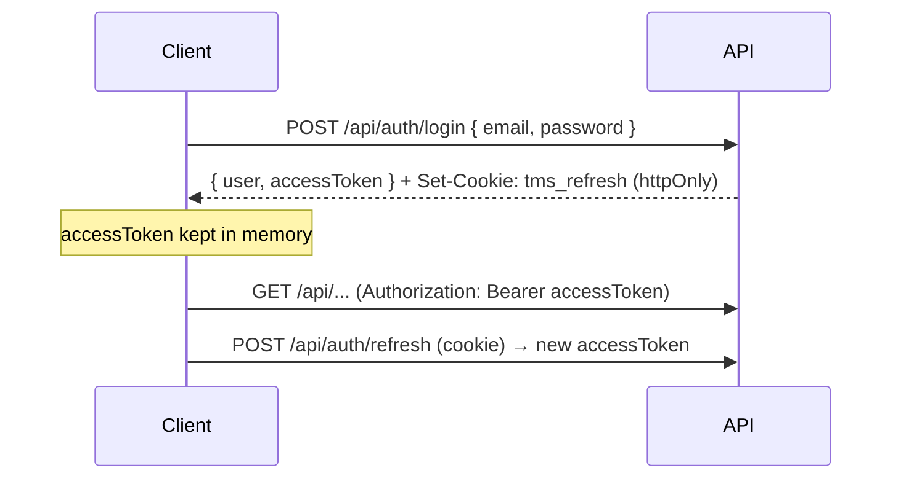
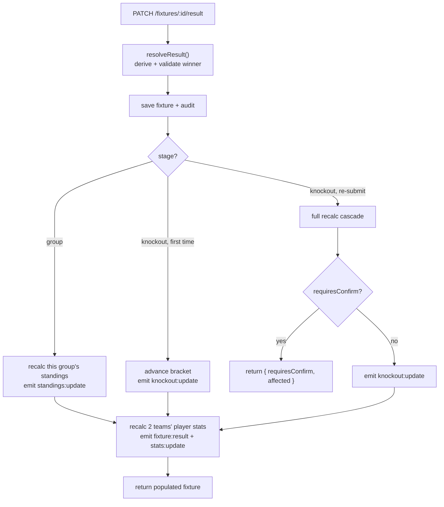
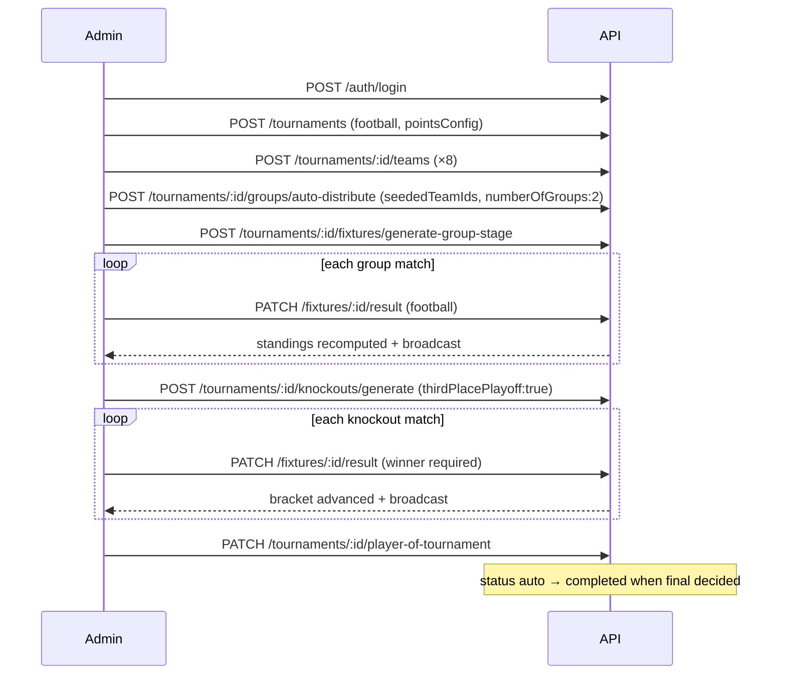

# 06 · API Reference

[← Database](./05-database.md) · [Back to index](./README.md) · Next: [Backend →](./07-backend.md)

---

Complete reference for the TourneyOps REST API: conventions, authentication, error codes,
rate limits, and every endpoint with its request/response shape, validation rules, and
authorization. Realtime (Socket.IO) events are documented in
[Realtime & Live Scoring](./09-realtime-and-live-scoring.md).

---

## 6.1 Conventions

- **Base URL:** all routes are under `/api` (e.g. `http://localhost:5000/api`). The SPA
  uses a same‑origin `/api` (Vite proxies it in dev).
- **Content type:** `application/json` for all bodies except `POST /api/uploads`
  (`multipart/form-data`).
- **Success envelope:**
  ```json
  { "success": true, "message": "Human-readable", "data": { /* payload */ } }
  ```
- **Error envelope:**
  ```json
  { "success": false, "error": { "message": "What went wrong", "details": [ { "path": "body.email", "message": "Invalid email" } ] } }
  ```
  `details` is present for validation (422) errors.
- **IDs:** 24‑char hex MongoDB ObjectIds.
- **Dates:** ISO‑8601 strings on input; ISO strings on output.
- **Validation:** request bodies/queries/params are validated by Zod schemas from
  `@tms/shared` (the `validate` middleware). Parsed values are coerced (e.g. numeric query
  params become numbers).

### Standard query/coercion behaviour

`validate(schema)` replaces `req.body/query/params` with the **parsed** result, so numeric
strings in query params are coerced to numbers, defaults are applied, and unknown extra
fields are stripped where the schema is strict.

---

## 6.2 Authentication & authorization

### Token model (two‑token)



- **Access token:** short‑lived JWT (`JWT_ACCESS_EXPIRES`, default 15m), sent as
  `Authorization: Bearer <token>`. Carries `sub`, `role`, `name`, `tv` (tokenVersion).
- **Refresh token:** long‑lived JWT (default 7d) in an **httpOnly** cookie `tms_refresh`,
  scoped to path `/api/auth`. Exchanged at `/api/auth/refresh`. Carries `sub`, `tv`.
- **Revocation:** bumping the user's `tokenVersion` (logout‑all, password change/reset,
  approval revocation) invalidates all outstanding tokens.

### Auth requirement legend

| Symbol | Meaning |
|--------|---------|
| **Public** | No auth required. |
| **Optional** | `optionalAuth` — works anonymously but personalises output when a valid token is sent (an invalid token returns 401). |
| **Token** | Any authenticated, approved, active user. |
| **Manager** | Tournament owner, collaborator admin, or super admin (`requireTournamentManager`). |
| **Owner** | Tournament creator or super admin (`requireTournamentOwner`). |
| **Super admin** | `authorize('superadmin')`. |

Full model: [Security → Authorization model](./10-security.md#102-authorization-model).

---

## 6.3 Error codes

| HTTP | When |
|------|------|
| `200 OK` | Successful read/update. |
| `201 Created` | Resource created. |
| `400 Bad Request` | Domain rule violation (e.g. "sportType cannot be changed", invalid winner, bad cast). |
| `401 Unauthorized` | Missing/invalid/expired token, invalid credentials, invalid refresh token. |
| `403 Forbidden` | Authenticated but lacks role/ownership; unapproved account; super‑admin password‑change attempt. |
| `404 Not Found` | Resource (or route) not found. |
| `409 Conflict` | Duplicate unique value, illegal status transition, locked bracket, "fixtures already exist", delete blocked. |
| `422 Unprocessable Entity` | Zod validation failed (with `details`). |
| `429 Too Many Requests` | Rate limit exceeded. |
| `500 Internal Server Error` | Unexpected error (stack hidden in production). |
| `502 Bad Gateway` | Cloudinary upload failure. |

---

## 6.4 Rate limits

Implemented in `server/src/middleware/rateLimit.js` (Redis‑backed when
`RATE_LIMIT_REDIS_URL` is set, else in‑memory per process):

| Limiter | Scope | Window | Max |
|---------|-------|--------|-----|
| `apiLimiter` | All `/api/*` | 60s | 300 requests |
| `authLimiter` | All `/api/auth/*` | 15 min | 30 requests |

Standard `RateLimit-*` headers are returned. Exceeding a limit returns `429` with
`{ success:false, error:{ message } }`.

---

## 6.5 Health

### `GET /api/health` — Public
Returns `{ success:true, message:"API is healthy", data:{ uptime } }`. Use for liveness
probes.

---

## 6.6 Authentication endpoints (`/api/auth`)

> All routes here are also subject to `authLimiter`.

| Method | Path | Auth | Body schema | Purpose |
|--------|------|------|-------------|---------|
| POST | `/signup` | Public | `signupSchema` | Organiser self‑signup (creates **pending** account; no tokens). |
| POST | `/register` | Super admin | `registerSchema` | Maintainer creates a pre‑approved account (only a super admin can mint a super admin). |
| POST | `/login` | Public | `loginSchema` | Authenticate; sets refresh cookie, returns access token. |
| POST | `/refresh` | Cookie | `refreshSchema` | Exchange refresh token for a new access token. |
| POST | `/logout` | Token | — | Bump `tokenVersion` (revoke all refresh tokens), clear cookie. |
| POST | `/logout-all` | Token | — | Same as logout (revoke everywhere). |
| GET | `/me` | Token | — | Return the current user. |
| PATCH | `/preferences` | Token | `updatePreferencesSchema` | Update theme preference. |
| POST | `/change-password` | Token | `changePasswordSchema` | Verify current → set new; bump tokenVersion; re‑issue tokens for this session. |
| POST | `/forgot-password` | Public | `forgotPasswordSchema` | Enumeration‑safe reset initiation (always generic 200; emails a 30‑min link if eligible). |
| POST | `/reset-password` | Public | `resetPasswordSchema` | Consume single‑use token, set new password, bump tokenVersion. |

**Key rules:**
- **Login:** super admins authenticate against the **fixed configured password**
  (timing‑safe compare); organisers against their bcrypt hash. Unapproved/rejected
  organisers are blocked with 403.
- **Super admins** cannot change/forgot/reset their password via API (403) — it is
  managed by configuration.
- `signup` notifies all super admins by email (best‑effort).

**Example — login**
```http
POST /api/auth/login
{ "email": "demo@tms.local", "password": "demo12345" }
```
```json
{ "success": true, "message": "Logged in",
  "data": { "user": { "_id": "...", "role": "tournamentadmin", "preferences": { "theme": "dark" } }, "accessToken": "eyJ..." } }
```

---

## 6.7 User management (`/api/users`) — Super admin only

| Method | Path | Query/Body | Purpose |
|--------|------|------------|---------|
| GET | `/` | `listUsersQuerySchema` (`status`, `role`, `q`, `page`, `limit`) | Paginated user directory; includes global `pendingCount`. |
| PATCH | `/:id/approval` | `updateApprovalSchema` (`status: approved\|rejected`, `note?`) | Approve/reject an organiser. |

**Rules:** cannot review a super admin (403) or yourself (403); on **reject**, the user's
`tokenVersion` is bumped (kills sessions); a decision email is sent **only if the status
actually changed**.

---

## 6.8 Tournament collection & detail (`/api/tournaments`)

| Method | Path | Auth | Schema | Purpose |
|--------|------|------|--------|---------|
| POST | `/` | Token (organiser/super) | `createTournamentSchema` | Create tournament (owner = caller). |
| GET | `/` | Optional | `listTournamentsQuerySchema` | List with filters/search/sort/pagination; per‑row `canManage`/`isOwner`/`myAccessRequest`/`canRequestAccess` for the caller. |
| GET | `/:id` | Optional | — | Detail + `stats` (team/group/fixture/completed counts). |
| PATCH | `/:id` | Manager | `updateTournamentSchema` | Update fields (sport **immutable**; date order enforced; tiebreakers validated). |
| PATCH | `/:id/points-config` | Manager | `updatePointsConfigSchema` | Update points/tiebreakers; **recomputes all standings** + audits. |
| PATCH | `/:id/status` | Manager | `updateStatusSchema` | Explicit status transition (validated against allowed transitions). |
| PATCH | `/:id/player-of-tournament` | Manager | `setPlayerOfTournamentSchema` | Assign/clear POTM (player must belong to tournament). |
| POST | `/:id/recalculate` | Manager | `recalculateSchema` (`confirm`) | Full recalculation cascade (see §6.15). |
| GET | `/:id/audit-logs` | Manager | `auditLogQuerySchema` (`page`, `limit`, `entityType`) | Paginated audit trail. |
| DELETE | `/:id` | **Owner** | — | Cascade‑delete the tournament and all dependents (transactional). |

### Collaborators

| Method | Path | Auth | Schema | Purpose |
|--------|------|------|--------|---------|
| GET | `/:id/admins` | Manager | — | Owner + collaborator list. |
| GET | `/:id/admin-candidates` | Super admin | `adminCandidatesQuerySchema` (`q`, ≥2 chars) | Search approved organisers to add (≤10). |
| POST | `/:id/admins` | Super admin | `assignAdminSchema` (`userId`) | Add a collaborator (validates active, approved organiser). |
| DELETE | `/:id/admins/:userId` | Super admin | — | Remove a collaborator (owner cannot be removed). |

### Access requests (tournament‑scoped)

| Method | Path | Auth | Schema | Purpose |
|--------|------|------|--------|---------|
| POST | `/:id/access-requests` | `tournamentadmin` | `createTournamentAccessRequestSchema` (`message?`) | Request collaborator access (blocked if already a manager or a pending request exists). |

**`createTournamentSchema` body** (key fields): `name`, `sportType` (`cricket`/`football`),
`logo?`, `bannerImage?`, `primaryColor?`, `startDate?`, `endDate?`, `venues[]`,
`description?`, `pointsConfig { win, draw, loss, noResult?, bonusPointRule?,
tiebreakerOrder[] }`, `groupSettings { numberOfGroups, doubleRoundRobin?,
qualifiersPerGroup }`. **Refinements:** `endDate ≥ startDate`; `tiebreakerOrder` entries
must be valid for the sport (cricket: `netRunRate`/`headToHead`/`totalWins`; football:
`goalDifference`/`goalsScored`/`headToHead`).

**`listTournamentsQuerySchema`:** `sport?`, `status?`, `state?` (`live`/`setup`/`completed`
grouping), `q?`, `sort?` (`newest`/`name`), `page?`, `limit?` (1–100), `mine?` (requires
auth). Pagination is opt‑in (supplying `page`/`limit`); otherwise capped at 200.

---

## 6.9 Teams & roster (`/api/tournaments/:id/teams`)

| Method | Path | Auth | Schema | Purpose |
|--------|------|------|--------|---------|
| GET | `/` | Public | — | List teams (sorted by seed, name). |
| GET | `/:teamId` | Public | — | Team detail + roster + fixtures. |
| POST | `/` | Manager | `createTeamSchema` | Create team (optional group). |
| PATCH | `/:teamId` | Manager | `updateTeamSchema` | Update team; syncs group membership. |
| PATCH | `/:teamId/formation` | Manager | `updateTeamFormationSchema` | Set/clear default football formation. |
| DELETE | `/:teamId` | Manager | — | Delete team (blocked if it has fixtures; cascades players/standings). |
| POST | `/:teamId/players` | Manager | `playerSchema` | Add player (sport‑aware role; football squad < 26). |
| PATCH | `/:teamId/players/:playerId` | Manager | `updatePlayerSchema` | Update player. |
| DELETE | `/:teamId/players/:playerId` | Manager | — | Remove player (also strips from default formation). |

**Rules of note:**
- `shortCode` must be 2–4 uppercase alphanumerics and unique within the tournament.
- Football **default formation** requires an **exactly 26‑player squad** (11 pitch + 15
  bench) and a valid preset with all 11 pitch slots assigned to roster players.
- Deleting a team that has **completed** fixtures → 409 (you must regenerate/clear
  fixtures or the bracket first).

---

## 6.10 Groups (`/api/tournaments/:id/groups`)

| Method | Path | Auth | Schema | Purpose |
|--------|------|------|--------|---------|
| GET | `/` | Public | — | List groups (ordered, with team summaries). |
| POST | `/` | Manager | `createGroupSchema` | Create a group (optional initial teams). |
| POST | `/auto-distribute` | Manager | `autoDistributeSchema` | **Snake‑draft** redistribute seeded teams across N groups (destructive reset of layout). |
| PATCH | `/:groupId` | Manager | `updateGroupSchema` | Rename / change membership. |
| DELETE | `/:groupId` | Manager | — | Delete group (clears team `groupId`, deletes its group fixtures + standings). |

**`autoDistributeSchema`:** `seededTeamIds[]` (≥2), plus `numberOfGroups` **or**
`groupNames[]`. Auto‑distribute deletes existing groups/group‑fixtures/standings and
rebuilds, then recalculates standings and emits `standings:update`.

---

## 6.11 Fixtures

### Tournament‑scoped (`/api/tournaments/:id/fixtures`)

| Method | Path | Auth | Schema | Purpose |
|--------|------|------|--------|---------|
| GET | `/` | Public | `listFixturesQuery` (`groupId`,`teamId`,`stage`,`status`,`from`,`to`) | Filterable fixture list (populated teams/winner). |
| POST | `/generate-group-stage` | Manager | `generateGroupFixturesSchema` | Generate round‑robin fixtures for all groups. |

**`generateGroupFixturesSchema`:** `doubleRoundRobin?`, `startDate?`, `daysBetweenRounds`
(default 7), `defaultVenue?`, `overwrite` (default false). Without `overwrite`, existing
group fixtures → 409. Moves `setup → groupStage` and recomputes standings.

### Fixture‑scoped (`/api/fixtures/:fixtureId`)

| Method | Path | Auth | Schema | Purpose |
|--------|------|------|--------|---------|
| GET | `/:fixtureId` | Public | — | Single fixture (populated). |
| PATCH | `/:fixtureId` | Manager | `updateFixtureSchema` | Update schedule/venue/status (re‑open audited). |
| PATCH | `/:fixtureId/result` | Manager | `submitResultSchema` | Submit/edit a final result (see flow below). |
| PATCH | `/:fixtureId/live-update` | Manager | `liveUpdateSchema` | Push an incremental live snapshot. |
| PATCH | `/:fixtureId/events` | Manager | `eventOpSchema` | Add/edit/delete one granular event (ball/over/goal/card/sub). |

**`submitResultSchema`** body: exactly **one** of `cricket` or `football` (a `superRefine`
enforces this), plus optional `confirm` (used to confirm downstream knockout resets).

**`eventOpSchema`** body: `target` (`cricketBall`/`cricketOver`/`goal`/`card`/`substitution`),
`op` (`add`/`edit`/`delete`), positional indices (`inningsIndex`/`overIndex`/`ballIndex`/
`index`), and the relevant payload (`ball`/`over`/`goal`/`card`/`sub`). A `superRefine`
enforces which indices/payloads are required per target+op.

#### Submit‑result flow



**Winner resolution rules** (`resolveResult`): score determines winner; a declared winner
that contradicts the score is rejected; group‑stage draws cannot declare a winner;
knockout ties resolve via **penalties** (football) or **Super Over** (cricket) and a
knockout fixture **must** have a winner.

**Response of `submitResult`:**
```json
{ "success": true, "message": "Result recorded",
  "data": { "fixture": { /* populated */ }, "requiresConfirm": false, "affected": [] } }
```
When re‑submitting an already‑played knockout result that would invalidate a later round,
`requiresConfirm: true` and `affected: [{ fixtureId, roundName, matchNumber }]` — resend
with `"confirm": true` to apply.

---

## 6.12 Standings (`/api/tournaments/:id/standings`)

| Method | Path | Auth | Purpose |
|--------|------|------|---------|
| GET | `/` | Public | Standings grouped by group, rows in rank order (populated teams). |
| POST | `/recalculate` | Manager | Recompute all standings + player stats (lighter than full recalc; no bracket reconciliation). Emits `standings:update` + `stats:update`. |

---

## 6.13 Knockouts (`/api/tournaments/:id/knockouts`)

| Method | Path | Auth | Schema | Purpose |
|--------|------|------|--------|---------|
| GET | `/` | Public | — | Bracket (populated teams + linked fixtures); `null` if none. |
| POST | `/generate` | Manager | `generateKnockoutSchema` | Generate/regenerate bracket from standings. |
| PATCH | `/adjust` | Manager | `adjustKnockoutSchema` | Manually reassign a slot on an **unlocked** bracket. |
| PATCH | `/lock` | Manager | — | Lock the bracket against regeneration/adjustment. |

**`generateKnockoutSchema`:** `format` (`single-elimination`/`playoff`),
`qualifiersPerGroup?`, `thirdPlacePlayoff?`, `startDate?`, `daysBetweenRounds` (default 3),
`defaultVenue?`.

**Rules:** locked bracket → 409 on generate/adjust; playoff needs ≥4 qualifiers
(globally ranked across groups when multiple groups); generating sets status
`knockoutStage` and emits `knockout:update`.

**`adjustKnockoutSchema`:** `roundIndex`, `matchupIndex`, `slotA?` / `slotB?` (ObjectId or
`null`). A non‑null team must belong to the tournament; the linked fixture is synced.

---

## 6.14 Stats, leaderboards, players

| Method | Path | Auth | Purpose |
|--------|------|------|---------|
| GET | `/api/tournaments/:id/leaderboards` | Public | Sport‑specific leaderboards (top 15 each) + POTM. |
| GET | `/api/tournaments/:id/players` | Public | All tournament players (with team info). |
| GET | `/api/players/:id/stats` | Public | Single player profile: cached aggregate + per‑match breakdown. |

**Cricket leaderboards:** `mostRuns`, `mostWickets`, `highestScore`, `bestBowling`,
`mostSixes`, `mostFours`, `bestStrikeRate` (≥10 balls faced), `bestEconomy` (≥12 balls
bowled). **Football leaderboards:** `topScorers`, `mostAssists`, `goldenGlove` (GKs),
`fairPlay` (per‑team disciplinary points; yellow=1, red=3).

---

## 6.15 Recalculation & audit

### `POST /api/tournaments/:id/recalculate` — Manager

Runs the full cascade (`recalcService.recalculateTournament`): standings → player stats →
bracket reconciliation → status sync.

**Two‑phase confirmation:** if reconciliation would reset an already‑played knockout
match, the first call (with `confirm:false`) returns:
```json
{ "success": true, "message": "Confirmation required: downstream knockout matches will be reset",
  "data": { "requiresConfirm": true, "affected": [ { "fixtureId": "...", "roundName": "Final", "matchNumber": 7 } ] } }
```
Resend with `{ "confirm": true }` to apply. Without conflicts:
```json
{ "data": { "requiresConfirm": false, "groups": 2, "playersUpdated": 44, "bracketChanged": true } }
```

### `GET /api/tournaments/:id/audit-logs` — Manager

Paginated (`page`, `limit` 1–100, optional `entityType`) newest‑first audit trail:
```json
{ "data": { "items": [ { "action": "update", "entityType": "result", "summary": "Edited result for match #3", "before": {...}, "after": {...}, "editedByName": "Demo Organiser", "createdAt": "..." } ], "page": 1, "limit": 25, "total": 3, "pages": 1 } }
```

---

## 6.16 Tournament access requests (`/api/tournament-access-requests`) — Super admin

| Method | Path | Schema | Purpose |
|--------|------|--------|---------|
| GET | `/` | `listTournamentAccessRequestsQuerySchema` (`status?`,`q?`,`page?`,`limit?`) | Review queue (populated tournament + requester); global `pendingCount`. |
| PATCH | `/:id/review` | `reviewTournamentAccessRequestSchema` (`status: approved\|rejected`, `note?`) | Approve (grants collaborator + audits) / reject. Atomic claim prevents double‑review. |

(The matching **create** endpoint is `POST /api/tournaments/:id/access-requests`, §6.8.)

---

## 6.17 Uploads (`/api/uploads`) — Token (organiser/super)

`POST /api/uploads` with `multipart/form-data`, field name **`file`**.

- Allowed types: PNG, JPEG, WebP, GIF (SVG intentionally rejected). Max **2 MB**.
- Stored on Cloudinary when configured, else local disk under `/uploads`.

```json
{ "success": true, "message": "Image uploaded", "data": { "url": "https://res.cloudinary.com/.../logo.png", "filename": "..." } }
```
Errors: no file → 400; oversize → 400; Cloudinary failure → 502.

---

## 6.18 End‑to‑end API flow example

A minimal "create and run a football tournament" sequence (all admin calls send the
`Authorization: Bearer` header):



---

## 6.19 Quick endpoint index

| Area | Endpoints |
|------|-----------|
| Health | `GET /health` |
| Auth | `POST /auth/{signup,register,login,refresh,logout,logout-all,change-password,forgot-password,reset-password}`, `GET /auth/me`, `PATCH /auth/preferences` |
| Users | `GET /users`, `PATCH /users/:id/approval` |
| Tournaments | `POST/GET /tournaments`, `GET/PATCH/DELETE /tournaments/:id`, `PATCH /tournaments/:id/{points-config,status,player-of-tournament}`, `POST /tournaments/:id/recalculate`, `GET /tournaments/:id/audit-logs` |
| Collaborators | `GET/POST /tournaments/:id/admins`, `GET /tournaments/:id/admin-candidates`, `DELETE /tournaments/:id/admins/:userId` |
| Teams | `GET/POST /tournaments/:id/teams`, `GET/PATCH/DELETE /tournaments/:id/teams/:teamId`, `PATCH /tournaments/:id/teams/:teamId/formation` |
| Players | `POST /tournaments/:id/teams/:teamId/players`, `PATCH/DELETE .../players/:playerId`, `GET /players/:id/stats` |
| Groups | `GET/POST /tournaments/:id/groups`, `POST /tournaments/:id/groups/auto-distribute`, `PATCH/DELETE /tournaments/:id/groups/:groupId` |
| Fixtures | `GET /tournaments/:id/fixtures`, `POST /tournaments/:id/fixtures/generate-group-stage`, `GET /fixtures/:id`, `PATCH /fixtures/:id`, `PATCH /fixtures/:id/{result,live-update,events}` |
| Standings | `GET /tournaments/:id/standings`, `POST /tournaments/:id/standings/recalculate` |
| Knockouts | `GET /tournaments/:id/knockouts`, `POST /tournaments/:id/knockouts/generate`, `PATCH /tournaments/:id/knockouts/{adjust,lock}` |
| Stats | `GET /tournaments/:id/{leaderboards,players}` |
| Access requests | `POST /tournaments/:id/access-requests`, `GET /tournament-access-requests`, `PATCH /tournament-access-requests/:id/review` |
| Uploads | `POST /uploads` |
