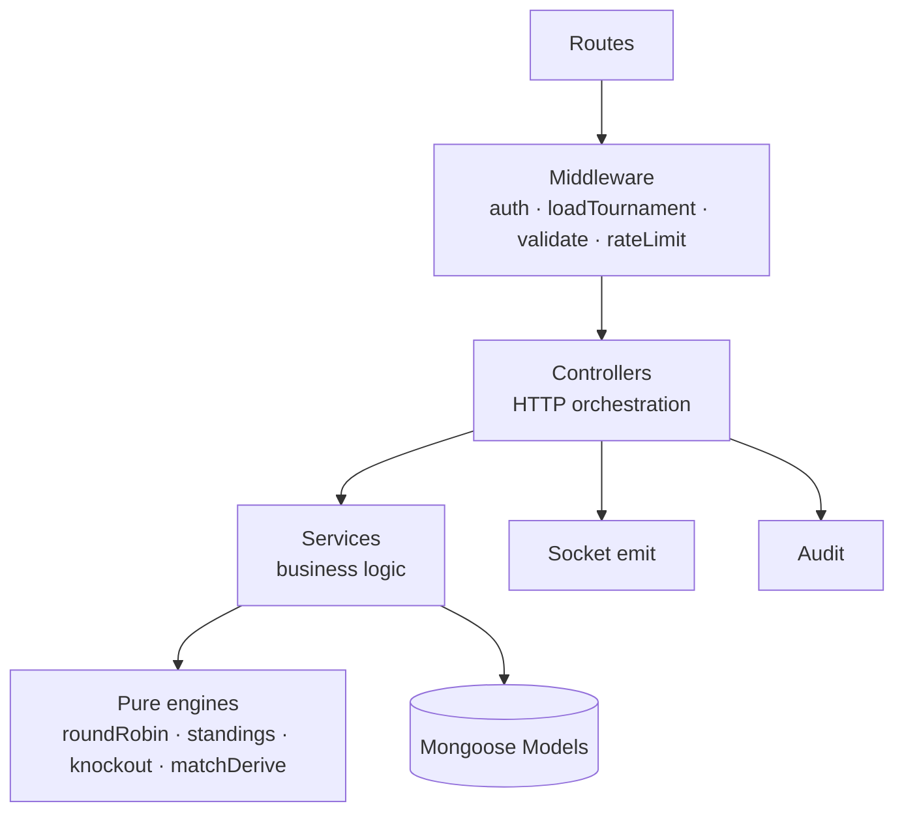
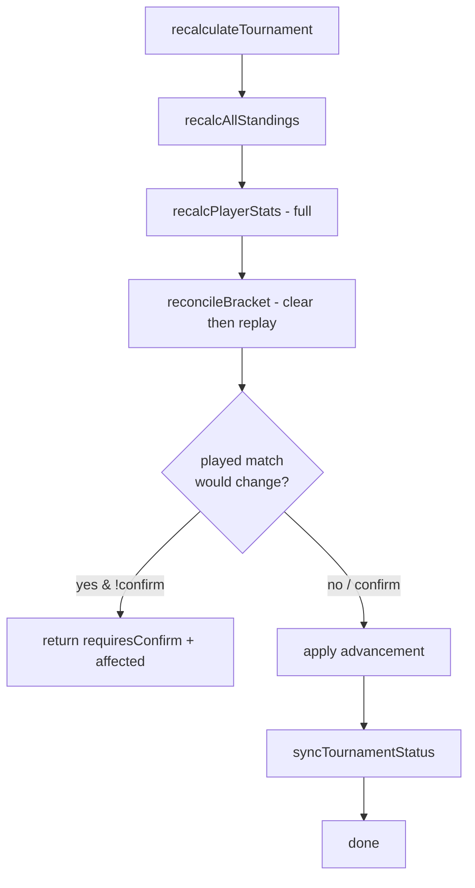

# 07 · Backend

[← API Reference](./06-api-reference.md) · [Back to index](./README.md) · Next: [Frontend →](./08-frontend.md)

---

This document explains how the server is built: the layered service architecture, the
request lifecycle through middleware, the **pure engines** vs **persistence services**
split, the recalculation cascade, event/derivation processing, and the platform services
(audit, email, image storage). Code lives in `server/src/`.

---

## 7.1 Service architecture

The backend is a **layered**, request‑driven Express app. There are no long‑running
background workers — all work is triggered by HTTP requests (or socket joins). Each layer
has a single responsibility:



| Layer | Folder | Responsibility | Pure? |
|-------|--------|----------------|-------|
| Routes | `routes/` | URL → middleware chain → controller | — |
| Middleware | `middleware/` | Auth, loading, validation, rate limiting, errors, uploads | mostly impure |
| Controllers | `controllers/` | Parse request, call services, emit sockets, audit, format response | impure (shell) |
| Services (persistence) | `services/*Service.js` | DB reads/writes, orchestration | impure (shell) |
| Engines (pure) | `services/{roundRobin,standings,knockout,matchDerive}.js` | Algorithms, no I/O | **pure** |
| Models | `models/` | Mongoose schemas | — |
| Utils | `utils/` | ApiError, ApiResponse, asyncHandler, tokens, zodError | pure helpers |

> **Pure core / imperative shell** is the central idea: anything algorithmically tricky
> (scheduling, NRR, seeding, advancement, event derivation) is a *pure function* that
> takes plain data and returns plain data, so it is trivially unit‑testable. The "shell"
> (controllers + `*Service` files) does the messy I/O. See
> [System Design](./03-system-design.md).

---

## 7.2 Request lifecycle

Every `/api` request flows through this pipeline (configured in `app.js`):

```
trust proxy → helmet → cors(credentials) → json/urlencoded → cookieParser
  → morgan (dev) → apiLimiter → /api router
      → [authLimiter on /auth]
      → route-specific: authenticate → loadTournament → requireTournamentManager → validate(schema)
      → asyncHandler(controller)
  → notFound → errorHandler
```

- **`asyncHandler`** wraps every controller so a rejected promise is forwarded to
  `errorHandler` instead of crashing the process.
- **`errorHandler`** is the single place that converts any thrown error into the standard
  envelope, normalising `ApiError`, `ZodError`, Mongoose validation/cast/duplicate‑key
  errors, and JWT errors. Stack traces are logged but never sent in production.

---

## 7.3 Middleware reference

### `auth.js`
- **`authenticate`** — extracts the Bearer token, verifies the access JWT, **re‑loads the
  user from the DB**, and rejects if missing, inactive, not approved, or if
  `tokenVersion` no longer matches (revocation). Attaches `req.user`.
- **`authorize(...roles)`** — RBAC gate; 403 if `req.user.role` isn't allowed.
- **`optionalAuth`** — like `authenticate` but anonymous requests pass through with
  `req.user = null`; an *invalid* token still 401s.

### `loadTournament.js`
- **`loadTournament`** — loads the tournament by `:id`/`:tournamentId` into
  `req.tournament` (404 if absent).
- **`loadTournamentFromFixture`** — for `/api/fixtures/:fixtureId`, resolves the fixture,
  then its tournament, attaching both.
- **Guards:** `requireTournamentManager` (owner ∪ collaborators ∪ super admin) and
  `requireTournamentOwner` (creator ∪ super admin). Helpers `canManageTournament` /
  `isTournamentOwner` are reused by controllers to compute per‑row capability flags.

### `validate.js`
Generic `validate(schema)` runs `schema.parse({ body, query, params })`, **writes parsed
values back** onto the request (coercion + defaults), and turns Zod failures into
`ApiError.unprocessable` with `details`.

### `rateLimit.js`
`authLimiter` (30/15min on auth) and `apiLimiter` (300/min global). Uses
`rate-limit-redis` when `RATE_LIMIT_REDIS_URL` is set so limits are shared across
instances; otherwise per‑process memory.

### `error.js`
`notFound` (404 for unmatched routes) and `errorHandler` (central normaliser + logger).

### `upload.js`
Multer single‑file (`file`) in memory, 2 MB cap, MIME allowlist, errors mapped to
`ApiError.badRequest`.

---

## 7.4 Pure engines (business logic core)

These four modules contain the algorithms and have **zero** database access.

### `roundRobin.js`
`generateRoundRobin(teamIds, { doubleRoundRobin })` implements the **circle method**: fix
one team, rotate the rest, add a `BYE` for odd counts, alternate home/away for fairness,
and optionally mirror for a return leg. `buildGroupFixtureSeeds(...)` decorates rounds
with match numbers, legs, and scheduled dates.

### `standings.js`
- `oversToDecimal("12.3")` → `12.5` (3 balls = 0.5 over) for NRR.
- `accumulateCricket` / `accumulateFootball` fold a fixture result into a team's row.
- `computeGroupStandings(teams, fixtures, pointsConfig)` builds rows, computes
  **Net Run Rate** / **goal difference**, applies bonus points, builds head‑to‑head, then
  sorts by points and the configured **tiebreaker order**, assigning `rank`.

### `knockout.js`
- `seedOrder(n)` — classic bracket seeding (1 v N, etc.).
- `collectQualifiers(groups, qualifiersPerGroup)` — gathers labelled qualifiers (A1, B2…).
- `generateBracket(...)` — single‑elimination with byes + optional 3rd‑place match.
- `generatePlayoffBracket(...)` — IPL‑style (Q1/Eliminator/Q2/Final).
- `computeAdvancement(bracket, matchup, winnerId)` — pure function returning where the
  winner (and loser, for playoffs) should be placed next.

### `matchDerive.js`
The **derivation layer** turns granular events or aggregates into normalised stats:
`ballsToOvers`, `deriveCricketInnings`, `deriveCricketPlayerStats`, `deriveFootballGoals`
(own goals credited to the opponent), `deriveFootballPlayerStats`,
`deriveFootballTeamCredits` (appearances, clean sheets), `lineupPlayerIds`, and
`deriveLiveTicker` (score snapshot for live broadcasts).

---

## 7.5 Persistence & orchestration services

These wrap the pure engines with database I/O.

### `standingsService.js`
`recalcGroupStandings(tournamentId, groupId)` recomputes one group via `standings.js` and
upserts its `Standing` rows. `recalcAllStandings` loops every group;
`recalcStandingsForFixture` recomputes only the group a fixture belongs to (scoped write).

### `knockoutService.js` — knockout bracket lifecycle
- `generateAndPersist(...)` — builds the bracket + creates the linked `Fixture` documents
  (byes auto‑complete).
- `getBracket(...)` — read with populated teams + fixtures.
- `applyAdjustment(...)` — manual slot edit on an unlocked bracket; syncs the fixture.
- `lockBracket(...)` — sets `locked`.
- `advanceAfterResult(fixture, winnerId)` — uses `computeAdvancement` to write the winner
  (and playoff loser) into the next matchup and its fixture.

### `playerStatsService.js`
`recalcPlayerStats(tournamentId, { teamIds? })` scans completed fixtures, derives
per‑player contributions via `matchDerive`, aggregates, and writes `Player.stats` with a
single `bulkWrite`. The optional `teamIds` scopes recompute to the two teams in an edited
fixture.

### `leaderboardService.js`
`computeLeaderboards(tournamentId)` reads cached `Player.stats` and ranks the
sport‑specific categories (min‑threshold rate stats). `computePlayerProfile(playerId)`
returns the aggregate plus a per‑match breakdown derived on the fly.

### `recalcService.js` — the recalculation cascade
`recalculateTournament(tournamentId, { confirm })` is the **idempotent rebuild** of all
derived state from fixtures:



**Clear‑then‑replay reconciliation:** the bracket is simulated from scratch by replaying
completed group/knockout results. If the simulation would overwrite a knockout match that
has *already been played* with a different participant, it stops and returns the
`affected` matches so the UI can ask the admin to confirm the destructive reset. With
`confirm:true` it applies and clears the now‑invalid downstream results.

`syncTournamentStatus` nudges the lifecycle (e.g. → `completed` when the final has a
winner).

---

## 7.6 Event processing & derivation

There is no message queue. "Event processing" means **granular match events** edited
through `PATCH /fixtures/:id/events`:

1. The controller applies one `add/edit/delete` op to the fixture's `result` structure
   (a cricket ball/over, or a football goal/card/substitution).
2. The result is re‑derived (`matchDerive`) so aggregates (innings totals, goal counts)
   stay consistent with the events — **events are the source, aggregates are derived**.
3. Standings (group) or bracket (knockout) and the two teams' player stats are recomputed.
4. Socket events broadcast the change.

Live scoring (`PATCH /fixtures/:id/live-update`) is a lighter path: it stores a
`liveState` snapshot and broadcasts `fixture:live` without a full recompute, for
high‑frequency ball‑by‑ball updates. Detail in
[Realtime & Live Scoring](./09-realtime-and-live-scoring.md).

---

## 7.7 Platform services

### `auditService.js`
`recordAudit(...)` writes an append‑only `AuditLog` entry **best‑effort** (failures are
logged, never thrown) so auditing can't break a mutation. `listAuditLogs` paginates and
filters. The `editedByName` is denormalised for durable readability.

### `emailService.js`
Lazy Nodemailer transporter; uses SMTP from env or falls back to `jsonTransport`
(console) in dev. Templated, best‑effort senders for password reset, organiser access
requests, signup notifications, and approval decisions. `dispatchEmail` never blocks or
fails the request path.

### `imageStorage.js`
`saveImage(buffer, mimetype, ...)` writes to **Cloudinary** when configured, else to local
disk (`server/uploads`, served at `/uploads`). Enforces the MIME allowlist + 2 MB cap.
Cloudinary failures surface as `502`.

### `superAdminService.js`
`ensureSeedSuperAdmin()` runs at boot: idempotently creates or reconciles the configured
super admin (name/role/approval/password) from `SEED_ADMIN_*` env vars.

---

## 7.8 Error‑handling strategy

- **Operational errors** use `ApiError` factory methods (`badRequest`, `unauthorized`,
  `forbidden`, `notFound`, `conflict`, `unprocessable`) with HTTP status + optional
  `details`.
- **Guard clauses** validate preconditions early and throw, keeping the happy path flat.
- **Best‑effort side effects** (audit, email) are wrapped so they never fail the primary
  operation.
- **Centralised normalisation** in `errorHandler` guarantees one consistent error shape
  regardless of the error's origin.
- **Async safety** via `asyncHandler` on every controller.

Full treatment in [System Design](./03-system-design.md) and
[Security](./10-security.md#107-threat-model--mitigations).

---

## 7.9 Background jobs & scheduling

TourneyOps deliberately has **no cron jobs, queues, or workers**. All derived state is
recomputed synchronously within the triggering request, and recomputations are scoped to
stay cheap. The only "scheduled" concept is the **reset‑token TTL** (checked at use) and
JWT expiries (checked on verify). If future features need async work (e.g. bulk emails,
exports), the recommended path is a small queue (BullMQ on the existing optional Redis) —
see [Maintenance → Future improvements](./14-maintenance-guide.md#146-future-improvement-opportunities).
