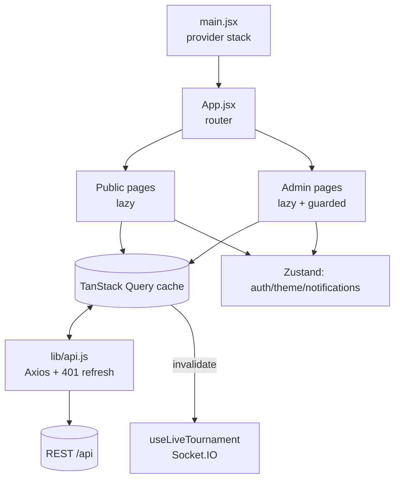
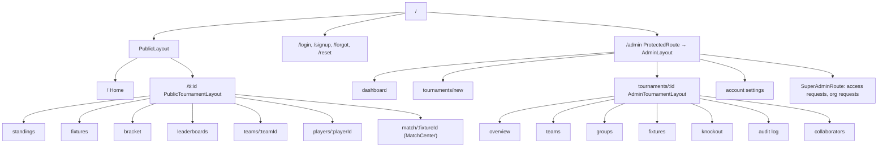
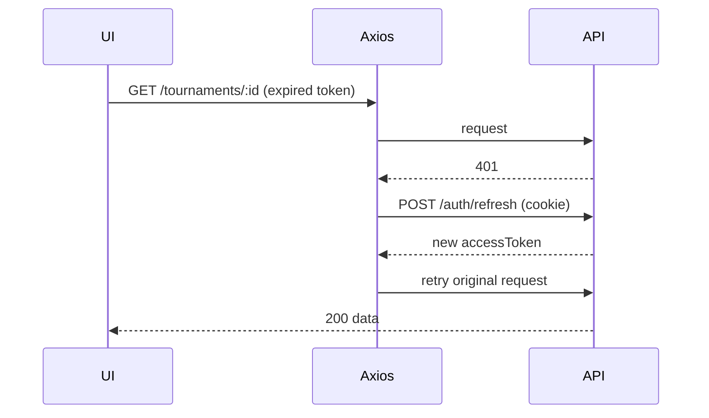

# 08 · Frontend

[← Backend](./07-backend.md) · [Back to index](./README.md) · Next: [Realtime & Live Scoring →](./09-realtime-and-live-scoring.md)

---

This document covers the React single‑page app: its architecture, routing, state
management (server vs client state), the component hierarchy, the styling system, key
user flows, and the domain helper libraries. Code lives in `client/src/`.

---

## 8.1 UI architecture

The client is a **React 19 + Vite** SPA with a clear separation between **server state**
(TanStack Query, the cache of API data) and **client state** (Zustand stores for session,
theme, ephemeral notifications). It is split into a **public broadcast surface** (read‑only
tournament viewing) and an **admin console** (authoring + live scoring).



**Provider stack** (`main.jsx`, outer → inner): `QueryClientProvider` →
`BrowserRouter` → `TooltipProvider` → `App`, with a global `ThemedToaster` and
`ErrorBoundary`.

**Why this split:** server data has its own lifecycle (caching, refetch, invalidation,
realtime) that TanStack Query models well; truly local concerns (is the user logged in,
what theme, transient toasts) are tiny and synchronous, which Zustand handles with no
boilerplate. Mixing them in one store would conflate cache invalidation with UI state.

---

## 8.2 Routing structure

Routing uses **React Router 7**. `App.jsx` defines the tree; most pages are
`React.lazy`‑loaded and wrapped in `Suspense` so the public bundle stays small and admin
code is only fetched when needed.



**Guards:**
- `ProtectedRoute` — requires an authenticated, approved user; otherwise redirects to
  `/login` (preserving the intended destination).
- `SuperAdminRoute` — additionally requires `role === 'superadmin'`.

**Layouts:** `PublicLayout` (header + footer + page transitions), `PublicTournamentLayout`
(tournament banner + tab nav, loads the tournament once and shares it via context),
`AdminLayout` (sidebar + top bar + command palette + notification bell),
`AdminTournamentLayout` (per‑tournament admin tabs with manager‑gated actions).

---

## 8.3 State management

### Server state — TanStack Query
- **`lib/queryClient.js`** sets defaults (stale times, retry/backoff, refetch policy).
- **`hooks/queries.js`** centralises **query keys** (`qk`) and exposes typed hooks for
  every resource (tournaments, teams, groups, fixtures, standings, knockout, leaderboards,
  players, audit, users, access requests) plus mutation hooks that **invalidate** the
  right keys on success.
- **Invalidation discipline:** a mutation invalidates exactly the queries whose data it
  could have changed (e.g. submitting a result invalidates that tournament's fixtures,
  standings, leaderboards). Realtime events do the same from the socket layer.

### Client state — Zustand
- **`store/auth.js`** — the session: in‑memory `accessToken` (never in `localStorage`),
  current `user`, and `bootstrap()` which silently calls `/auth/refresh` on load to
  restore a session from the httpOnly cookie. Exposes `login`, `logout`, and a
  cache‑reset hook so logging out clears the Query cache.
- **`store/theme.js`** — theme (`dark`/`light`); applies the `.dark` class to `<html>` and
  persists to the **server** (`PATCH /auth/preferences`) for logged‑in users so the
  preference follows the account.
- **`store/notifications.js`** — an ephemeral in‑memory feed (the bell), fed by realtime
  tournament events; not persisted.

> **Why the access token lives in memory:** keeping it out of `localStorage` mitigates XSS
> token theft; the refresh token is an httpOnly cookie the JS can't read. See
> [Security](./10-security.md#104-data-protection).

---

## 8.4 Data fetching & the Axios client

`lib/api.js` configures Axios with `baseURL: '/api'` and `withCredentials: true`, injects
the in‑memory access token on each request, and implements a **single‑flight 401 refresh
interceptor**: on a 401 it calls `/auth/refresh` once, queues concurrent failed requests,
retries them with the new token, and on refresh failure forces a logout. This makes the
short access‑token lifetime invisible to the UI.



---

## 8.5 Component hierarchy

```
client/src/
├── pages/
│   ├── public/    Home, TournamentHub, Standings/Fixtures/Bracket/Leaderboards,
│   │              TeamPage, PlayerPage, MatchCenter, NotFound
│   └── admin/     Login/Signup/Forgot/Reset, Dashboard, NewTournament,
│                  Admin{Overview,Teams,Groups,Fixtures,Knockout,AuditLog,Collaborators},
│                  AccountSettings, Access/Org request pages, AdminSetup
├── components/
│   ├── admin/     ResultEntryDialog, CricketConsole, FootballConsole, LiveScoring,
│   │              LineupPicker, FormationEditor, TournamentForm, ImageUpload, ...
│   ├── charts/    ManhattanChart, WormChart, MatchTimeline, WinProbabilityBar
│   ├── layout/    PublicLayout, PageTransition
│   ├── ui/        Radix-based primitives (button, card, dialog, tabs, select, ...)
│   └── (shared)   StandingsTable, Bracket, FixtureItem, MatchDetail, LiveTicker,
│                  BestEleven, FormPills, QualificationPanel, CommandPalette,
│                  NotificationBell, ErrorBoundary, ThemedToaster, ThemeToggle
├── hooks/         queries, useLiveTournament, useTournamentNotifications,
│                  useSubmitResult, useDebouncedValue, useMediaQuery, useDocumentTitle
├── lib/           api, socket, queryClient, format, utils, cricket, formation,
│                  bestEleven, winPredictor, commentary, qualification, formGuide,
│                  exportCsv, resultCard, celebrate, motion, cricketSeries
└── store/         auth, theme, notifications
```

**Key admin components:**
- **`ResultEntryDialog`** — entry point for recording a result; switches between
  `CricketConsole` and `FootballConsole`.
- **`CricketConsole` / `FootballConsole`** — sport‑specific scoring UIs that build the
  granular result/event payloads sent to `/fixtures/:id/result` and `/events`.
- **`LiveScoring`** — ball‑by‑ball / event live mode that pushes `/live-update` snapshots.
- **`LineupPicker` / `FormationEditor` / `FormationBoard`** — football lineup & tactical
  layout editors backed by the shared formation presets.

**Key public components:** `StandingsTable`, `Bracket`, `MatchCenter`/`MatchDetail`,
`LiveTicker`, `BestEleven`, charts (`Manhattan`/`Worm`/`WinProbability`).

---

## 8.6 Domain helper libraries (`lib/`)

The frontend mirrors some domain logic for rich, instant UI (presentation‑only — the
server remains authoritative):

| Module | Purpose |
|--------|---------|
| `cricket.js`, `cricketSeries.js` | Over/run math, innings shaping, chart series. |
| `winPredictor.js` | Live win‑probability estimate for the probability bar. |
| `commentary.js` | Auto‑generated ball/event commentary text. |
| `formation.js` | Football formation slot math (mirrors `@tms/shared` presets). |
| `bestEleven.js` | "Team of the tournament" computation from stats. |
| `qualification.js`, `formGuide.js` | Standings scenarios + recent‑form pills. |
| `resultCard.js`, `exportCsv.js` | Shareable result cards + CSV export. |
| `format.js`, `utils.js`, `motion.js`, `celebrate.js` | Formatting, `cn()` class merge, animation variants, confetti. |

---

## 8.7 Styling system

- **Tailwind CSS v4** with a **CSS‑first** config in `client/src/index.css`: design tokens
  (`--background`, `--foreground`, `--primary`, sizes) are CSS variables, and a custom
  `dark` variant toggles via the `.dark` class on `<html>`.
- **Radix UI primitives** under `components/ui/` provide accessible, unstyled behaviour;
  Tailwind classes (merged with `cn()` from `lib/utils.js`) provide the look.
- **Framer Motion** (`lib/motion.js`, `PageTransition`) handles route/page animations.
- **Theming** is per‑user and persisted server‑side; the toggle updates the store, the
  `<html>` class, and the user's preference.

---

## 8.8 Key user flows

### Public viewer watching a live match
1. Open `/t/:id/match/:fixtureId` (MatchCenter).
2. `useLiveTournament` joins the tournament + fixture socket rooms.
3. `fixture:live` events update the `LiveTicker`, win‑probability bar, and charts in real
   time; `fixture:result` / `standings:update` invalidate the relevant queries.

### Admin recording a result
1. From `AdminFixtures`, open `ResultEntryDialog` for a fixture.
2. Enter the scorecard in the sport console (optionally ball‑by‑ball via `LiveScoring`).
3. `useSubmitResult` posts to `/fixtures/:id/result`; on a knockout re‑submit conflict it
   surfaces the confirm dialog (`requiresConfirm` + `affected`).
4. On success, queries invalidate and the broadcast surface updates instantly.

### Organiser onboarding
1. `Signup` → pending account (cannot log in to the console yet).
2. Super admin approves in **Access requests**; the organiser receives an email.
3. Organiser logs in, lands on the `Dashboard`, creates a tournament via
   `NewTournament` / `TournamentForm`.

---

## 8.9 Performance & resilience

- **Code splitting:** `React.lazy` per route + Vite `manualChunks` (react, radix, query,
  motion, charts) keep first load small; admin code is never shipped to public visitors
  until needed.
- **Cache‑first reads:** TanStack Query serves cached data instantly and refetches in the
  background; realtime events keep it fresh without polling.
- **Optimistic‑ish live updates:** high‑frequency `fixture:live` events update local UI
  state directly rather than refetching, to avoid request storms.
- **Error boundaries:** a top‑level `ErrorBoundary` plus `Suspense` fallbacks prevent a
  single failing chunk/component from blanking the app.
- **Debounced inputs** (`useDebouncedValue`) for search fields reduce request churn.
