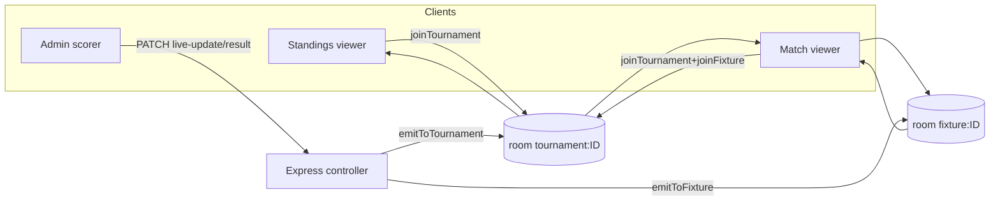
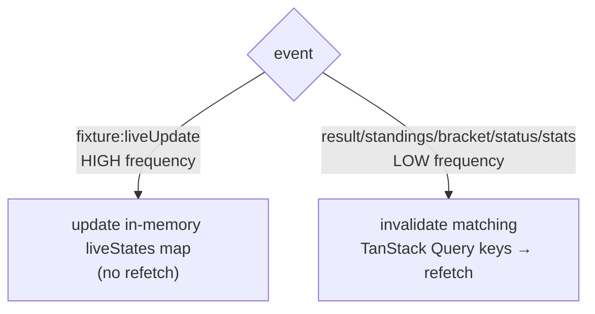
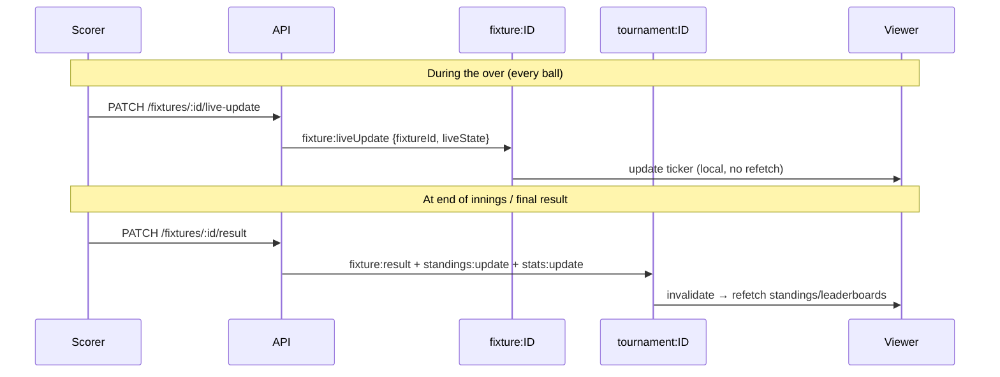

# 09 · Realtime & Live Scoring

[← Frontend](./08-frontend.md) · [Back to index](./README.md) · Next: [Security →](./10-security.md)

---

This document describes the realtime layer: the Socket.IO architecture, the room model,
the full event contract, how live ball‑by‑ball / event scoring works end‑to‑end, and the
deliberate design choices that keep it cheap during high‑frequency updates. Server code is
`server/src/socket/index.js`; client code is `client/src/lib/socket.js` and
`client/src/hooks/useLiveTournament.js`.

---

## 9.1 Why realtime

A tournament platform is a **broadcast** product: dozens to hundreds of viewers watch a
match simultaneously and expect the score, standings, and bracket to update without
refreshing. Polling would be wasteful and laggy. TourneyOps uses **Socket.IO** to push
updates only to the viewers who are looking at the affected tournament or match.

---

## 9.2 Architecture & room model

Socket.IO is attached to the same HTTP server as Express (`initSocket(httpServer)` in
`server/src/index.js`) and shares the CORS origin allowlist with credentials enabled.

Clients **join rooms** to scope what they receive:

| Room | Name | Who joins | What they get |
|------|------|-----------|---------------|
| Tournament | `tournament:<id>` | Anyone viewing a tournament (home/standings/fixtures/bracket/leaderboards) | Result/standings/bracket/status/stats updates for that tournament. |
| Fixture | `fixture:<id>` | Anyone on a live match view | High‑frequency live snapshots for that match. |

**Server emit helpers:** `emitToTournament(id, event, payload)` and
`emitToFixture(id, event, payload)`. Controllers call these after a successful mutation —
the socket layer never reads/writes the DB itself, it only fans out.

**Join‑message validation:** `joinTournament`/`joinFixture`/`leaveTournament`/
`leaveFixture` payloads must be valid 24‑char ObjectIds or the join is silently ignored —
preventing room‑name injection.

---

## 9.3 Event contract

The event names are a **shared constant** duplicated verbatim on both ends
(`server/src/socket/index.js` `EVENTS` ≡ `client/src/lib/socket.js` `EVENTS`):

| Constant | Event name | Emitted to | When | Payload |
|----------|-----------|------------|------|---------|
| `LIVE_UPDATE` | `fixture:liveUpdate` | fixture room | Live snapshot pushed (`/live-update`) | `{ fixtureId, liveState }` |
| `RESULT` | `fixture:result` | tournament room | A result is recorded/edited | `{ fixtureId, ... }` |
| `STANDINGS` | `standings:update` | tournament room | Standings recomputed | `{ tournamentId }` |
| `STATUS` | `fixture:status` | tournament room | Fixture status/schedule changes | `{ fixtureId, status }` |
| `BRACKET` | `knockout:update` | tournament room | Bracket generated/advanced/adjusted | `{ tournamentId }` |
| `STATS` | `stats:update` | tournament room | Player aggregate stats recomputed | `{ tournamentId }` |

**Client→server (room management):** `joinTournament`, `leaveTournament`, `joinFixture`,
`leaveFixture`.

---

## 9.4 Client handling — invalidate vs. local update

`useLiveTournament(tournamentId)` joins the tournament room and wires handlers. The key
design decision is **two different reactions** depending on event frequency:

- **`fixture:liveUpdate`** (every ball / every goal) updates only an **in‑memory snapshot
  map** used by the ticker and live banners. It does **not** invalidate queries —
  invalidating the fixtures list on every delivery would cause a refetch storm during live
  scoring.
- **`fixture:result` / `standings:update` / `knockout:update` / `fixture:status` /
  `stats:update`** are infrequent and authoritative, so they **invalidate** the precise
  query keys and let TanStack Query refetch the source of truth:
  - result → fixtures + standings + knockout
  - standings → standings
  - bracket → knockout
  - status → fixtures
  - stats → team rosters + teams + leaderboards

This "**local for hot, refetch for cold**" split keeps the UI instant during scoring while
guaranteeing eventual consistency with the server for everything that matters.

---

## 9.5 Live scoring end‑to‑end

There are **two write paths** from the admin scoring consoles:

### Path A — Live snapshot (high frequency)
`PATCH /api/fixtures/:id/live-update` with a `liveState` snapshot (derived by
`matchDerive.deriveLiveTicker`).
1. Controller stores `liveState` on the fixture (no standings/stat recompute).
2. Emits `fixture:liveUpdate` to the **fixture room**.
3. Viewers' tickers/charts/win‑probability bars update from the in‑memory snapshot.

### Path B — Authoritative result / events (lower frequency)
`PATCH /api/fixtures/:id/result` or `/events`.
1. Result derived + validated (`resolveResult`), fixture saved, audit recorded.
2. Standings (group) or bracket (knockout) + the two teams' player stats recomputed.
3. Emits `fixture:result` (+ `standings:update` / `knockout:update` / `stats:update`) to
   the **tournament room**.
4. Viewers invalidate and refetch the affected data.

---

## 9.6 Connection management & resilience

- **Singleton client socket** (`getSocket()`), lazily created, `autoConnect`, transports
  `['websocket','polling']` (auto‑fallback), `withCredentials`.
- **Re‑join on view change:** `useLiveTournament` joins on mount and leaves on unmount;
  switching tournaments drops stale live snapshots.
- **Reconnect:** Socket.IO auto‑reconnects; because cold events trigger a query
  invalidation/refetch, a client that missed events while disconnected re‑syncs to the
  source of truth on the next event or normal refetch (no event replay needed).
- **At‑most‑once, best‑effort delivery:** events are not persisted or acked; the server DB
  remains the source of truth and the client always reconciles via refetch. This is a
  deliberate simplicity/robustness trade‑off appropriate for a broadcast read model.

---

## 9.7 Scaling realtime

The current setup is single‑process. To scale horizontally (multiple API instances behind
a load balancer):

- Add the **Socket.IO Redis adapter** so `emitTo*` fans out across all instances (the
  optional Redis used for rate limiting can host this too).
- Enable **sticky sessions** at the load balancer for the polling transport handshake.

See [DevOps → Scaling](./11-devops-and-infrastructure.md#116-scaling) and
[Architecture → Scalability](./02-architecture.md).
