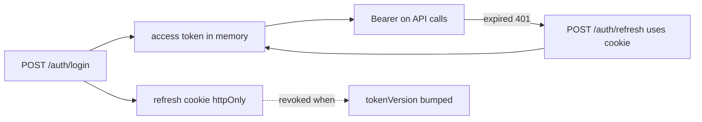
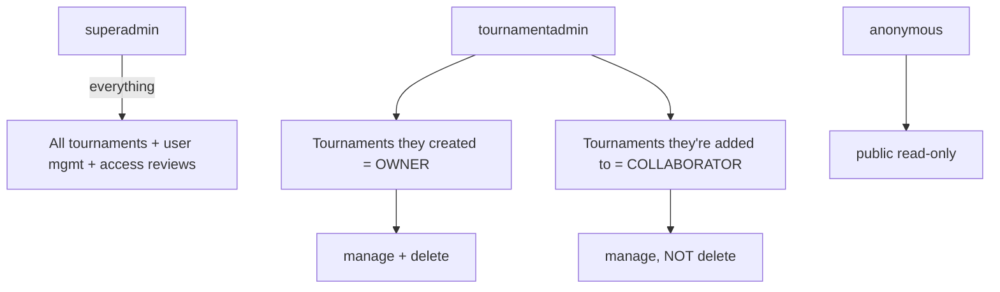

# 10 · Security

[← Realtime & Live Scoring](./09-realtime-and-live-scoring.md) · [Back to index](./README.md) · Next: [DevOps & Infrastructure →](./11-devops-and-infrastructure.md)

---

This document covers the security model end‑to‑end: authentication, the authorization
model, data protection, the threat model and mitigations, and the operational hardening
checklist. Most controls live in `server/src/middleware/`, `server/src/utils/tokens.js`,
and `server/src/config/env.js`.

---

## 10.1 Authentication mechanisms

### Two‑token JWT scheme
- **Access token** — short‑lived (`JWT_ACCESS_EXPIRES`, default 15m) JWT signed with
  `JWT_ACCESS_SECRET`. Sent as `Authorization: Bearer`. Payload: `sub` (user id), `role`,
  `name`, `tv` (token version). Kept **in memory only** on the client.
- **Refresh token** — long‑lived (default 7d) JWT signed with a **separate**
  `JWT_REFRESH_SECRET`, delivered as an **httpOnly, SameSite, Secure (prod)** cookie
  `tms_refresh` scoped to path `/api/auth`. Payload: `sub`, `tv`.

### Token revocation via `tokenVersion`
Each user has a `tokenVersion`. Both tokens embed it as `tv`. `authenticate` re‑loads the
user and rejects any token whose `tv` ≠ the stored value. Bumping `tokenVersion`
**instantly invalidates every outstanding token** for that user. It is bumped on:
- logout / logout‑all,
- password change,
- password reset,
- account rejection by a super admin.

### Password handling
- Organiser passwords are hashed with **bcrypt** (10 salt rounds) and stored in
  `passwordHash` (`select:false`). Never logged, never returned (`toJSON` strips it).
- The **super admin** password is **not stored as a user‑editable hash** — it is the
  configured `SEED_ADMIN_PASSWORD`, compared with a **timing‑safe** comparison at login,
  and cannot be changed/reset through the API.

### Password reset (enumeration‑safe)
- `forgot-password` always returns a generic success regardless of whether the email
  exists (no account enumeration).
- A random token is generated; only its **SHA‑256 hash** is stored
  (`resetPasswordTokenHash`, `select:false`), with a 30‑minute expiry. The raw token is
  emailed in the link.
- `reset-password` hashes the presented token, looks it up, checks expiry, sets the new
  password, clears the token, and bumps `tokenVersion`.

### Account approval gate
Self‑signups are created `pending` and **cannot authenticate to the console** until a
super admin approves. `authenticate` rejects non‑approved/inactive accounts even if they
hold a valid token.

---

## 10.2 Authorization model

Two roles plus per‑tournament ownership/collaboration:

| Capability | Public | Collaborator | Owner | Super admin |
|------------|:------:|:------------:|:-----:|:-----------:|
| View public pages | ✅ | ✅ | ✅ | ✅ |
| Create tournament | ❌ | ✅ (becomes owner) | — | ✅ |
| Edit teams/fixtures/results/standings/knockout | ❌ | ✅ | ✅ | ✅ |
| Delete tournament | ❌ | ❌ | ✅ | ✅ |
| Manage collaborators | ❌ | ❌ | ❌ | ✅ |
| Approve users / review access requests | ❌ | ❌ | ❌ | ✅ |
| Register/create accounts | ❌ | ❌ | ❌ | ✅ |

**Enforcement layers (defence in depth):**
1. **Route middleware** — `authenticate` → `authorize(role)` and/or `loadTournament` →
   `requireTournamentManager` / `requireTournamentOwner`.
2. **Controller checks** — additional guards (e.g. cannot review yourself or another super
   admin; owner can't be removed as collaborator).
3. **UI gating** — pages compute `canManage`/`isOwner` flags to hide controls (UX only,
   never the security boundary).

> The server is the **only** trust boundary; every mutating endpoint re‑checks
> authorization regardless of what the UI shows.

---

## 10.3 Input validation

- **Zod schemas** (`@tms/shared/schemas`) validate every request body/query/params via the
  `validate` middleware, with strict typing, enums, length/range caps, regex (e.g.
  `shortCode`), and cross‑field refinements (e.g. one of cricket/football, date ordering,
  sport‑valid tiebreakers).
- Parsed/coerced values **replace** the raw request, so controllers never see unvalidated
  input.
- Mongoose adds a second schema‑level validation layer (types, enums, required) before any
  write.
- **ObjectId casting** failures are normalised to clean 400s by `errorHandler` rather than
  leaking Mongoose internals.

---

## 10.4 Data protection

| Concern | Control |
|---------|---------|
| Passwords | bcrypt hashes, `select:false`, stripped in `toJSON`. |
| Reset tokens | only the SHA‑256 hash stored, `select:false`, 30‑min TTL, single‑use. |
| Secrets | `JWT_*` secrets required (and validated for strength outside dev) in `env.js`; never committed (`.env` git‑ignored). |
| Refresh token | httpOnly (no JS access) + Secure (prod) + SameSite + path‑scoped. |
| Access token | memory only (not `localStorage`/cookies) → not readable by XSS, not sent as ambient credential. |
| PII | only name/email/organisation stored; no payment or sensitive categories. |
| Audit trail | append‑only `AuditLog` with before/after snapshots and actor for accountability. |
| Uploads | MIME allowlist (no SVG → no script payloads), 2 MB cap, served with `crossOriginResourcePolicy` via Helmet. |

---

## 10.5 Transport & HTTP hardening

- **Helmet** sets secure response headers (incl. `crossOriginResourcePolicy` configured to
  allow image embedding from the API/CDN).
- **CORS** is an explicit **origin allowlist** (`CLIENT_ORIGIN`, comma‑separated) with
  `credentials: true` — required because the refresh cookie is cross‑site in split
  deployments. Wildcard origins are not used with credentials.
- **`trust proxy`** is enabled so client IPs (for rate limiting) are correct behind a
  reverse proxy / PaaS.
- **HTTPS** is expected in production (Secure cookies require it); terminate TLS at the
  proxy/PaaS.

---

## 10.6 Rate limiting & abuse protection

| Limiter | Scope | Limit | Purpose |
|---------|-------|-------|---------|
| `authLimiter` | `/api/auth/*` | 30 / 15 min / IP | Throttle credential stuffing & reset abuse. |
| `apiLimiter` | `/api/*` | 300 / min / IP | Blunt general abuse / scraping. |

Backed by Redis (`RATE_LIMIT_REDIS_URL`) for **shared** limits across instances, else
in‑memory per process. See [DevOps](./11-devops-and-infrastructure.md).

---

## 10.7 Threat model & mitigations

| Threat | Mitigation |
|--------|-----------|
| **XSS token theft** | Access token in memory; refresh token httpOnly; React escaping; no `dangerouslySetInnerHTML` on untrusted data; SVG uploads blocked. |
| **CSRF** | Access token is a non‑cookie Bearer header (not ambient); refresh cookie is `SameSite` and only accepted at `/api/auth/refresh`. |
| **Credential stuffing / brute force** | `authLimiter`, bcrypt cost, generic auth errors. |
| **Account enumeration** | Generic `forgot-password` response; uniform login errors. |
| **Privilege escalation** | RBAC + ownership re‑checked server‑side on every mutation; only super admins mint super admins. |
| **Session persistence after compromise** | `tokenVersion` revocation on logout‑all/password change/reset/reject. |
| **Injection (NoSQL/over‑posting)** | Zod strict parsing + Mongoose typing; unknown fields stripped; ObjectId validation on socket joins. |
| **Mass assignment** | Controllers write explicit field sets; schemas constrain inputs. |
| **DoS via large payloads** | JSON body limits, 2 MB upload cap, pagination caps. |
| **Information disclosure** | Stack traces hidden in production; secrets validated/absent from responses; sensitive fields `select:false`. |
| **Replay of stale derived state** | Server is source of truth; clients reconcile by refetch on cold events. |

---

## 10.8 Security best practices implemented

- Separate signing secrets for access vs refresh tokens.
- Short access‑token lifetime + silent refresh (small blast radius).
- Least‑privilege roles with owner/collaborator distinction.
- Centralised, consistent error handling that never leaks internals.
- Validation at the edge (Zod) **and** the model (Mongoose).
- Best‑effort, non‑blocking side effects (audit/email) so security logging can't be used to
  break the request, while still recording accountability.
- Secrets and config strictly via environment, validated at boot.

---

## 10.9 Production security checklist

- [ ] `NODE_ENV=production`.
- [ ] Strong, unique `JWT_ACCESS_SECRET` and `JWT_REFRESH_SECRET` (long random; enforced
      by `env.js`).
- [ ] Strong `SEED_ADMIN_PASSWORD`; rotate periodically.
- [ ] `CLIENT_ORIGIN` set to exact production origin(s) — no wildcards.
- [ ] HTTPS everywhere (Secure cookies).
- [ ] `RATE_LIMIT_REDIS_URL` set when running >1 instance.
- [ ] MongoDB authentication enabled and network‑restricted (not public).
- [ ] Cloudinary configured (so uploads aren't on ephemeral disk) with a restricted key.
- [ ] SMTP credentials scoped to send‑only.
- [ ] `.env` never committed; secrets stored in the platform's secret manager.
- [ ] Dependencies patched (`npm audit`) on a schedule.

See [DevOps & Infrastructure](./11-devops-and-infrastructure.md) for how these map to a
deployment, and [Maintenance](./14-maintenance-guide.md) for ongoing hygiene.
