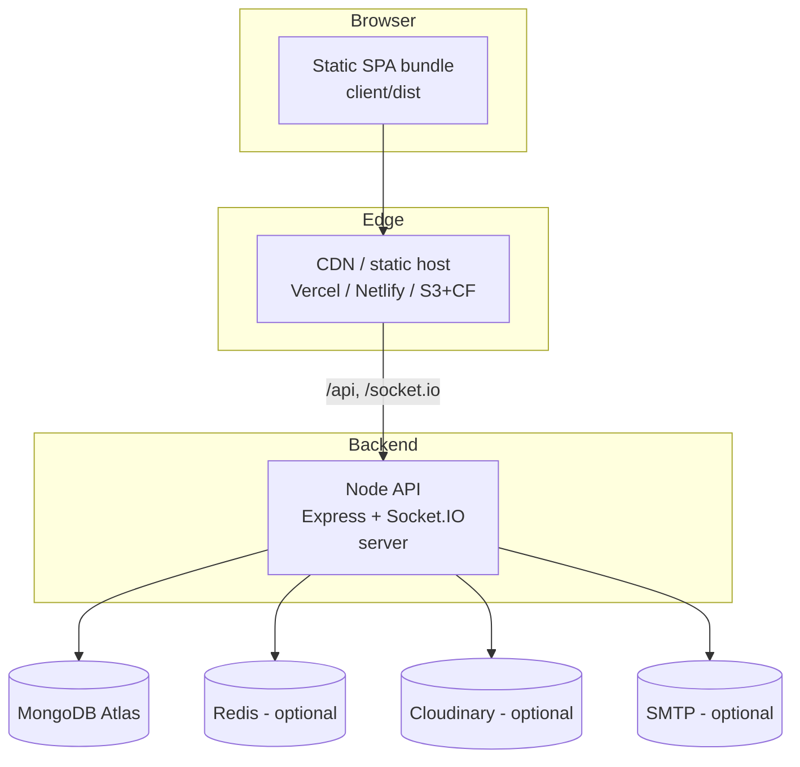

# 11 · DevOps & Infrastructure

[← Security](./10-security.md) · [Back to index](./README.md) · Next: [Testing →](./12-testing.md)

---

This document describes how TourneyOps is deployed and operated: the deployment
architecture, environment configuration, build/run process, optional infrastructure
components, recommended CI/CD and containerisation, monitoring/logging, and disaster
recovery.

> **Status note.** The repository ships **application code and seed scripts** but no
> committed Dockerfiles, CI config, or IaC. The Docker/CI/compose snippets below are
> **recommended templates** you can drop in; they reflect the app's actual runtime
> contract (env vars, ports, build outputs). Anything currently in the repo is called out
> explicitly.

---

## 11.1 Deployment architecture

TourneyOps deploys as **three deployable artifacts** from one monorepo:



- **Client** — `npm run build` (Vite) produces a static `client/dist/` served by any
  static host/CDN. It calls the API at `/api` and connects Socket.IO; in split deployments
  point it at the API origin (`VITE_SOCKET_URL` and a reverse‑proxy/`baseURL` for `/api`).
- **Server** — `npm start` runs the Express + Socket.IO API (default port `5000`). It is
  **API‑only**; it does **not** serve the SPA (it only static‑serves `/uploads` for
  local‑disk image storage). `trust proxy` is on for PaaS/reverse proxies.
- **Database** — MongoDB (managed Atlas recommended).
- **Optional** — Redis (shared rate limit + future socket adapter), Cloudinary (image
  CDN), SMTP (transactional email).

**Two common topologies:**
1. **Split origin** (recommended): SPA on a CDN host, API on a Node PaaS. Set
   `CLIENT_ORIGIN` to the SPA origin (CORS + cookies), and front the API with HTTPS.
2. **Single origin behind a reverse proxy**: Nginx serves `client/dist` and proxies
   `/api` + `/socket.io` to the Node process — simplest for cookies/CORS (same origin).

---

## 11.2 Environment configuration

All server config is environment‑driven and validated at boot by
`server/src/config/env.js`. Template: `server/.env.example`.

| Variable | Required | Default | Purpose |
|----------|:--------:|---------|---------|
| `NODE_ENV` | rec. | `development` | Enables prod hardening (secret validation, secure cookies, no stack traces). |
| `PORT` | no | `5000` | API listen port. |
| `CLIENT_ORIGIN` | **prod** | `http://localhost:5173` | Comma‑separated CORS allowlist (browser origins). |
| `MONGODB_URI` | **yes** | local URI | MongoDB connection string. |
| `JWT_ACCESS_SECRET` | **prod** | dev placeholder | Access‑token signing secret (≥32 random). |
| `JWT_REFRESH_SECRET` | **prod** | dev placeholder | Refresh‑token signing secret (separate). |
| `JWT_ACCESS_EXPIRES` | no | `15m` | Access token TTL. |
| `JWT_REFRESH_EXPIRES` | no | `7d` | Refresh token TTL. |
| `RATE_LIMIT_REDIS_URL` | no | — | Shared rate‑limit store (multi‑instance). |
| `SEED_ADMIN_NAME/EMAIL/PASSWORD` | **yes** | dev defaults | Fixed super‑admin login. |
| `SYNC_SEED_ADMIN_PASSWORD` | no | `true` | Re‑sync super‑admin password on boot (prefer `false` in prod). |
| `SEED_DEMO_NAME/EMAIL/PASSWORD` | no | dev defaults | Demo organiser for `seed:demo`. |
| `CLOUDINARY_*` / `CLOUDINARY_URL` | rec. prod | — | Image CDN (else local disk — ephemeral on PaaS!). |
| `CLOUDINARY_FOLDER` | no | `tourneyops` | Upload folder. |
| `PUBLIC_API_URL` | no | — | Absolute base for local‑disk upload URLs (split deploys). |
| `SMTP_HOST/PORT/SECURE/USER/PASS` | no | — | Email transport (blank → console). |
| `MAIL_FROM` | no | placeholder | From header. |
| `APP_URL` | no | first `CLIENT_ORIGIN` | Base URL for links in emails. |

**Client build‑time vars** (Vite, `VITE_` prefix): `VITE_SOCKET_URL` (Socket.IO origin in
split deploys); the REST base defaults to same‑origin `/api`.

> **Boot‑time validation:** outside development, `env.js` throws if required secrets are
> missing or weak — so a misconfigured production deploy fails fast rather than running
> insecurely.

---

## 11.3 Build & run

From the repo root (`package.json` scripts):

| Command | Action |
|---------|--------|
| `npm run install:all` | Install root + shared + server + client deps. |
| `npm run dev` | Run API + Vite dev server concurrently. |
| `npm run build` | Build the client SPA (`client/dist`). |
| `npm start` | Start the API in production mode. |
| `npm run seed` | Ensure super admin + backfill legacy users. |
| `npm run seed:demo` | Create/refresh demo data (demo organiser only). |
| `npm run setup` | install:all + seed + seed:demo. |
| `npm test` | Run server unit tests (Vitest). |

**Production sequence (split deploy):**
```bash
# API host
npm --prefix shared install && npm --prefix server install
NODE_ENV=production npm --prefix server run seed   # one-time / on admin rotation
NODE_ENV=production npm --prefix server start

# Static host (build step)
npm --prefix shared install && npm --prefix client install
npm --prefix client run build   # publish client/dist
```

---

## 11.4 Containerisation (recommended template)

No Dockerfile is committed. A minimal API image:

```dockerfile
# server.Dockerfile
FROM node:20-alpine
WORKDIR /app
COPY shared ./shared
COPY server ./server
RUN npm --prefix shared install --omit=dev \
 && npm --prefix server install --omit=dev
ENV NODE_ENV=production PORT=5000
EXPOSE 5000
WORKDIR /app/server
CMD ["npm", "run", "start"]
```

A `docker-compose.yml` for local full‑stack (API + Mongo + Redis):

```yaml
services:
  mongo:
    image: mongo:7
    ports: ["27017:27017"]
    volumes: ["mongo-data:/data/db"]
  redis:
    image: redis:7
    ports: ["6379:6379"]
  api:
    build: { context: ., dockerfile: server.Dockerfile }
    env_file: server/.env
    environment:
      MONGODB_URI: mongodb://mongo:27017/tournament_manager
      RATE_LIMIT_REDIS_URL: redis://redis:6379
    ports: ["5000:5000"]
    depends_on: [mongo, redis]
volumes: { mongo-data: {} }
```

> If you use local‑disk uploads in a container, mount a **persistent volume** at
> `server/uploads` — otherwise images vanish on redeploy. Prefer Cloudinary in production.

---

## 11.5 CI/CD (recommended template)

No pipeline is committed. A GitHub Actions outline:

```yaml
name: ci
on: [push, pull_request]
jobs:
  test:
    runs-on: ubuntu-latest
    steps:
      - uses: actions/checkout@v4
      - uses: actions/setup-node@v4
        with: { node-version: 20, cache: npm }
      - run: npm run install:all
      - run: npm test                      # server unit tests (Vitest)
      - run: npm --prefix client run build # ensure the SPA builds
```

Recommended deploy stages after `test` passes:
1. **Build** client → publish `client/dist` to the static host.
2. **Deploy** API container/image to the Node host.
3. **Migrate/seed** if needed (`seed` is idempotent; safe to run each deploy).
4. **Smoke test** `GET /api/health`.

---

## 11.6 Scaling

- **API is stateless** (JWT auth, no server sessions) → scale horizontally behind a load
  balancer.
- **Rate limiting** must use `RATE_LIMIT_REDIS_URL` when running >1 instance (otherwise
  each instance counts separately).
- **Socket.IO** needs the **Redis adapter** + **sticky sessions** to fan out across
  instances (see [Realtime → Scaling](./09-realtime-and-live-scoring.md#97-scaling-realtime)).
- **Reads scale well** because standings/leaderboards are denormalised single‑query reads;
  add Mongo read replicas for heavy public traffic.
- **Static/assets** offload to CDN (SPA bundle + Cloudinary images).
- **MongoDB** scales via Atlas tiers / sharding by tournament if ever needed.

---

## 11.7 Monitoring & logging

| Aspect | Current | Recommended addition |
|--------|---------|----------------------|
| Request logs | `morgan('dev')` in development only | Structured JSON access logs (pino) in prod, shipped to a log aggregator. |
| Error logs | `console.error` in `errorHandler` (server errors) | Error tracking (Sentry) with release tagging. |
| Liveness | `GET /api/health` (uptime) | Wire to platform health checks / uptime monitor. |
| DB | Mongoose connection lifecycle logs | Atlas metrics + slow‑query alerts. |
| Realtime | — | Track socket connection counts / room sizes. |
| Frontend | `ErrorBoundary` | Client error reporting (Sentry browser SDK). |

Health endpoint contract: `GET /api/health` → `{ success:true, data:{ uptime } }` (use for
load‑balancer and uptime probes).

---

## 11.8 Disaster recovery

| Risk | Mitigation / procedure |
|------|------------------------|
| Data loss | **MongoDB is the only durable store** — enable Atlas continuous/automated backups + point‑in‑time restore. Derived collections (standings, player stats, bracket advancement) are re‑computable via the recalculation cascade after a restore. |
| Corrupt derived data | Run `POST /tournaments/:id/recalculate` (or `seed`/recompute) to rebuild from fixtures (source of truth). |
| Lost uploads | Use Cloudinary (durable) rather than container disk; if on disk, back up the volume. |
| Leaked JWT secret | Rotate `JWT_*` secrets → instantly invalidates all tokens; users re‑login. |
| Compromised admin | Bump `tokenVersion` (reject/rotate), rotate `SEED_ADMIN_PASSWORD` + re‑seed. |
| Region outage | Stateless API → redeploy in another region pointed at the same Atlas cluster (multi‑region Atlas for HA). |

**RPO/RTO:** with Atlas backups, RPO is the backup interval; RTO is restore time + a
redeploy. Because the API is stateless and derived state is rebuildable, recovery is
primarily a database‑restore exercise.

See [Maintenance Guide](./14-maintenance-guide.md) for routine operations and upgrades.
