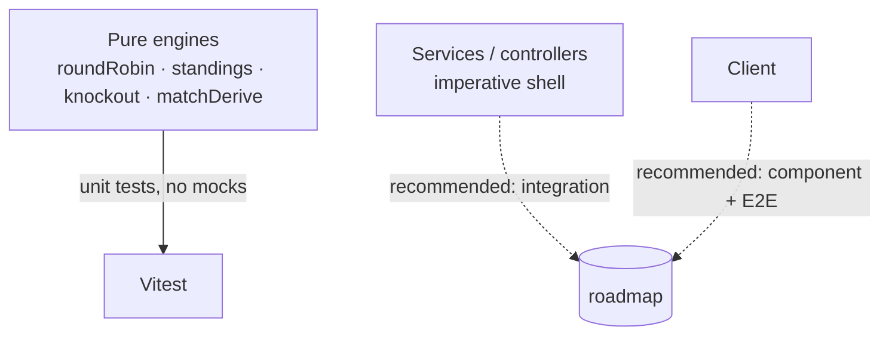

# 12 · Testing

[← DevOps & Infrastructure](./11-devops-and-infrastructure.md) · [Back to index](./README.md) · Next: [Development Guide →](./13-development-guide.md)

---

This document describes the testing strategy: what is tested today, how the tests are
structured, how to run them, the coverage philosophy, and a roadmap for the layers not yet
covered (integration / E2E).

---

## 12.1 Testing philosophy

TourneyOps follows a **"test the dangerous part hard, keep the rest thin"** strategy. The
correctness risk is concentrated in the **pure domain engines** — scheduling, standings +
Net Run Rate, knockout seeding/advancement, event derivation. Because these are written as
**pure functions** (no DB, no I/O), they are exhaustively unit‑tested with plain
in‑memory data and no mocks.



> **Why this works:** the imperative shell (controllers/services) is mostly thin
> orchestration around the engines. The engines hold the logic that is hard to get right
> (ICC NRR rules, tie/no‑result handling, bye placement, advancement), so testing them
> directly gives high confidence per line of test.

---

## 12.2 Current test suite

Framework: **Vitest 4** (`server/package.json`). Tests live in `server/tests/`:

| File | Engine under test | What it verifies |
|------|-------------------|------------------|
| `roundRobin.test.js` | `roundRobin.js` | Circle‑method correctness: every pair plays once, bye handling for odd counts, home/away alternation, double round‑robin mirroring. |
| `standings.test.js` | `standings.js` | Football points/GD/ranking, own‑goal crediting, head‑to‑head tiebreak; cricket NRR (full allotted overs when bowled out), no‑result & tie sharing, ignoring non‑completed fixtures; `oversToDecimal` conversion + clamping. |
| `knockout.test.js` | `knockout.js` | Seed ordering, qualifier collection/labelling, single‑elimination bracket shape with byes + third place, playoff bracket, advancement targets. |
| `matchDerive.test.js` | `matchDerive.js` | Ball→over conversion, cricket innings/player derivation, football goals (own‑goal attribution), player stats, clean sheets, live ticker. |
| `formationRegression.test.js` | shared formation logic | Football formation preset/slot normalisation & position inference (regression guard). |

**Representative test** (from `standings.test.js`) — note the ICC "full allotted overs"
NRR rule is explicitly asserted:

```javascript
it('computes net run rate, using full allotted overs when a side is bowled out', () => {
  const rows = computeGroupStandings({
    sport: 'cricket', pointsConfig: CRICKET_CFG, teamIds: ['A', 'B'],
    fixtures: [ ck('A','B', [
      { battingTeam:'A', runs:160, overs:20, wickets:5, allottedOvers:20 },
      { battingTeam:'B', runs:150, overs:18, wickets:10, allottedOvers:20 }, // bowled out
    ], 'A', 'runs') ],
  });
  // NRR uses 20 overs for B (not 18) → 160/20 - 150/20 = +0.5 / -0.5
  expect(byTeam(rows).A.netRunRate).toBeCloseTo(0.5, 3);
});
```

---

## 12.3 Running the tests

```bash
npm test                      # from repo root → runs server Vitest once
npm --prefix server test      # equivalent
npm --prefix server run test:watch   # watch mode while developing
```

- Tests are **fast and hermetic**: no database, network, or env setup required (pure
  functions + in‑memory fixtures).
- `npm test` (root) maps to `vitest run` in the server workspace.

---

## 12.4 Coverage expectations

| Area | Target | Rationale |
|------|--------|-----------|
| Pure engines (`roundRobin`, `standings`, `knockout`, `matchDerive`) | **High (≈90%+ branches)** | This is where correctness bugs hurt; cheap to cover thoroughly. |
| Derivation edge cases (own goals, no‑result, ties, byes, super over) | **Explicitly cased** | Domain rules that are easy to get subtly wrong. |
| Services/controllers (shell) | Lower; cover via integration (roadmap) | Mostly orchestration; integration gives better ROI than unit mocks. |
| Client | Component/E2E (roadmap) | Currently manual. |

To add coverage reporting:
```bash
npm --prefix server exec vitest run -- --coverage   # add @vitest/coverage-v8
```

---

## 12.5 Mocking strategy

- **Engines:** *no mocks* — they are pure, so tests pass plain objects/arrays and assert on
  returned values. This is the biggest reason the suite is reliable and fast.
- **Services (when integration tests are added):** prefer a **real ephemeral MongoDB**
  (`mongodb-memory-server`) over mocking Mongoose, so query/index behaviour is exercised
  realistically.
- **External adapters** (Cloudinary, SMTP, Redis) are already designed with **fallbacks**
  (local disk / `jsonTransport` / in‑memory) — integration tests can run against the
  fallbacks without any test doubles.

---

## 12.6 Recommended test roadmap

The unit layer is solid; the following are recommended to reach full‑pyramid coverage.

### Integration tests (API)
Spin up the Express app + `mongodb-memory-server` and exercise real HTTP flows with
`supertest`:
- Auth lifecycle: signup → approve → login → refresh → logout‑all revocation.
- Result submission → standings recompute → leaderboard reflects change.
- Knockout generation → advancement → **re‑submit conflict** returns `requiresConfirm`,
  then `confirm:true` applies.
- Authorization matrix: public vs collaborator vs owner vs super admin per endpoint.
- Validation: malformed bodies return `422` with `details`.

```javascript
// sketch
import request from 'supertest';
it('blocks a non-manager from editing a result', async () => {
  const res = await request(app)
    .patch(`/api/fixtures/${fixtureId}/result`)
    .set('Authorization', `Bearer ${strangerToken}`)
    .send({ football: { /* ... */ } });
  expect(res.status).toBe(403);
});
```

### Component tests (client)
`Vitest + @testing-library/react` for `StandingsTable`, `Bracket`,
`CricketConsole`/`FootballConsole` payload building, and the 401‑refresh interceptor.

### End‑to‑end
`Playwright` happy‑path: create tournament → add teams → generate fixtures → score a match
→ verify the public page updates live (drives the Socket.IO path too).

### CI gating
Run `npm test` + `npm --prefix client run build` on every PR (see
[DevOps → CI/CD](./11-devops-and-infrastructure.md#115-cicd-recommended-template)); add the
integration job once `mongodb-memory-server` is wired in.

---

## 12.7 Manual test checklist (pre‑release)

Until E2E is automated, smoke‑test these flows against `seed:demo` data:

- [ ] Login as super admin and demo organiser.
- [ ] Create a cricket and a football tournament; add teams/players.
- [ ] Auto‑distribute groups; generate group fixtures.
- [ ] Enter results (incl. an own goal, a tie/no‑result, a bowled‑out NRR case).
- [ ] Verify standings ranking + tiebreakers + leaderboards.
- [ ] Generate knockout (single‑elim + playoff); advance to a final; re‑submit an early
      result and confirm the downstream‑reset prompt appears.
- [ ] Live scoring: open a public match view in a second browser and confirm realtime
      ticker + standings updates.
- [ ] Approve/reject an organiser; request/review tournament access.
- [ ] Upload a logo; trigger password reset (check console email in dev).
