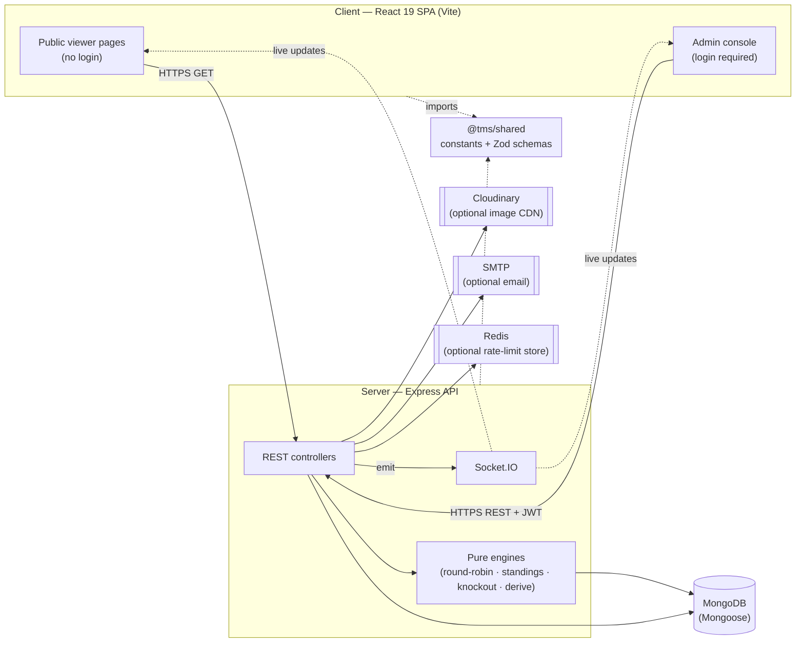

# TourneyOps — Engineering Documentation

> **TourneyOps** is a configurable **cricket & football** tournament management
> platform: it runs group stages (round‑robin with Net Run Rate / goal‑difference
> standings), seeded cross‑group knockouts, live ball‑by‑ball / event scoring over
> WebSockets, and public broadcast‑quality leaderboards. It is a Node.js monorepo
> with an **Express + MongoDB + Socket.IO** API and a **React 19 + Vite** single‑page
> app, sharing domain constants and Zod schemas through a common package.

This `docs/` folder is the complete, production‑grade reference for the system. It is
written for **new developers, architects, DevOps/SRE engineers, QA engineers, and
stakeholders**. It assumes **no prior knowledge** of the project, and it explains not
only *what* the code does but *why* it was designed that way.

---

## How to read this documentation

If you are… | Start here
--- | ---
**A stakeholder / product owner** | [Project Overview](./01-project-overview.md)
**A new developer onboarding** | [Project Overview](./01-project-overview.md) → [Development Guide](./13-development-guide.md) → [Code Structure](./04-code-structure.md)
**An architect** | [Architecture](./02-architecture.md) → [System Design](./03-system-design.md)
**A backend engineer** | [Backend](./07-backend.md) → [Database](./05-database.md) → [API Reference](./06-api-reference.md)
**A frontend engineer** | [Frontend](./08-frontend.md) → [Realtime & Live Scoring](./09-realtime-and-live-scoring.md) → [API Reference](./06-api-reference.md)
**A DevOps / SRE engineer** | [DevOps & Infrastructure](./11-devops-and-infrastructure.md) → [Security](./10-security.md) → [Maintenance Guide](./14-maintenance-guide.md)
**A QA engineer** | [Testing](./12-testing.md) → [API Reference](./06-api-reference.md) → [Domain Glossary](./15-domain-glossary.md)

---

## Table of contents

| # | Document | What it covers |
|---|----------|----------------|
| 01 | [Project Overview](./01-project-overview.md) | Purpose, business goals, use cases, core features, high‑level system view |
| 02 | [Architecture](./02-architecture.md) | System architecture, patterns, component & data‑flow diagrams, sequence diagrams, scalability, fault tolerance |
| 03 | [System Design (HLD & LLD)](./03-system-design.md) | High‑ and low‑level design, module decomposition, domain modeling, design patterns, trade‑offs, performance |
| 04 | [Code Structure](./04-code-structure.md) | Repository & folder layout, file‑by‑file map, module responsibilities, dependency rationale |
| 05 | [Database](./05-database.md) | MongoDB architecture, every schema, entity relationships, indexing, migrations, data lifecycle |
| 06 | [API Reference](./06-api-reference.md) | Every endpoint, request/response shapes, auth, error codes, validation rules, rate limits, flow examples |
| 07 | [Backend](./07-backend.md) | Service layers, the scoring/bracket engines, middleware, business logic, background work |
| 08 | [Frontend](./08-frontend.md) | UI architecture, routing, state management, component hierarchy, styling system, user flows |
| 09 | [Realtime & Live Scoring](./09-realtime-and-live-scoring.md) | Socket.IO rooms, event contract, live‑update flow, cache‑sync strategy |
| 10 | [Security](./10-security.md) | Authentication, authorization model, data protection, threat mitigations |
| 11 | [DevOps & Infrastructure](./11-devops-and-infrastructure.md) | Deployment topology, environments, configuration, monitoring/logging, DR |
| 12 | [Testing](./12-testing.md) | Test strategy, the engine test suite, coverage expectations, mocking, what to test next |
| 13 | [Development Guide](./13-development-guide.md) | Prerequisites, local setup, env vars, running locally, debugging, contribution workflow |
| 14 | [Maintenance Guide](./14-maintenance-guide.md) | Troubleshooting playbooks, known limitations, upgrades, technical debt, roadmap |
| 15 | [Domain Glossary](./15-domain-glossary.md) | Every domain term (NRR, qualifiers, tiebreakers, stages, roles, …) defined |

---

## The 60‑second mental model

**Key idea — one engine, two sports.** Sport‑specific behaviour is *data‑driven*: a
tournament's `sportType` + `pointsConfig` decide which result fields, statistics, and
tiebreakers apply. The engines branch on data, not on hard‑coded flows. See
[System Design](./03-system-design.md#35-design-patterns-catalogue).

**Key idea — derived, never incremented.** Standings, player stats, and the knockout
bracket are always *recomputed from the source‑of‑truth fixtures*, so they can never
drift out of sync after an edit. See
[Backend → The recalculation cascade](./07-backend.md#75-persistence--orchestration-services).

---

## Technology at a glance

| Layer | Technology |
|-------|------------|
| Language / runtime | JavaScript (ESM), Node.js 18+ |
| API framework | Express 4 |
| Database | MongoDB 6+ via Mongoose 8 |
| Realtime | Socket.IO 4 |
| Auth | JWT (access + refresh), bcryptjs |
| Validation | Zod 3 (shared schemas) |
| Frontend | React 19, Vite 6, React Router 7 |
| Client data | TanStack Query 5, Zustand 5, axios |
| Styling | Tailwind CSS v4 (CSS‑first), Radix UI primitives, Framer Motion |
| Optional infra | Cloudinary (images), Redis (rate‑limit store), SMTP (email) |
| Tests | Vitest |

For exact versions, see the `package.json` of each workspace
(`/package.json`, `/server/package.json`, `/client/package.json`, `/shared/package.json`).

---

## Conventions used in these docs

- **File references** use repo‑relative paths, e.g. `server/src/services/standings.js`.
- **Mermaid diagrams** are embedded throughout; they render natively on GitHub and in
  most Markdown viewers.
- **API examples** use the standard response envelope:
  - Success: `{ "success": true, "message": "...", "data": { ... } }`
  - Error: `{ "success": false, "error": { "message": "...", "details?": [...] } }`
- **"Why" call‑outs** explain design rationale and trade‑offs inline.

> Maintenance note: when you change a model, engine, endpoint, or env var, update the
> corresponding document here in the same pull request. Documentation drift is treated
> as a bug — see [Maintenance Guide → Keeping docs current](./14-maintenance-guide.md#148-keeping-documentation-current).
